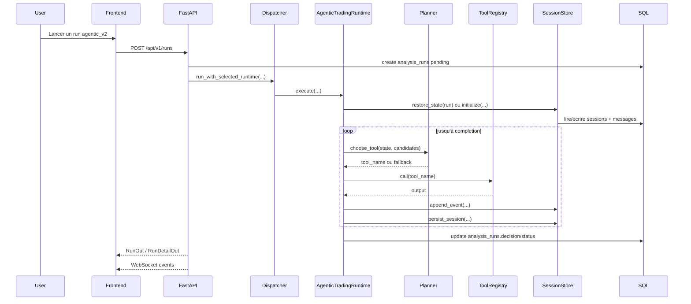
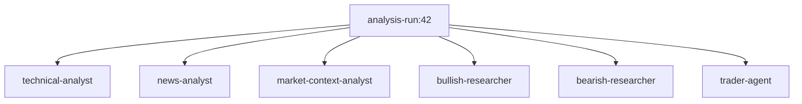
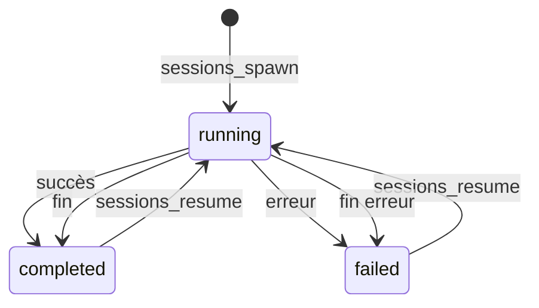
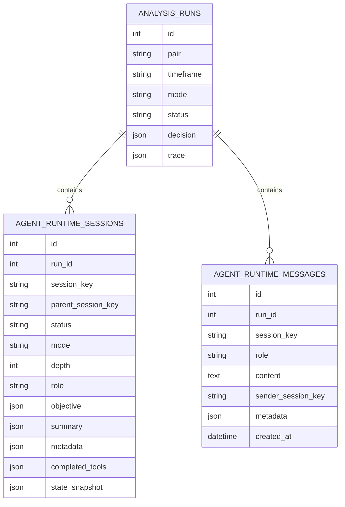

# Architecture `agentic_v2` alignée OpenClaw

Ce document décrit précisément ce qui a été ajouté au projet pour faire évoluer la plateforme d'un workflow multi-agent V1 vers un runtime plus agentique, inspiré d'OpenClaw, tout en conservant les barrières critiques de trading.

Périmètre principal couvert:

- Runtime agentique: `backend/app/services/agent_runtime/`
- Sélection runtime: `backend/app/api/routes/runs.py`, `backend/app/tasks/run_analysis_task.py`
- Persistance SQL runtime: `backend/app/db/models/agent_runtime_session.py`, `backend/app/db/models/agent_runtime_message.py`
- Migration DB: `backend/alembic/versions/0005_agentic_runtime_storage.py`
- Streaming temps réel: `backend/app/main.py`
- UI runtime: `frontend/src/pages/DashboardPage.tsx`, `frontend/src/pages/RunDetailPage.tsx`, `frontend/src/types/index.ts`

## 1. Objectif

L'objectif de `agentic_v2` est de remplacer un enchaînement strictement codé en dur par un runtime qui:

- maintient un état de session vivant;
- choisit le prochain outil via un planner LLM sous contraintes;
- sait ouvrir des sous-sessions spécialistes;
- garde une trace structurée des événements;
- reprend un run depuis un snapshot d'état;
- conserve `risk-manager` et `execution-manager` comme garde-fous déterministes.

Le projet ne remplace pas `agents_v1`. Les deux runtimes coexistent:

- `agents_v1`: pipeline historique fixe;
- `agentic_v2`: runtime planifié, traçable, avec sessions et sous-agents.

## 2. Résumé des évolutions réalisées

Les changements ont été livrés en 6 blocs successifs.

### Bloc 1. Runtime agentique minimal

Ajouts:

- package `backend/app/services/agent_runtime/`
- dispatcher runtime dans `backend/app/services/agent_runtime/dispatcher.py`
- sélection runtime dans l'API `/runs`
- choix UI `agents_v1` vs `agentic_v2`

Effet:

- le système sait maintenant lancer soit l'ancien orchestrateur, soit un runtime agentique séparé.

### Bloc 2. Tracing compatible OpenClaw

Ajouts:

- modèle d'événements `stream / seq / ts / runId / sessionKey / data`
- événements `lifecycle`, `assistant`, `sessions`, `tool_called`, `tool_result`
- affichage front des événements runtime

Effet:

- le runtime devient observable à un niveau plus fin qu'un simple `status=running/completed`.

### Bloc 3. Sous-agents et primitives de session

Ajouts:

- sessions racine et enfant
- outils `sessions_spawn`, `sessions_resume`, `sessions_list`, `session_status`
- sessions spécialistes pour `technical`, `news`, `market-context`, `bullish`, `bearish`, `trader`

Effet:

- les spécialistes ne sont plus seulement des fonctions dans une chaîne fixe; ils deviennent des sessions adressables.

### Bloc 4. Planner LLM

Ajouts:

- `planner.py`
- `LlmClient.chat_json(...)`
- prompt `agentic-runtime-planner`
- fallback déterministe si le planner échoue ou choisit un outil invalide

Effet:

- le prochain outil n'est plus choisi uniquement par ordre fixe; le runtime passe par une décision planifiée.

### Bloc 5. Historique de session et reprise

Ajouts:

- `sessions_send`
- `sessions_history`
- `state_snapshot`
- reprise depuis snapshot dans `runtime.execute(...)`

Effet:

- les sessions ont un historique propre et le runtime peut reprendre son état logique après interruption.

### Bloc 6. Stockage SQL dédié

Ajouts:

- table `agent_runtime_sessions`
- table `agent_runtime_messages`
- migration Alembic `0005_agentic_runtime_storage`
- réhydratation API des sessions et messages vers `trace.agentic_runtime`

Effet:

- l'historique de session et le snapshot d'état ne vivent plus dans le JSON `analysis_runs.trace`.

## 3. Vue d'ensemble

```mermaid
flowchart LR
  UI[Frontend React] --> API[FastAPI /runs]
  API --> DISP[Runtime dispatcher]
  DISP -->|agents_v1| V1[ForexOrchestrator]
  DISP -->|agentic_v2| RT[AgenticTradingRuntime]

  RT --> PLAN[AgenticRuntimePlanner]
  RT --> REG[RuntimeToolRegistry]
  RT --> STORE[RuntimeSessionStore]

  REG --> CTX[Context tools]
  REG --> MEM[Memory tools]
  REG --> SESS[Session tools]
  REG --> ANA[Analysis specialists]
  REG --> RISK[Risk manager]
  REG --> EXEC[Execution manager]

  ANA --> ORCH[Legacy specialist implementations]
  RISK --> ORCH
  EXEC --> ORCH

  STORE --> RUNS[(analysis_runs)]
  STORE --> RS[(agent_runtime_sessions)]
  STORE --> RM[(agent_runtime_messages)]

  API --> WS[WebSocket /ws/runs/{id}]
  WS --> UI
```

## 4. Composants principaux

| Composant | Rôle | Fichier principal |
|---|---|---|
| Runtime dispatcher | Choisit `agents_v1` ou `agentic_v2` | `backend/app/services/agent_runtime/dispatcher.py` |
| `AgenticTradingRuntime` | Boucle agentique principale | `backend/app/services/agent_runtime/runtime.py` |
| `AgenticRuntimePlanner` | Choisit le prochain outil via LLM JSON | `backend/app/services/agent_runtime/planner.py` |
| `RuntimeToolRegistry` | Enregistre et appelle les outils | `backend/app/services/agent_runtime/tool_registry.py` |
| `RuntimeSessionStore` | Persiste état, sessions, messages, événements | `backend/app/services/agent_runtime/session_store.py` |
| `RuntimeSessionState` | État vivant du runtime | `backend/app/services/agent_runtime/models.py` |
| `ForexOrchestrator` | Réutilisation des briques spécialistes existantes | `backend/app/services/orchestrator/engine.py` |

## 5. Flux d'exécution d'un run `agentic_v2`

### 5.1 Flux macro



### 5.2 Boucle interne du runtime

Le runtime suit ce cycle:

1. mettre le run en `running`;
2. charger les prompts par défaut et résoudre le compte MetaApi demandé;
3. tenter `restore_state(run)`;
4. sinon initialiser un `RuntimeSessionState` racine;
5. calculer la liste des outils candidats;
6. demander au planner quel outil exécuter;
7. valider le choix du planner;
8. appeler l'outil;
9. persister événements et état;
10. recommencer jusqu'à absence de candidats ou dépassement de `max_turns`.

## 6. Graphe logique du planner

Le planner ne choisit pas librement n'importe quel outil. Il choisit à l'intérieur d'un graphe borné de capacités.

```mermaid
flowchart TD
  START[Runtime turn N] --> CAND[_candidate_tools(state)]
  CAND --> PROMPT[Prompt planner + contexte compact]
  PROMPT --> LLM[chat_json]
  LLM --> VALID{outil valide ?}
  VALID -- oui --> TOOL[outil choisi]
  VALID -- non --> FB[fallback déterministe]
  FB --> TOOL
  TOOL --> CALL[appel outil]
  CALL --> UPDATE[update state + trace + SQL]
  UPDATE --> NEXT{candidats restants ?}
  NEXT -- oui --> START
  NEXT -- non --> END[finalisation]
```

Règles importantes:

- le planner ne contourne pas `risk-manager` ni `execution-manager`;
- le runtime garde une logique de fallback si la sortie JSON LLM est vide, invalide ou incohérente;
- le planner émet un événement `assistant / agentic-runtime-planner`.

## 7. Inventaire des outils runtime

### 7.1 Outils de contexte et mémoire

- `resolve_market_context`
- `load_memory_context`
- `refresh_memory_context`

### 7.2 Outils de session

- `spawn_subagent`
- `sessions_spawn`
- `sessions_resume`
- `session_status`
- `sessions_list`
- `sessions_send`
- `sessions_history`

### 7.3 Outils spécialistes

- `run_technical_analyst`
- `run_news_analyst`
- `run_market_context_analyst`
- `run_bullish_researcher`
- `run_bearish_researcher`
- `run_trader_agent`

### 7.4 Outils critiques

- `run_risk_manager`
- `run_execution_manager`

## 8. Modèle de session

Le runtime manipule deux niveaux de session:

- une session racine par run;
- des sessions enfant pour les sous-agents spécialistes.

Clés de session:

- racine: `analysis-run:{run_id}`
- enfant: `analysis-run:{run_id}:subagent:{n}`

### 8.1 Graphe de sessions



### 8.2 Cycle de vie d'une session enfant



### 8.3 Données stockées par session

Chaque session conserve:

- `session_key`
- `parent_session_key`
- `label`, `name`
- `status`
- `mode`
- `depth`
- `role`
- `can_spawn`
- `control_scope`
- `turn`
- `current_phase`
- `resume_count`
- `source_tool`
- `objective`
- `summary`
- `metadata`
- `completed_tools`
- `state_snapshot` pour la racine
- `started_at`, `ended_at`, `last_resumed_at`

## 9. Historique de session

Chaque message de session contient:

- `id`
- `run_id`
- `session_key`
- `role`
- `content`
- `sender_session_key`
- `metadata`
- `created_at`

Cas d'usage actuels:

- message système écrit quand un sous-agent démarre ou reprend;
- message assistant écrit à la fin d'un sous-agent avec résumé compact;
- message utilisateur écrit par `sessions_send`.

## 10. Persistance des données runtime

### 10.1 Répartition actuelle

| Donnée | Source principale | Remarque |
|---|---|---|
| `runtime_engine` | `analysis_runs.trace` | choisi à la création du run |
| événements runtime | `analysis_runs.trace.agentic_runtime.events` | toujours stockés en JSON |
| sessions runtime | SQL `agent_runtime_sessions` | miroir léger maintenu dans `trace` |
| messages de session | SQL `agent_runtime_messages` | réhydratés à la lecture API |
| snapshot d'état | SQL `agent_runtime_sessions.state_snapshot` | session racine |

### 10.2 Diagramme ER simplifié



### 10.3 Pourquoi sortir le snapshot et l'historique du `trace`

Objectifs recherchés:

- éviter de faire grossir indéfiniment `analysis_runs.trace`;
- rendre les sessions et les messages requêtables proprement;
- préparer une étape future où les événements auront aussi leur table dédiée;
- faciliter une reprise plus robuste.

## 11. Réhydratation API

`GET /api/v1/runs/{id}` ne renvoie pas directement le JSON brut stocké dans `analysis_runs.trace`. Il reconstruit la partie runtime:

1. lecture de `analysis_runs.trace`;
2. si `runtime_engine == agentic_v2`, appel à `RuntimeSessionStore.hydrate_trace(run)`;
3. injection de `sessions` depuis SQL;
4. injection de `session_history` depuis SQL;
5. optionnellement injection de `state_snapshot` si demandé.

Conséquence:

- le frontend garde la même forme de données qu'avant;
- le backend peut faire évoluer le stockage sans casser l'UI.

## 12. Intégration frontend

### 12.1 Dashboard

Le dashboard permet de choisir le runtime au lancement du run:

- `agents_v1`
- `agentic_v2`

### 12.2 Run detail

`RunDetailPage` affiche:

- la décision finale;
- les `agent_steps` historiques;
- les sessions runtime;
- l'historique de messages par session;
- les événements runtime streamés.

### 12.3 Flux UI

```mermaid
flowchart LR
  D[DashboardPage] --> C[createRun runtime=agentic_v2]
  C --> API[POST /api/v1/runs]
  API --> RD[RunDetailPage]
  RD --> WS[WebSocket /ws/runs/{id}]
  RD --> GET[GET /api/v1/runs/{id}]
  GET --> RH[trace réhydraté]
  RH --> RD
  WS --> RD
```

## 13. Traçabilité et audit

Le runtime produit trois couches de trace:

### 13.1 Événements

Exemples de streams:

- `lifecycle`
- `assistant`
- `sessions`
- `tool_called`
- `tool_result`

Format logique:

```json
{
  "id": 17,
  "seq": 17,
  "stream": "sessions",
  "name": "message_sent",
  "turn": 4,
  "runId": "42",
  "sessionKey": "analysis-run:42",
  "data": {
    "phase": "message"
  },
  "ts": 1770000000000
}
```

### 13.2 État logique

Le `RuntimeSessionState` racine garde:

- `objective`
- `turn`
- `max_turns`
- `status`
- `current_phase`
- `plan`
- `completed_tools`
- `context`
- `artifacts`
- `history`
- `notes`

### 13.3 Sessions et messages

Les tables SQL donnent un audit plus propre des interactions inter-sessions qu'un simple blob JSON.

## 14. Paramètres runtime

Variables clés:

- `AGENTIC_RUNTIME_MAX_TURNS`
- `AGENTIC_RUNTIME_EVENT_LIMIT`
- `AGENTIC_RUNTIME_HISTORY_LIMIT`

Effets:

- borne la boucle agentique;
- borne les événements conservés dans `trace`;
- borne les messages conservés par session.

## 15. Migration et exploitation

Pour un environnement déjà initialisé:

```bash
cd backend
alembic upgrade head
```

Cette migration crée:

- `agent_runtime_sessions`
- `agent_runtime_messages`

Au démarrage local, `Base.metadata.create_all(...)` permet aussi d'initialiser les tables en environnement de dev/test.

## 16. Validation réalisée

Validation backend:

```bash
python3 -m pytest backend/tests/unit/test_agentic_runtime.py backend/tests/integration/test_api_runs_agentic_v2.py backend/tests/integration/test_api_runs.py -q
```

Validation frontend:

```bash
npm --prefix frontend run -s build
```

## 17. Ce que cette architecture apporte réellement

Par rapport à V1, `agentic_v2` apporte:

- un runtime séparé du pipeline historique;
- une boucle de décision outillée;
- des sous-agents traçables;
- des primitives de session explicites;
- une mémoire de session et une reprise d'état;
- une base SQL dédiée pour les sessions/messages;
- une UI capable d'inspecter la hiérarchie runtime.

Ce que l'architecture ne prétend pas encore faire est documenté dans `docs/agentic-v2-limits.md`.
