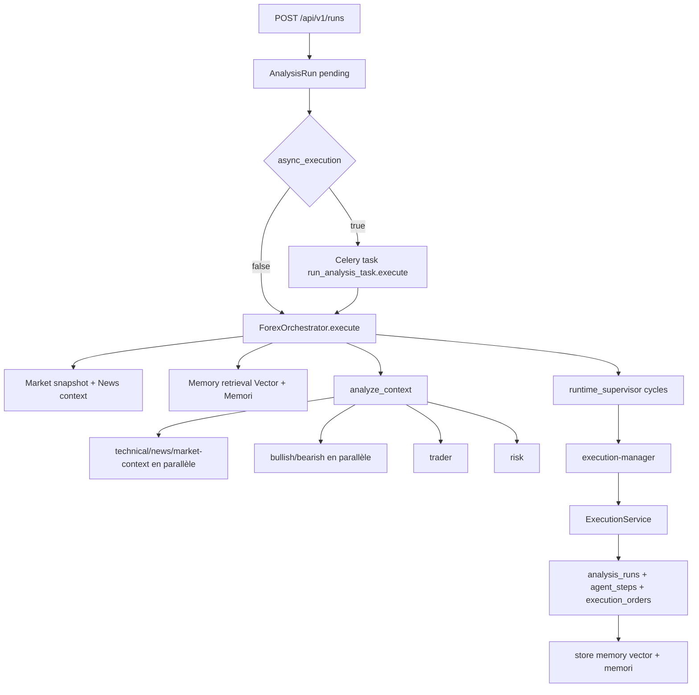
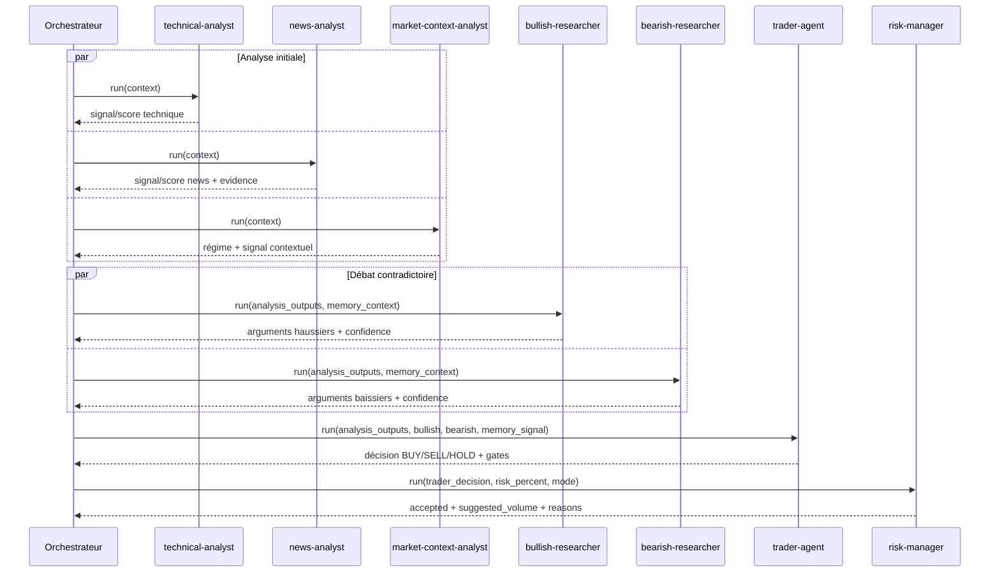
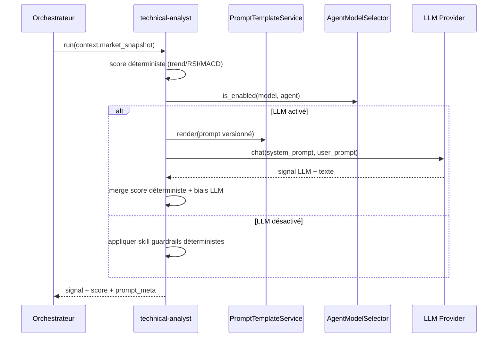
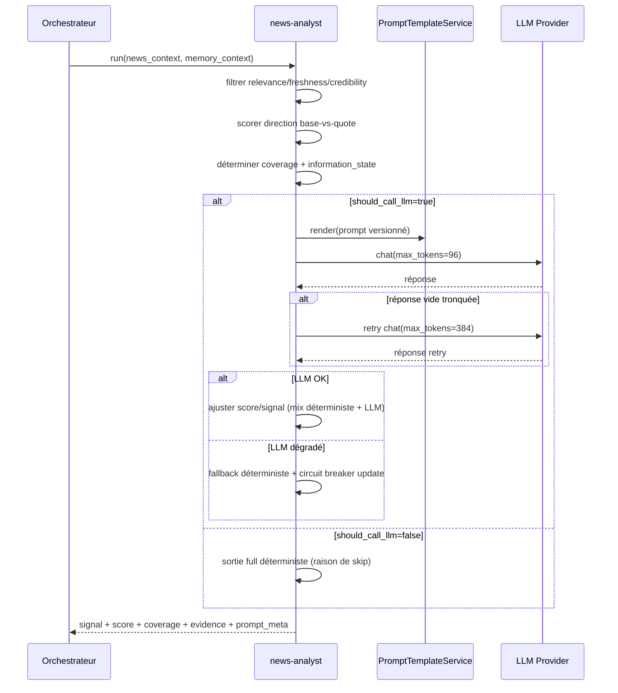
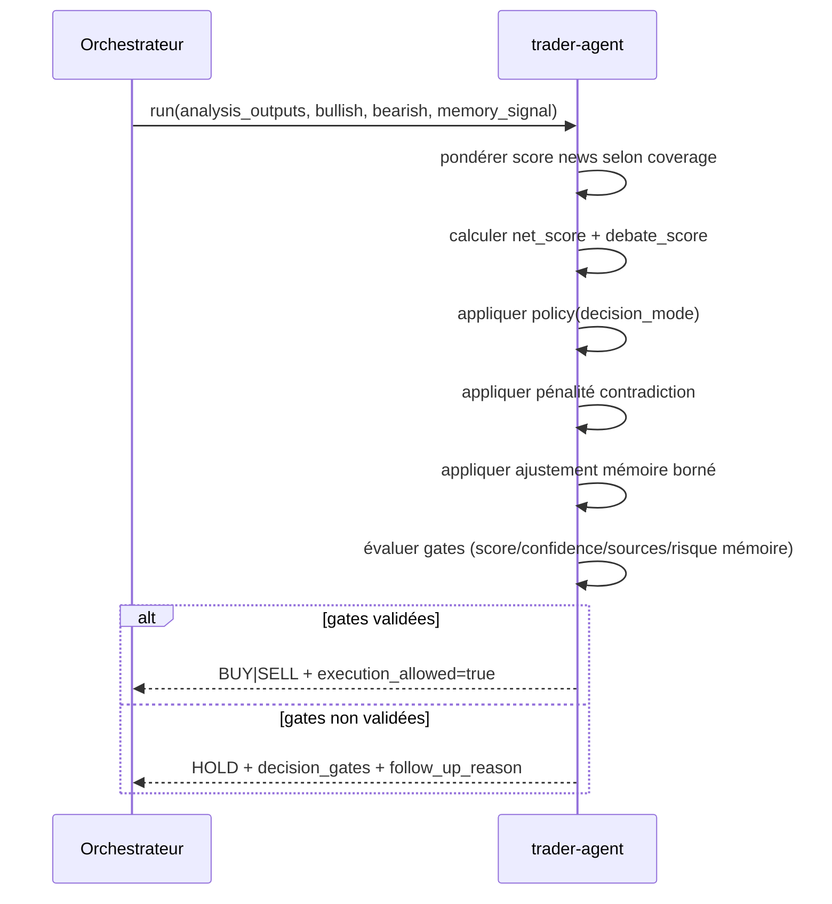
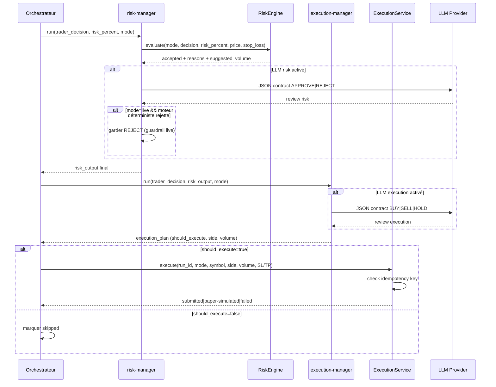

# Architecture des agents (V1)

Ce document décrit, de manière opérationnelle et fidèle au code, comment fonctionne la chaîne multi-agent de trading.

Périmètre principal couvert:

- Orchestration runtime: `backend/app/services/orchestrator/engine.py`
- Logique agents: `backend/app/services/orchestrator/agents.py`
- Mémoire vectorielle: `backend/app/services/memory/vector_memory.py`
- Mémoire sémantique Memori: `backend/app/services/memory/memori_memory.py`
- Exécution ordres: `backend/app/services/execution/executor.py`
- Risque déterministe: `backend/app/services/risk/rules.py`
- Entrées API et tâche asynchrone: `backend/app/api/routes/runs.py`, `backend/app/tasks/run_analysis_task.py`
- Config prompts/modèles: `backend/app/services/prompts/registry.py`, `backend/app/services/llm/model_selector.py`

## 1. Vue d'ensemble

Le système suit une chaîne d'analyse agentique supervisée, puis applique des barrières de sécurité déterministes avant toute exécution d'ordre.

Principe clef:

- Agentique fort sur l'analyse et la réévaluation (`runtime_supervisor` avec cycles, second pass, arbitrage de bundle).
- Déterministe strict sur les garde-fous critiques (risk engine, checks d'exécution, idempotence, blocages live).

Flux macro:

## 2. Point d'entrée run

Chemin API:

- `POST /api/v1/runs` crée un `AnalysisRun` en `pending`.
- Si `async_execution=true` (défaut), run passe en `queued` puis exécution via Celery.
- Sinon l'orchestrateur tourne dans la requête HTTP.

Fichiers:

- `backend/app/api/routes/runs.py`
- `backend/app/tasks/run_analysis_task.py`

Contrôles d'entrée importants:

- `timeframe` doit appartenir à `settings.default_timeframes`.
- `mode=live` exige rôle élevé (`super-admin`, `admin`, `trader-operator`).
- `metaapi_account_ref` est validé si fourni.

## 3. Orchestrateur: responsabilités exactes

Classe: `ForexOrchestrator`.

Responsabilités:

- Charger les contextes marché/news/mémoire.
- Exécuter les agents dans l'ordre et avec parallélisme contrôlé.
- Piloter les cycles d'autonomie (`runtime_supervisor`).
- Appliquer les aborts live sur outputs dégradés critiques.
- Enchaîner `execution-manager` puis `ExecutionService`.
- Persister trace complète (`analysis_runs`, `agent_steps`, `execution_orders`).
- Enrichir mémoire post-run (vector + Memori).

Ordre de workflow déclaré (`WORKFLOW_STEPS`):

1. `technical-analyst`
2. `news-analyst`
3. `market-context-analyst`
4. `bullish-researcher`
5. `bearish-researcher`
6. `trader-agent`
7. `risk-manager`
8. `execution-manager`

## 4. Contrat de contexte transmis aux agents

Dataclass `AgentContext`:

- `pair`
- `timeframe`
- `mode`
- `risk_percent`
- `market_snapshot`
- `news_context`
- `memory_context`
- `memory_signal`
- `llm_model_overrides`

Règle importante:

- `memory_context` peut contenir vector + Memori.
- `memory_signal` est calculé uniquement depuis la mémoire vectorielle déterministe.

## 5. Pipeline `analyze_context`

`analyze_context` exécute 3 sous-phases:

1) Analyse initiale parallèle:

- `technical-analyst`
- `news-analyst`
- `market-context-analyst`

2) Débat parallèle:

- `bullish-researcher`
- `bearish-researcher`

3) Synthèse et garde-fou:

- `trader-agent`
- `risk-manager`

Sortie `analysis_bundle`:

- `analysis_outputs`
- `bullish`
- `bearish`
- `trader_decision`
- `risk`

Parallélisme:

- contrôlé par `ORCHESTRATOR_PARALLEL_WORKERS`.
- chaque step est mesuré (`orchestrator_step_duration_seconds`) et persisté dans `agent_steps` si mode record.

## 6. Architecture détaillée des agents

### 6.0 Contrat I/O synthétique

| Agent | Entrées principales | Sorties principales | Déterministe vs LLM |
|---|---|---|---|
| `technical-analyst` | `market_snapshot` | `signal`, `score`, `indicators` | Déterministe d'abord, LLM optionnel en ajustement |
| `news-analyst` | `news_context`, `memory_context` | `signal`, `score`, `coverage`, `evidence` | Déterministe majoritaire, LLM conditionnel avec circuit breaker |
| `market-context-analyst` | `market_snapshot` | `signal`, `score`, `regime`, `volatility_context` | Déterministe majoritaire, LLM note contextuelle optionnelle |
| `bullish-researcher` | outputs analytiques compactés + `memory_context` | `arguments`, `confidence` | Déterministe + débat LLM conditionnel |
| `bearish-researcher` | outputs analytiques compactés + `memory_context` | `arguments`, `confidence` | Déterministe + débat LLM conditionnel |
| `trader-agent` | `analysis_outputs`, `bullish`, `bearish`, `memory_signal` | `decision`, `confidence`, `decision_gates`, `memory_signal` | Gating déterministe fort, LLM uniquement pour note finale |
| `risk-manager` | `trader_decision`, `risk_percent`, `mode` | `accepted`, `suggested_volume`, `reasons` | RiskEngine déterministe; LLM revue contractuelle optionnelle |
| `execution-manager` | `trader_decision`, `risk_output`, `mode` | `should_execute`, `side`, `volume`, `reason` | Déterministe d'abord; LLM sous contrat strict, plus strict en live |

Diagramme de séquence global (section 6):

### 6.1 `technical-analyst`

Rôle:

- produire un biais technique initial.

Entrées:

- `market_snapshot`: trend, RSI, MACD, prix.

Logique déterministe:

- score de base = somme de composantes trend/RSI/MACD.
- seuils de signal: > `0.15` bullish, < `-0.15` bearish, sinon neutral.
- si LLM off: skill guardrails déterministes peuvent ajuster score/seuil.

LLM (optionnel):

- prompt versionné via `PromptTemplateService`.
- fusion signal déterministe + signal LLM via `_merge_llm_signal`.

Sortie typique:

- `signal`, `score`, `indicators`, `llm_summary`, `degraded`, `prompt_meta`.

Diagramme de séquence `technical-analyst`:

### 6.2 `news-analyst`

Rôle:

- transformer news + macro-events en signal directionnel pondéré.

Entrées:

- `news_context.news`
- `news_context.macro_events`
- métadonnées providers (`fetch_status`, provider_status, symbol scanné)
- `memory_context` (injecté dans prompt LLM)

Logique déterministe:

- filtrage pertinence/fraîcheur/crédibilité.
- scoring directionnel base-vs-quote (pair relevance, macro relevance).
- classification couverture: `none|low|medium|high`.
- états informationnels: `no_recent_news`, `mixed_signals`, `clear_directional_bias`, etc.

Résilience LLM:

- circuit breaker local (`_llm_consecutive_failures`, `_llm_circuit_open_until`).
- appel LLM seulement si couverture/evidence suffisantes.
- retry spécifique si réponse vide et stop_reason tronqué.
- fallback déterministe si LLM dégradé.

Sortie typique:

- `signal`, `score`, `confidence`, `coverage`, `evidence_strength`
- `information_state`, `decision_mode`
- `provider_status`, `evidence`
- `llm_fallback_used`, `llm_retry_used`, `llm_call_attempted`, `llm_circuit_open`
- `degraded`, `prompt_meta`

Diagramme de séquence `news-analyst`:

### 6.3 `market-context-analyst`

Rôle:

- qualifier le régime de marché et la lisibilité contextuelle (pas d'interprétation macro externe).

Entrées:

- snapshot marché (trend, ATR, RSI, EMA, MACD, change%).

Logique déterministe:

- calcule `regime` (`trending`, `ranging`, `calm`, `unstable`, `volatile`).
- calcule `volatility_context` (`supportive`, `neutral`, `unsupportive`).
- construit score contextuel borné, pénalisé si contexte mixte/instable.
- signal final via seuil 0.12.

LLM (optionnel):

- produit une note contextuelle concise.
- la structure directionnelle principale reste déterministe.

Sortie typique:

- `signal`, `score`, `confidence`, `regime`, `momentum_bias`, `volatility_context`, `reason`
- `llm_note`, `llm_summary`, `prompt_meta`.

### 6.4 `bullish-researcher` et `bearish-researcher`

Rôle:

- formaliser argumentaires contradictoires à partir des signaux compactés.

Entrées:

- `analysis_outputs` compactés
- `memory_context`

Logique:

- extraction d'arguments déterministes (scores >0 pour bullish, <0 pour bearish).
- confidence dérivée des scores agrégés.
- LLM appelé seulement si evidence directionnelle minimale.

Sortie:

- `arguments`, `confidence`, `llm_debate`, `degraded`, `llm_called`, `prompt_meta`.

### 6.5 `trader-agent`

Rôle:

- fusion finale multi-signaux et décision `BUY|SELL|HOLD`.

Entrées:

- `analysis_outputs`
- sorties débat bullish/bearish
- `memory_signal`
- `market_snapshot`

Étapes internes clés:

1. Pondération du news score par couverture.
2. Calcul `net_score` et `raw_net_score`.
3. Détection conflit fort (`strong_conflict`) via équilibre bullish/bearish.
4. Alignement de sources directionnelles (technique + news + market-context).
5. `debate_score` ajouté au net pour produire `raw_combined_score`.
6. Pénalité contradiction trend/momentum selon policy de mode.
7. Application contrôlée de `memory_signal` (sans inversion de direction).
8. Calcul qualité de preuve (`evidence_quality`) et `confidence`.
9. Application des gates: score, confidence, sources, contradiction majeure, blocage mémoire.
10. Décision finale + `execution_allowed` + `decision_gates` + `needs_follow_up`.

Formules structurantes:

- `raw_net_score = somme(scores agents bruts)`
- `net_score = somme(scores effectifs après pondération news)`
- `raw_combined_score = net_score + debate_score`
- `combined_score = raw_combined_score - pénalité_contradiction +/- ajustement_mémoire`
- `decision_confidence_base = min(edge_strength * 0.7 + evidence_quality * 0.5, 1.0)`
- `confidence = decision_confidence_base * confidence_multiplier (+/- mémoire, borné [0,1])`

Decision policies (`decision_mode`):

- `conservative`: seuils plus stricts.
- `balanced`: compromis.
- `permissive`: autorise plus d'overrides techniques sous contraintes.

Paramètres exacts des policies (valeurs codées):

| Paramètre | Conservative | Balanced | Permissive |
|---|---:|---:|---:|
| `min_combined_score` | 0.30 | 0.25 | 0.18 |
| `min_confidence` | 0.35 | 0.30 | 0.22 |
| `min_aligned_sources` | 2 | 1 | 1 |
| `technical_neutral_exception_min_sources` | 2 | 2 | 1 |
| `technical_neutral_exception_min_strength` | 0.22 | 0.20 | 0.10 |
| `technical_neutral_exception_min_combined` | 0.30 | 0.25 | 0.20 |
| `allow_low_edge_technical_override` | false | true | true |
| `allow_technical_single_source_override` | false | false | true |
| `technical_single_source_min_score` | 0.00 | 0.00 | 0.18 |
| `contradiction_weak_penalty` | 0.00 | 0.00 | 0.02 |
| `contradiction_moderate_penalty` | 0.06 | 0.05 | 0.05 |
| `contradiction_major_penalty` | 0.12 | 0.10 | 0.10 |
| `block_major_contradiction` | true | true | true |

Exemples de garde-fous Trader:

- blocage `technical_neutral_gate` sauf exceptions encadrées.
- blocage `major_contradiction_execution_block`.
- blocage mémoire `memory_risk_block` si historique adverse.

Paramètres de sortie critiques:

- `decision`, `execution_allowed`
- `combined_score`, `confidence`
- `decision_gates`, `needs_follow_up`, `follow_up_reason`, `uncertainty_level`
- `memory_signal` enrichi (avant/après ajustements)
- `rationale` détaillée
- niveaux SL/TP heuristiques (ATR)

LLM Trader:

- sert principalement à produire une `execution_note` compacte.
- note LLM est validée contre la décision et les niveaux; sinon fallback déterministe.

Diagramme de séquence `trader-agent`:

### 6.6 `risk-manager`

Rôle:

- valider le risque et proposer volume final.

Entrées:

- `trader_decision`, `risk_percent`, `mode`, prix, SL.

Cœur déterministe (RiskEngine):

- `HOLD` => accepté, volume 0.
- SL obligatoire.
- limites de risque par mode:
  - `simulation`: 5%
  - `paper`: 3%
  - `live`: 2%
- SL trop tight rejeté.
- sizing via distance SL et pip value.

LLM Risk (optionnel):

- contrat JSON strict `APPROVE|REJECT`.
- en `live`, un rejet déterministe ne peut pas être renversé par LLM.

Sortie:

- `accepted`, `reasons`, `suggested_volume`
- `contract_valid`, `llm_summary`, `degraded`, `prompt_meta`.

### 6.7 `execution-manager`

Rôle:

- traduire décision + risque en plan d'exécution final.

Entrées:

- `trader_decision`, `risk_output`, `mode`.

Logique déterministe:

- `deterministic_allowed` si:
  - décision trader BUY/SELL
  - `execution_allowed=true`
  - `risk.accepted=true`

LLM Execution (optionnel):

- contrat JSON strict `BUY|SELL|HOLD`.
- en `live`, exécution seulement si LLM confirme exactement la décision déterministe.
- sinon HOLD de sécurité.

Sortie:

- `decision`, `should_execute`, `side`, `volume`, `reason`
- `contract_valid`, `llm_summary`, `degraded`, `prompt_meta`.

Diagramme de séquence `risk-manager` + `execution-manager`:

## 7. Runtime supervisor (agentique fort)

Le runtime ne s'arrête pas à un simple pipeline: il peut faire des cycles de réévaluation.

Composants:

- `orchestrator_autonomy_enabled`
- `orchestrator_autonomy_max_cycles`
- `orchestrator_second_pass_enabled`
- `orchestrator_second_pass_max_attempts`
- garde-fou anti-stagnation
- sélection du meilleur bundle via `_prefer_autonomy_bundle`

Actions possibles par cycle:

- `accept`
- `rerun_due_to_degraded_outputs`
- `rerun_with_conflict_focus`
- `rerun_with_memory_refresh`
- `rerun_second_pass`
- `finalize_hold`

Déclencheurs de rerun:

- outputs dégradés.
- HOLD avec conflit fort ou preuve insuffisante mais edge présent.
- qualité insuffisante sur décision directionnelle.

Mémoire dans les reruns:

- `rerun_with_memory_refresh` augmente `memory_limit` (pas de boucle infinie).
- un nouveau `memory_context` est recalculé.

Model boost:

- possibilité de forcer temporairement certains agents vers `default_model` au rerun.

Sorties runtime:

- `decision.runtime_supervisor`
- `trace.runtime_supervisor`
- compatibilité legacy conservée via `second_pass`.

Déclenchement du second pass (logique exacte):

- prérequis:
  - `ORCHESTRATOR_SECOND_PASS_ENABLED=true`
  - décision trader du cycle courant = `HOLD`
  - sortie trader non dégradée
- annulation immédiate si gate `major_contradiction_execution_block`.
- déclenchement si un de ces cas:
  - `strong_conflict=true`
  - gate `insufficient_aligned_sources` et `abs(combined_score) >= ORCHESTRATOR_SECOND_PASS_MIN_COMBINED_SCORE`
  - `needs_follow_up=true` avec `follow_up_reason in {insufficient_evidence, low_edge}` et edge minimum.

Sélection du bundle final:

- le runtime peut conserver le bundle du cycle 1 même si cycle 2 exécuté.
- promotion cycle 2 si meilleure qualité (direction HOLD->BUY/SELL valide, moins de dégradations, meilleure evidence/confidence, etc.).
- garde-fou de stagnation: si deux cycles consécutifs n'apportent pas d'amélioration mesurable, arrêt anticipé.

## 8. Mémoire hybride

## 8.1 VectorMemoryService (déterministe)

Fonctions:

- stocker les outcomes run dans `memory_entries`.
- rechercher cas similaires (`pair/timeframe` stricts).
- calculer `memory_signal` directionnel + risque.

Mécanique:

- embedding hash lexical déterministe (pas d'embedding LLM externe).
- Qdrant prioritaire; fallback SQL cosine si indisponible.
- reranking par score composite:
  - `0.45 * vector`
  - `0.40 * business_similarity`
  - `0.15 * recency`

`memory_signal`:

- ajustements bornés:
  - `MAX_SCORE_ADJUSTMENT = 0.08`
  - `MAX_CONFIDENCE_ADJUSTMENT = 0.05`
- peut fournir des `risk_blocks` buy/sell selon historique adverse.

## 8.2 MemoriMemoryService (sémantique additionnelle)

Activation:

- `MEMORI_ENABLED=true`

Fonctions:

- `recall`: récupération facts Memori pour enrichir `memory_context`.
- `store_run_memory`: écrit des facts compactés post-run.

Règles d'intégration runtime:

- `memory_signal` reste calculé sur mémoire vectorielle uniquement.
- Memori influence le contexte narratif transmis aux agents, pas les garde-fous déterministes de risque.
- traçabilité explicitée dans `trace.memory_runtime`.

Variables Memori:

- `MEMORI_ENABLED`
- `MEMORI_PROCESS_ID`
- `MEMORI_ENTITY_PREFIX`
- `MEMORI_RECALL_LIMIT`
- `MEMORI_RECALL_MIN_SIMILARITY`
- `MEMORI_STORE_RUN_MEMORIES`

## 9. Barrières live et sécurité d'exécution

## 9.1 Aborts live avant exécution

L'orchestrateur peut refuser le run live si outputs LLM critiques sont dégradés.

Nuance:

- si pas de trade candidat réel, certaines dégradations débat/trader/risk ne bloquent pas.
- pour trade candidat live, les dégradations analytiques critiques bloquent.

Matrice pratique (mode live):

| Condition | Effet |
|---|---|
| `decision != BUY/SELL` ou `execution_allowed=false` ou `risk.accepted=false` | pas de blocage live par dégradation amont, run peut finir en HOLD |
| trade candidat live + `technical/news/market-context` dégradé | abort run (`status=failed`) |
| trade candidat live + `bullish/bearish/trader/risk` dégradé | non bloquant à ce stade précis |
| `execution-manager` dégradé en live | abort run systématique |

## 9.2 Exécution ordres (`ExecutionService`)

Fonctions de sécurité:

- clé d'idempotence par run + symbol + side + volume + SL/TP + account.
- replay d'ordre existant si même clé.
- statuts normalisés (`simulated`, `submitted`, `paper-simulated`, `blocked`, `failed`, ...).
- classification d'erreurs (`transient_network`, `rate_limited`, `auth_or_permission`, ...).

Comportement par mode:

- `simulation`: jamais d'envoi broker.
- `paper`: broker si possible, sinon fallback paper simulé.
- `live`: pas de fallback simulé silencieux; échec explicite si broker fail.

## 10. Prompts, modèles, skills

## 10.1 PromptTemplateService

Capacités:

- seed de prompts par défaut.
- versionning/activation en base (`prompt_templates`).
- rendu avec variables + détection variables manquantes.
- injection skills agent depuis `connector_configs.settings.agent_skills`.
- normalisation langage (français + labels trading stricts).

## 10.2 AgentModelSelector

Capacités:

- provider global (`ollama|openai|mistral`).
- modèle global + overrides par agent.
- switch `agent_llm_enabled` par agent.
- résolution `decision_mode`.
- switch `memory_context_enabled`.

Mapping LLM par défaut (code actuel):

- ON: `news-analyst`, `bullish-researcher`, `bearish-researcher`, `schedule-planner-agent`
- OFF: `technical-analyst`, `market-context-analyst`, `trader-agent`, `risk-manager`, `execution-manager`, `order-guardian`

## 11. Persistance et observabilité

Tables principales:

- `analysis_runs`: état global, `decision`, `trace`, `error`.
- `agent_steps`: input/output par étape agent.
- `execution_orders`: historique d'ordres + payload request/response.
- `memory_entries`: cas mémoire long-terme vectoriels.
- `prompt_templates`: prompts versionnés.
- `connector_configs`: settings runtime (models, skills, mode, memory_context_enabled).

Champs trace utiles pour debug:

- `trace.market`
- `trace.news`
- `trace.memory_context`
- `trace.memory_signal`
- `trace.memory_runtime`
- `trace.analysis_outputs`
- `trace.bullish` / `trace.bearish`
- `trace.second_pass`
- `trace.runtime_supervisor`
- `trace.memory_persistence`
- `trace.debug_trace_file` (si debug JSON actif)

## 12. Contrat de décision final

Le `run.decision` final contient au minimum:

- décision trader enrichie
- `risk`
- `execution`
- `execution_manager`
- `second_pass`
- `runtime_supervisor`
- `memory_runtime`
- `memory_persistence`

## 13. Config runtime à connaître

Variables orchestration/autonomie:

- `ORCHESTRATOR_PARALLEL_WORKERS`
- `ORCHESTRATOR_AUTONOMY_ENABLED`
- `ORCHESTRATOR_AUTONOMY_MAX_CYCLES`
- `ORCHESTRATOR_AUTONOMY_ACCEPT_MIN_CONFIDENCE`
- `ORCHESTRATOR_AUTONOMY_ACCEPT_MIN_EVIDENCE`
- `ORCHESTRATOR_AUTONOMY_MEMORY_LIMIT_STEP`
- `ORCHESTRATOR_AUTONOMY_MEMORY_LIMIT_MAX`
- `ORCHESTRATOR_AUTONOMY_MODEL_BOOST_ENABLED`
- `ORCHESTRATOR_MEMORY_SEARCH_LIMIT`
- `ORCHESTRATOR_SECOND_PASS_ENABLED`
- `ORCHESTRATOR_SECOND_PASS_MAX_ATTEMPTS`
- `ORCHESTRATOR_SECOND_PASS_MIN_COMBINED_SCORE`

Variables debug:

- `DEBUG_TRADE_JSON_ENABLED`
- `DEBUG_TRADE_JSON_DIR`
- `DEBUG_TRADE_JSON_INCLUDE_PROMPTS`
- `DEBUG_TRADE_JSON_INCLUDE_PRICE_HISTORY`
- `DEBUG_TRADE_JSON_PRICE_HISTORY_LIMIT`
- `DEBUG_TRADE_JSON_INLINE_IN_RUN_TRACE`

## 14. Frontière LLM vs déterministe (résumé clair)

Composants à dominante déterministe:

- calculs techniques de base.
- market regime classification de base.
- gating trader (score/confidence/source/contradiction).
- risk engine (accept/reject + sizing).
- exécution effective, idempotence, fallback mode.
- live guardrails.

Composants à dominante LLM (si activés):

- enrichissement narratif/argumentatif (news, débat, notes d'exécution).
- arbitrage complémentaire non critique sous contrat JSON strict (risk/execution managers).

Garantie recherchée:

- LLM améliore l'analyse; il ne doit pas court-circuiter les barrières de sécurité live.

## 15. Lire un run comme un audit

Méthode recommandée:

1. Ouvrir `analysis_runs.trace.runtime_supervisor` pour voir cycles et action retenue.
2. Vérifier `analysis_runs.trace.memory_runtime` (volumes vector/memori, disponibilité).
3. Contrôler `analysis_runs.decision.decision_gates` et `follow_up_reason`.
4. Vérifier `analysis_runs.decision.risk.accepted` et raisons.
5. Vérifier `analysis_runs.decision.execution_manager.should_execute`.
6. Vérifier `execution_orders` (idempotency key, statut, erreur éventuelle).
7. En cas d'anomalie, inspecter `agent_steps` étape par étape.

## 16. Extension: ajouter un nouvel agent proprement

Checklist minimale:

1. Créer la classe agent dans `agents.py` avec contrat d'entrée/sortie stable.
2. Ajouter le prompt par défaut dans `DEFAULT_PROMPTS`.
3. Brancher l'agent dans `engine.py`:
   - instanciation
   - insertion dans `WORKFLOW_STEPS`
   - wiring dans `analyze_context`
4. Mettre à jour la compaction des outputs si nécessaire (`_compact_analysis_outputs_for_debate`).
5. Ajouter tests unitaires ciblés:
   - sortie nominale
   - comportement dégradé
   - impact sur décision finale
6. Vérifier trace et `agent_steps`.

## 17. Limites connues (techniques)

- Une partie des agents reste orientée pipeline (autonomie locale limitée hors superviseur).
- Les débats bullish/bearish sont utiles mais encore dépendants de la qualité des signaux amont.
- Les ajustements mémoire sont bornés volontairement, donc impact parfois modéré.
- La robustesse dépend fortement de la qualité des providers news externes.

## 18. En une phrase

Le système est un runtime multi-agent supervisé, avec réévaluation autonome et mémoire hybride, mais il conserve volontairement une frontière déterministe stricte sur risque et exécution pour la sécurité de production.
