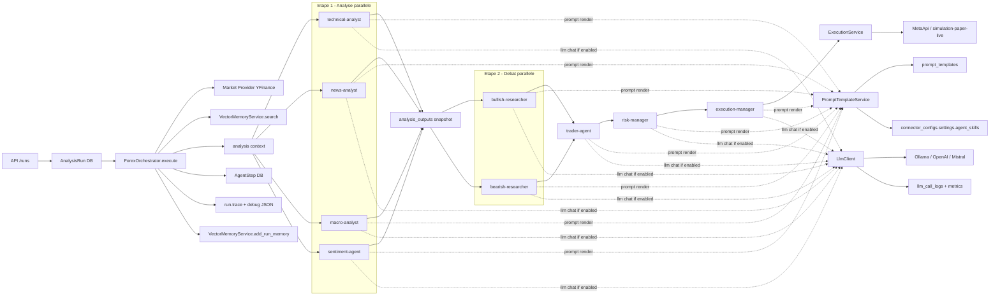
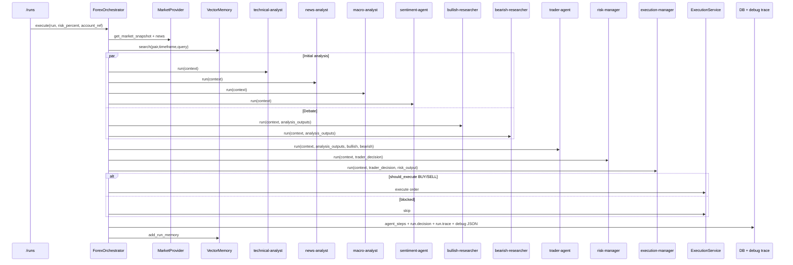
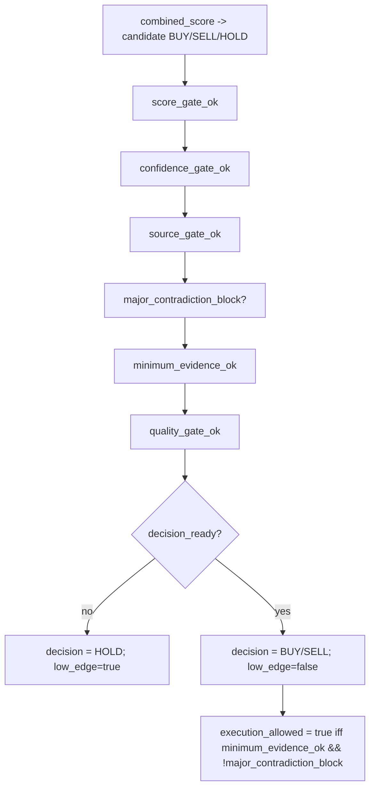
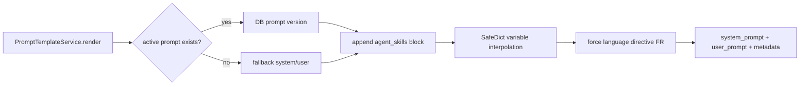
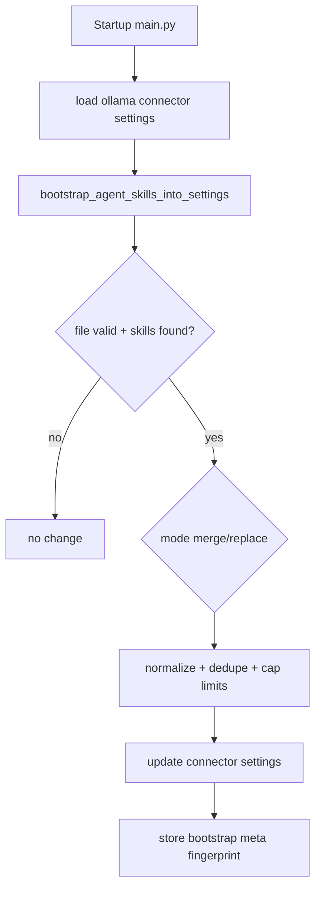
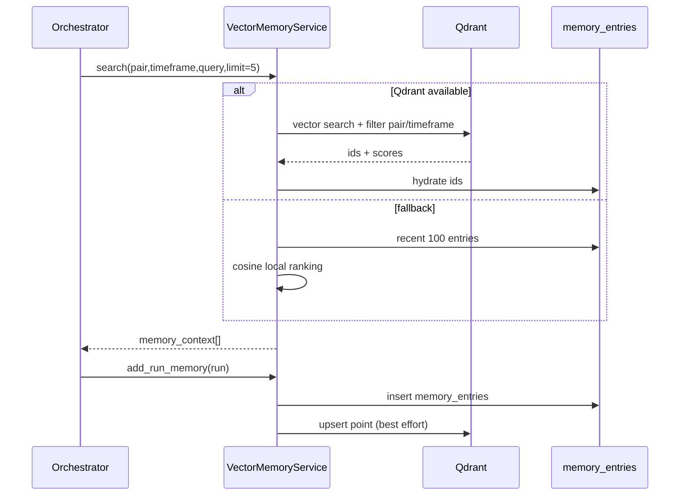
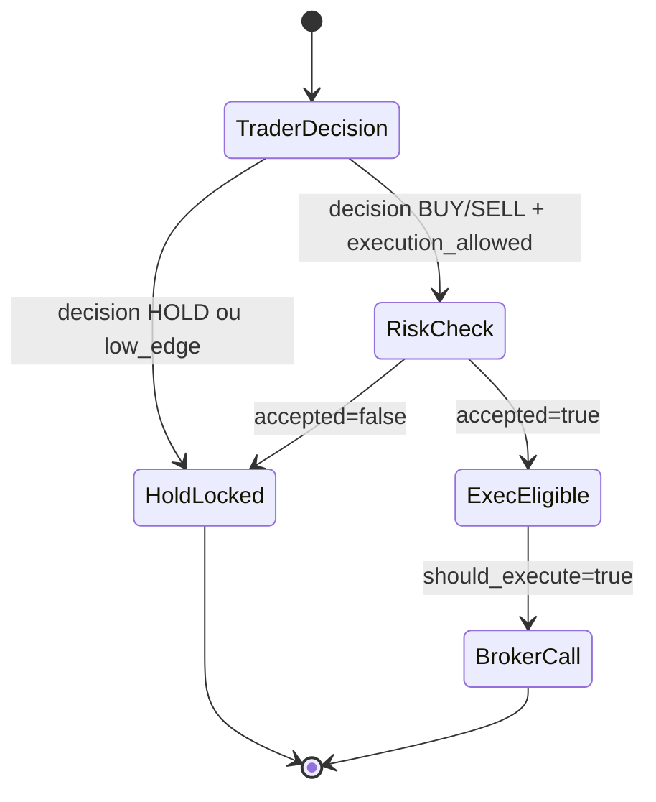
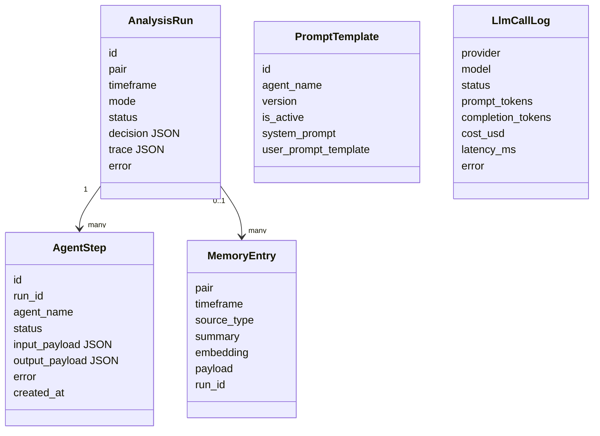

# Architecture Agents - MultiAgentTrading

Date: 2026-03-19  
Scope: backend trading orchestration + agents satellites (`schedule-planner-agent`, `order-guardian`)  
Source of truth: code Python + tests unitaires + traces JSON (`backend/debug-traces/run-*.json`)

Note de mise à jour runtime:
- Le workflow actif remplace désormais `macro-analyst` et `sentiment-agent` par `market-context-analyst`.
- Les mentions `macro-analyst` / `sentiment-agent` restantes dans ce document correspondent à des alias legacy conservés pour compatibilité.

## 1) Objectif

Ce document explique l'architecture complete des agents:
- orchestration
- prompts
- skills
- memoire
- decision BUY/SELL/HOLD
- risque + execution
- traces et observabilite

Le contenu est ancre sur le code actuel, pas sur une specification theorique.

## 2) Artefacts inspectes

Code principal:
- `backend/app/services/orchestrator/engine.py`
- `backend/app/services/orchestrator/agents.py`
- `backend/app/services/prompts/registry.py`
- `backend/app/services/llm/model_selector.py`
- `backend/app/services/llm/provider_client.py`
- `backend/app/services/llm/ollama_client.py`
- `backend/app/services/llm/openai_compatible_client.py`
- `backend/app/services/memory/vector_memory.py`
- `backend/app/services/risk/rules.py`
- `backend/app/services/execution/executor.py`
- `backend/app/services/llm/skill_bootstrap.py`
- `backend/app/api/routes/connectors.py`
- `backend/app/services/scheduler/automation_agent.py`
- `backend/app/services/trading/order_guardian.py`

Modele de donnees:
- `backend/app/db/models/run.py`
- `backend/app/db/models/agent_step.py`
- `backend/app/db/models/prompt_template.py`
- `backend/app/db/models/llm_call_log.py`
- `backend/app/db/models/connector_config.py`
- `backend/app/db/models/memory_entry.py`

Tests utilises comme preuve comportementale:
- `backend/tests/unit/test_trader_agent.py`
- `backend/tests/unit/test_risk_execution_agents.py`
- `backend/tests/unit/test_orchestrator_debug_trace.py`
- `backend/tests/unit/test_connectors_settings_sanitization.py`

Traces runtime inspectees:
- `backend/debug-traces/run-45...run-74` (30 runs, horodatage UTC 2026-03-19 14:34 -> 14:43)

## 3) Vue systeme

Ce schema est maintenant aligne sur l'ordre reel du run (meme granularite que la section 4).



## 4) Cycle d'un run (ordre reel)

`ForexOrchestrator.WORKFLOW_STEPS`:
1. `technical-analyst`
2. `news-analyst`
3. `market-context-analyst`
4. `bullish-researcher`
5. `bearish-researcher`
6. `trader-agent`
7. `risk-manager`
8. `execution-manager`

Execution:
- etape 1 en parallele (3 agents)
- etape 2 en parallele (debat bullish/bearish)
- etape 3/4/5 en serie (decision -> risque -> execution)



## 5) Contrat de contexte et bundles

### 5.1 `AgentContext` (input commun agents)

```json
{
  "pair": "EURUSD.PRO",
  "timeframe": "M15",
  "mode": "live|paper|simulation",
  "risk_percent": 1.0,
  "market_snapshot": {},
  "news_context": {},
  "memory_context": [],
  "llm_model_overrides": {}
}
```

### 5.2 Bundle d'analyse (`analyze_context`)

```json
{
  "analysis_outputs": {
    "technical-analyst": {"signal": "bullish", "score": 0.3},
    "news-analyst": {"signal": "neutral", "score": 0.0},
    "macro-analyst": {"signal": "bullish", "score": 0.1},
    "sentiment-agent": {"signal": "neutral", "score": 0.0}
  },
  "bullish": {"arguments": [], "confidence": 0.0},
  "bearish": {"arguments": [], "confidence": 0.0},
  "trader_decision": {},
  "risk": {}
}
```

## 6) Catalogue des agents (core trading)

| Agent | Role | Noyau deterministe | LLM par defaut | Output cle |
|---|---|---|---|---|
| `technical-analyst` | bias technique | trend (+/-0.35), RSI (+/-0.25), MACD (+/-0.2), seuil signal 0.15 | OFF | `signal`, `score`, `indicators` |
| `news-analyst` | sentiment news/macro multi-provider | agrégation déterministe (relevance/freshness/credibility/importance) + fallback si LLM dégradé | ON | `signal`, `score`, `coverage`, `decision_mode`, `fetch_status`, `news_count`, `macro_event_count` |
| `macro-analyst` | biais macro proxy | ATR/price > 0.01 -> neutral sinon suit trend (+/-0.1) | OFF | `signal`, `score`, `reason` |
| `sentiment-agent` | momentum court terme | `change_pct` > 0.1 => +0.1, < -0.1 => -0.1 | OFF | `signal`, `score`, `reason` |
| `bullish-researcher` | these haussiere | somme scores positifs capee [0,1] | ON | `arguments`, `confidence`, `llm_debate` |
| `bearish-researcher` | these baissiere | somme scores negatifs (abs) capee [0,1] | ON | `arguments`, `confidence`, `llm_debate` |
| `trader-agent` | decision finale | scoring + gating + SL/TP | OFF | `decision`, `confidence`, `combined_score`, `execution_allowed`, `rationale` |
| `risk-manager` | validation risque | `RiskEngine.evaluate` + volume multiplier | OFF | `accepted`, `suggested_volume`, `reasons` |
| `execution-manager` | autorisation execution | trader+risk guardrails | OFF | `should_execute`, `side`, `volume`, `reason` |

Notes:
- si un agent est `llm_enabled=False`, il reste totalement fonctionnel en mode deterministe.
- certains chemins early-return (ex: `news` absente, market `degraded`) renvoient un payload minimal sans `prompt_meta`.

## 7) Moteur de decision (TraderAgent)

### 7.1 Formules de score

1. `raw_net_score` et `net_score`  
- `raw_net_score`: somme brute des `score` des analystes.  
- `net_score`: somme pondérée, avec modulation du score `news-analyst` selon `coverage` (`none=0.0`, `low=0.35`, `medium/high=1.0`).

2. `debate_score`  
- `preliminary_signal` selon signe de `net_score`
- `source_alignment_score` base sur consensus directionnel des sources credibles
- `debate_score = sign(preliminary_signal) * source_alignment_score * 0.12`
- si `strong_conflict` (bullish_conf>=0.35 et bearish_conf>=0.35 et ecart<=0.2), `debate_score *= 0.5`

3. `raw_combined_score = net_score + debate_score`

4. Penalite contradiction trend/momentum  
- opposition si `(trend bullish && macd_diff < 0)` ou `(trend bearish && macd_diff > 0)`
- ratio: `abs(macd_diff)/atr` (ou `abs(macd_diff)` si `atr=0`)
- niveaux:
  - `major` si ratio >= 0.12
  - `moderate` si ratio >= 0.05
  - `weak` si active dans policy mode (seulement permissive actuellement)
- penalite appliquee vers zero sur `combined_score`

5. `confidence`
- `edge_strength = min(abs(combined_score), 1.0)`
- `evidence_quality = clamp(source_coverage*0.55 + independent_coverage*0.25 + technical_support - contradiction_quality_penalty - neutral_quality_penalty, 0..1)`
- `decision_confidence_base = min(edge_strength*0.7 + evidence_quality*0.5, 1.0)`
- `confidence = decision_confidence_base * confidence_multiplier(mode + contradiction)`

### 7.2 Sources, evidence et seuils de credibilite

Une source est directionnelle si:
- signal deduit/explicite `bullish` ou `bearish`
- et `abs(score)` >= seuil credibilite:
  - `technical-analyst`: 0.12
  - `news-analyst`: 0.08
  - `macro-analyst`: 0.08
  - `sentiment-agent`: 0.08

Sources independantes:
- `news-analyst`, `macro-analyst`, `sentiment-agent`

### 7.3 Gate stack (ordre logique)



`quality_gate_ok` exige:
- pas de `strong_conflict`
- pas de `technical_neutral_block`
- seuil directionnel (`decision_buy_threshold` / `decision_sell_threshold`) respecte

### 7.4 Technical neutral + exceptions

Si `technical_signal == neutral`:
- blocage par defaut (`technical_neutral_gate`)
- exception possible (`technical_neutral_exception`) seulement si convergence non-technique suffisante (sources independantes + force + combined score) selon policy du mode

### 7.5 Overrides

1. `technical_single_source_override`
- active seulement si policy l'autorise
- autorise un trade meme si `aligned_source_count < min_aligned_sources`
- conditions strictes: signal technique aligne + score technique min + score/confidence min

2. `permissive_technical_override`
- reserve mode `permissive`
- autorise BUY/SELL si technique directionnel fort, seuils score/confidence passes, pas de contradiction major
- utilise pour eviter faux negatifs lorsque les sources independantes sont absentes/neutres

3. `low_edge_override` (alias legacy)
- mappe `technical_alignment_support`
- conserve compatibilite payloads historiques

## 8) Policies des 3 modes

### 8.1 Seuils principaux

| Parametre | Conservative | Balanced | Permissive |
|---|---:|---:|---:|
| `min_combined_score` | 0.30 | 0.25 | 0.22 |
| `min_confidence` | 0.35 | 0.30 | 0.26 |
| `min_aligned_sources` | 2 | 1 | 1 |
| `technical_neutral_exception_min_sources` | 2 | 2 | 3 |
| `technical_neutral_exception_min_strength` | 0.22 | 0.20 | 0.28 |
| `technical_neutral_exception_min_combined` | 0.30 | 0.25 | 0.35 |
| `allow_low_edge_technical_override` | false | true | true |
| `allow_technical_single_source_override` | false | false | true |
| `technical_single_source_min_score` | 0.00 | 0.00 | 0.22 |

### 8.2 Penalites contradiction (trend vs momentum)

| Parametre | Conservative | Balanced | Permissive |
|---|---:|---:|---:|
| weak penalty | 0.00 | 0.00 | 0.02 |
| weak confidence mult. | 1.00 | 1.00 | 0.96 |
| weak volume mult. | 1.00 | 1.00 | 0.90 |
| moderate penalty | 0.06 | 0.05 | 0.05 |
| moderate confidence mult. | 0.85 | 0.88 | 0.90 |
| moderate volume mult. | 0.75 | 0.70 | 0.60 |
| major penalty | 0.12 | 0.10 | 0.10 |
| major confidence mult. | 0.70 | 0.75 | 0.75 |
| major volume mult. | 0.55 | 0.50 | 0.45 |
| `block_major_contradiction` | true | true | true |

## 9) Prompts: versioning + rendu runtime

### 9.1 Sources prompts
- defaults seeds dans `DEFAULT_PROMPTS`
- versions stockees en DB (`prompt_templates`) avec `(agent_name, version)` unique
- une version active par agent

### 9.2 Pipeline de rendu prompt



Metadonnees par appel:
- `prompt_id`
- `prompt_version`
- `llm_model`
- `llm_enabled`
- `skills_count`
- `skills` (si debug trade json actif)
- `system_prompt` / `user_prompt` (si `DEBUG_TRADE_JSON_INCLUDE_PROMPTS=true`)

## 10) Skills architecture

### 10.1 Ou sont configurees les skills

Dans `connector_configs` (connector `ollama`) -> `settings.agent_skills`.

Format normalise:
```json
{
  "agent_skills": {
    "trader-agent": [
      "HOLD par defaut si edge ambigu",
      "Exiger coherence stop-loss/take-profit"
    ],
    "risk-manager": [
      "Ne jamais accepter sans stop loss valide"
    ]
  }
}
```

Contraintes de normalisation:
- max 12 skills/agent
- max 500 caracteres/skill
- dedupe case-insensitive
- parsing multi-formats (`list`, JSON string, lignes, `;`, `||`)

### 10.2 Bootstrap automatique au demarrage

Si `AGENT_SKILLS_BOOTSTRAP_FILE` est defini:
- charge un JSON externe
- extrait skills (`agent_skills`, `agent_skill_map`, ou payload de proposal)
- merge/replace selon `AGENT_SKILLS_BOOTSTRAP_MODE`
- option `APPLY_ONCE` avec fingerprint SHA256



### 10.3 Impact skills en mode deterministe

Quand LLM est OFF, certains agents appliquent des guardrails skills:
- seuil plus strict si mots cle (`convergence`, `prudence`, `neutral`, ...)
- attenuation score (`*0.75`) pour patterns `hold`, `faux signal`, ...

Effet:
- skills ne sont pas uniquement "prompt-level", elles influencent aussi la logique deterministe.

## 11) Memoire long-terme

### 11.1 Fonctionnement

`VectorMemoryService`:
- embedding deterministe SHA256 -> vecteur taille 64 normalise
- stockage SQL (`memory_entries`) + optional Qdrant
- `search()`:
  - priorite Qdrant si dispo
  - fallback cosine SQL
  - dedupe `(pair, source_type, summary)`
- `add_run_memory()` apres chaque run complete

### 11.2 Donnees stockees

`summary` de run:
- `"PAIR TIMEFRAME -> DECISION confidence=... net_score=..."`

`payload`:
- `risk`, `execution`, `status`, `created_at`



## 12) Frontiere decision -> risque -> execution

### 12.1 Regles deterministes

1. Trader produit:
- `decision` (BUY/SELL/HOLD)
- `execution_allowed` (gate final trading)
- `volume_multiplier` (impact contradiction)

2. RiskManager:
- applique `RiskEngine.evaluate`
- si `execution_allowed=false`, force decision effective HOLD pour le risk check
- applique `volume_multiplier` sur `suggested_volume` (clamp [0.01, 2.0] et [0.1,1.0] pour le multiplier)

3. ExecutionManager:
- `deterministic_allowed = risk.accepted && decision in {BUY,SELL} && execution_allowed`
- sinon `should_execute=false`

4. ExecutionService:
- `simulation`: jamais d'ordre broker
- `paper`: envoi MetaApi si active, fallback paper-simulated si MetaApi indispo
- `live`: bloque si `ALLOW_LIVE_TRADING=false`

### 12.2 Guardrails mode live

- si un agent renvoie `degraded=true`, run live est abort (exception)
- si `execution-manager` LLM est active en live:
  - execution autorisee uniquement si LLM confirme exactement la decision deterministe
  - sinon HOLD force
- `major_contradiction_block` bloque execution pour tous les modes



## 13) Observabilite et traces

### 13.1 Ce qui est persiste par run

`analysis_runs`:
- `decision` JSON final (trader + risk + execution)
- `trace` JSON (market/news/analysis/memory/workflow + debug meta)

`agent_steps`:
- input/output de chaque agent (ordre workflow)

`llm_call_logs`:
- provider, model, status, tokens, cout, latence, erreur

### 13.2 Debug trace JSON fichier

Structure racine:
```json
{
  "schema_version": 1,
  "generated_at": "...",
  "run": {},
  "context": {},
  "workflow": [],
  "agent_steps": [],
  "agent_prompt_skills": {},
  "analysis_bundle": {},
  "final_decision": {}
}
```

### 13.3 Diagramme donnees



### 13.4 Metriques Prometheus observees

- `analysis_runs_total{status}`
- `orchestrator_step_duration_seconds{agent}`
- `llm_calls_total{provider,status}`
- `llm_prompt_tokens_total{provider,model}`
- `llm_completion_tokens_total{provider,model}`
- `llm_cost_usd_total{provider,model}`
- `llm_latency_seconds{provider,model,status}`
- `external_provider_failures_total{provider}`

## 14) Etat observe dans les traces (2026-03-19)

Population inspectee: 30 runs (`run-45` -> `run-74`, mode execution `live`).

### 14.1 Distribution modes decision

| decision_mode | count |
|---|---:|
| conservative | 2 |
| balanced | 2 |
| permissive | 26 |

### 14.2 Distribution decisions trader

| decision | count |
|---|---:|
| HOLD | 24 |
| BUY | 3 |
| SELL | 3 |

### 14.3 Contradictions et overrides

| champ | count true / repartition |
|---|---|
| `contradiction_level=none` | 21 |
| `contradiction_level=moderate` | 4 |
| `contradiction_level=major` | 5 |
| `permissive_technical_override=true` | 6 |
| `technical_single_source_override=true` | 6 |
| `execution_manager.should_execute=true` | 6 |
| `execution_result.status=submitted` | 6 |

### 14.4 Gate reasons frequentes (30 runs)

| gate reason | occurrences |
|---|---:|
| `low_edge` | 24 |
| `insufficient_aligned_sources` | 22 |
| `confidence_below_minimum` | 21 |
| `technical_neutral_gate` | 21 |
| `combined_score_below_minimum` | 11 |
| `major_contradiction_execution_block` | 5 |
| `trend_momentum_contradiction_major` | 5 |
| `trend_momentum_contradiction_moderate` | 4 |
| `permissive_technical_override` | 6 |
| `technical_single_source_override` | 6 |

## 15) API/config points d'entree pour piloter les agents

### 15.1 `PUT /api/v1/connectors/ollama`

Settings cibles:
```json
{
  "enabled": true,
  "settings": {
    "provider": "ollama|openai|mistral",
    "decision_mode": "conservative|balanced|permissive",
    "default_model": "model-name",
    "agent_models": {
      "trader-agent": "deepseek-v3.2"
    },
    "agent_llm_enabled": {
      "trader-agent": true,
      "risk-manager": false
    },
    "agent_skills": {
      "trader-agent": ["skill 1", "skill 2"]
    }
  }
}
```

Sanitization/validation:
- `decision_mode` invalide -> 422 (validation explicite route)
- `agent_skills` normalisees/bornees
- cache model selector invalide via `AgentModelSelector.clear_cache()`

## 16) Agents satellites

### 16.1 `schedule-planner-agent`
- agent dedie planification cron
- LLM ON par defaut
- prompt versionne via meme `PromptTemplateService`
- output principal: `llm_result` JSON/text pour generation de plans actifs

### 16.2 `order-guardian`
- supervision des positions ouvertes MetaApi
- reutilise l'orchestrateur pour evaluer chaque position
- peut appliquer un `guardian_model` comme override modele pour les agents de trading
- produit actions (`EXIT`, `UPDATE_SL_TP`, `SKIP`) + rapport LLM synthese

## 17) Tests de reference (ce que la suite garantit deja)

`test_trader_agent.py` couvre notamment:
- blocage low edge
- neutral technical gate
- conflit bullish/bearish fort
- penalties contradiction moderate/major
- differences conservative/balanced/permissive
- overrides permissive + single source
- exposition des gate fields au root payload

`test_risk_execution_agents.py` couvre:
- execution bloquee si risk reject
- impossibilite de promouvoir HOLD en BUY/SELL par LLM execution
- respect `execution_allowed` trader
- application volume multiplier

`test_orchestrator_debug_trace.py` couvre:
- generation debug JSON
- presence execution-manager dans `agent_steps`
- abort live si `degraded=true` sur agent LLM

`test_connectors_settings_sanitization.py` couvre:
- normalisation skills
- validation/normalisation `decision_mode`

## 18) Limites techniques actuelles (constat architecture)

1. Embedding memoire non semantique:
- hash SHA256 deterministe, pas d'embedding LLM
- robuste offline mais rappel contextuel moins fin

2. Heterogeneite payloads en early return:
- certaines sorties agents n'incluent pas toujours `prompt_meta` (ex: no news)
- complique l'observabilite uniforme

3. Double exposition de certains champs trader:
- root + `rationale` (utile compatibilite, mais verbeux)

4. Dependance forte `connector_configs.settings`:
- une mauvaise hygiene settings peut changer modeles/modes/skills rapidement
- sanitization limite ce risque mais n'impose pas de workflow de validation metier

## 19) Resume operationnel

Architecture actuelle:
- pipeline multi-agent deterministe-first avec LLM optionnel
- gating decisionnel explicite et traceable
- policies multi-mode parametrees dans le code
- garde-fous live (degraded abort + risk/execution locks)
- traces runtime riches (step-level + prompts + skills + gates)

Ce document doit etre maintenu en meme temps que:
- `agents.py` (rules/gates/policies)
- `engine.py` (workflow + tracing)
- `model_selector.py` et `registry.py` (prompts/skills)
