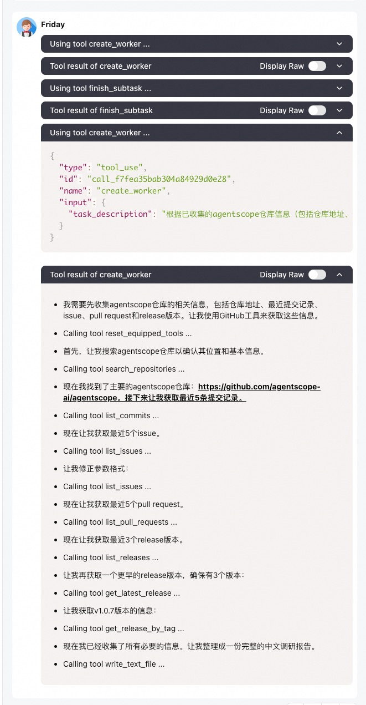
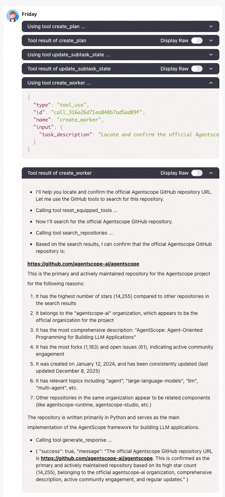

# Exemple de Meta Planner Agent

Dans cet exemple, nous montrons

- comment construire un agent planificateur capable de décomposer une tâche complexe en sous-tâches gérables et d'orchestrer des sous-agents pour les accomplir
- comment gérer correctement l'affichage des messages des sous-agents dans un système multi-agents
- comment propager les événements d'interruption des sous-agents vers l'agent planificateur principal

Concrètement, dans [main.py](./main.py), un agent planificateur est créé avec une instance de `PlanNotebook` pour créer et gérer des plans. Il est doté d'une fonction outil nommée `create_worker` dans [tool.py](./tool.py) pour créer dynamiquement des sous-agents et accomplir la sous-tâche assignée. Les sous-agents sont équipés d'outils de base et de serveurs MCP préconfigurés pour étendre leurs capacités.

> Nous recommandons d'utiliser AgentScope-Studio pour visualiser les interactions entre agents dans cet exemple.

## Démarrage rapide

Installez agentscope si ce n'est pas déjà fait :

```bash
pip install agentscope
```

Assurez-vous d'avoir défini votre clé API DashScope comme variable d'environnement.

Dans cet exemple, les sous-agents sont équipés des serveurs MCP suivants ; définissez les variables d'environnement correspondantes pour les activer.
Si elles ne sont pas définies, le MCP correspondant sera désactivé.
Pour plus de détails sur les outils, consultez [tool.py](./tool.py). Vous pouvez également ajouter ou modifier les outils selon vos besoins.

| MCP                      | Description                    | Environment Variable |
|--------------------------|--------------------------------|----------------------|
| AMAP MCP                 | Provide map related services   | GAODE_API_KEY        |
| GitHub MCP               | Search and access GitHub repos | GITHUB_TOKEN         |
| Microsoft Playwright MCP | Web Browser-use MCP server     | -                    |

Lancez l'exemple :

```bash
python main.py
```

Vous pouvez ensuite demander à l'agent planificateur de vous aider à accomplir une tâche complexe, par exemple "Conduct research on AgentScope repo".

Notez que pour les questions simples, l'agent planificateur peut répondre directement sans créer de sous-agents.

## Utilisation avancée

### Gestion de la sortie des sous-agents

Dans cet exemple, les sous-agents n'affichent pas les messages directement dans la console (via `agent.set_console_output_enable(True)` dans tool.py).
Au lieu de cela, leurs messages d'affichage sont renvoyés en flux continu à l'agent planificateur sous forme de réponses en streaming de la fonction outil `create_worker`.
De cette manière, seul l'agent planificateur est exposé à l'utilisateur, plutôt que de multiples agents, ce qui offre une meilleure expérience utilisateur.
Cependant, la réponse de la fonction outil `create_worker` peut consommer trop de longueur de contexte si le sous-agent accomplit la tâche donnée avec un long processus de raisonnement-action.

Cette figure montre comment la sortie du sous-agent est affichée en tant que réponse en streaming de l'outil dans AgentScope-Studio :

<details>
 <summary>Chinese</summary>
 <p align="center">
  
 </p>
</details>

<details>
 <summary>English</summary>
 <p align="center">
  
 </p>
</details>


Vous pouvez également choisir d'exposer le sous-agent à l'utilisateur, et de ne renvoyer que les résultats structurés à l'agent planificateur en tant que résultat de l'outil `create_worker`.

### Propagation des événements d'interruption

Dans `ReActAgent`, lorsque la réponse finale est générée par la fonction `handle_interrupt`, le champ metadata du message de retour
contiendra une clé `_is_interrupted` avec la valeur `True` pour indiquer que l'agent a été interrompu.

Grâce à ce champ, nous pouvons propager l'événement d'interruption du sous-agent vers l'agent planificateur principal dans la fonction outil `create_worker`.
Pour les classes d'agents définies par l'utilisateur, vous pouvez définir votre propre logique de propagation dans la fonction `handle_interrupt` de votre classe d'agent.

### Changement du LLM

L'exemple est construit avec le modèle de chat DashScope. Si vous souhaitez changer de modèle dans cet exemple, n'oubliez pas
de changer le formatter en même temps ! La correspondance entre les modèles intégrés et les formatters est
listée dans [notre tutoriel](https://doc.agentscope.io/tutorial/task_prompt.html#id1)

## Lectures complémentaires

- [Plan](https://doc.agentscope.io/tutorial/task_plan.html)
