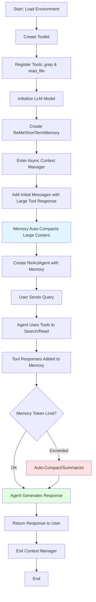

# Mémoire à court terme ReMe dans AgentScope

Cet exemple montre comment

- utiliser ReMeShortTermMemory pour fournir une gestion automatique de la mémoire de travail aux agents AgentScope,
- gérer les longs contextes de conversation avec un résumé et une compaction intelligents,
- intégrer la mémoire à court terme avec les agents ReAct pour une utilisation efficace des outils et une gestion du contexte, et
- configurer les modèles DashScope pour les opérations de mémoire.

## Pourquoi la mémoire à court terme ?

### Le défi : de l'ingénierie de prompts à l'ingénierie de contexte

À mesure que les agents IA ont évolué de simples chatbots vers des systèmes autonomes sophistiqués, l'attention s'est déplacée de l'ingénierie de prompts ("prompt engineering") vers l'ingénierie de contexte ("context engineering"). Alors que l'ingénierie de prompts se concentrait sur la rédaction d'instructions efficaces pour les modèles de langage, l'ingénierie de contexte aborde un défi plus fondamental : **gérer l'historique de conversation et d'exécution d'outils en constante croissance que les agents accumulent**.

### Le problème central : l'explosion du contexte

Les systèmes agentiques fonctionnent en liant les LLM à des outils et en les exécutant dans une boucle où l'agent décide quels outils appeler et réinjecte les résultats dans l'historique des messages. Cela crée un effet boule de neige :

- **Croissance rapide** : Une tâche apparemment simple peut déclencher plus de 50 appels d'outils, les agents en production exécutant souvent des centaines de tours de conversation
- **Sorties volumineuses** : Chaque appel d'outil peut renvoyer un texte substantiel, consommant des quantités massives de tokens
- **Pression sur la mémoire** : La fenêtre de contexte se remplit rapidement à mesure que les messages et les résultats d'outils s'accumulent chronologiquement

### La conséquence : la dégradation du contexte

Lorsque le contexte devient trop volumineux, les performances du modèle se dégradent significativement -- un phénomène connu sous le nom de **"context rot"** (dégradation du contexte) :

- **Réponses répétitives** : Le modèle commence à générer des réponses redondantes ou circulaires
- **Raisonnement plus lent** : L'inférence devient notablement plus lente à mesure que la longueur du contexte augmente
- **Dégradation de la qualité** : La qualité globale des réponses et la cohérence diminuent
- **Perte de concentration** : Le modèle peine à identifier les informations pertinentes dans le contexte surchargé

### Le paradoxe fondamental

Les agents font face à une tension critique :

- **Besoin d'un contexte riche** : Les agents nécessitent des informations historiques complètes pour prendre des décisions éclairées
- **Souffrent d'un contexte trop large** : Un contexte excessif cause une dégradation des performances et une inefficacité

**La gestion du contexte vise à maintenir "juste assez" d'informations dans la fenêtre** -- suffisamment pour une prise de décision efficace tout en laissant de la place pour la récupération et l'expansion, sans surcharger le modèle.

### Pourquoi la gestion de la mémoire à court terme est importante

Une gestion efficace de la mémoire à court terme est essentielle pour :

1. **Maintenir les performances** : Garder le contexte dans une taille optimale prévient la dégradation de la qualité
2. **Permettre les tâches de longue durée** : Les agents peuvent gérer des flux de travail complexes en plusieurs étapes sans atteindre les limites de contexte
3. **Efficacité des coûts** : Réduire l'utilisation des tokens diminue directement les coûts d'API
4. **Préserver la qualité du raisonnement** : Un contexte propre et ciblé aide les modèles à maintenir des chaînes de raisonnement cohérentes
5. **Scalabilité** : Une gestion appropriée de la mémoire permet aux agents de passer à l'échelle pour des charges de travail en production

### La solution : gestion intelligente du contexte

ReMeShortTermMemory implémente des stratégies éprouvées de gestion du contexte :

- **Déchargement du contexte** : Déplacer les sorties volumineuses d'outils vers un stockage externe tout en conservant les références
- **Réduction du contexte** : Compacter les résultats d'outils en représentations minimales et résumer si nécessaire
- **Rétention intelligente** : Conserver les messages récents intacts pour maintenir la continuité et fournir des exemples d'utilisation
- **Déclenchement automatique** : Surveiller l'utilisation des tokens et appliquer les stratégies avant que les performances ne se dégradent

En implémentant ces stratégies, ReMeShortTermMemory permet aux agents de gérer des conversations arbitrairement longues et des tâches complexes tout en maintenant des performances optimales tout au long du processus.

## Prérequis

- Python 3.10 ou supérieur
- Clé API DashScope d'Alibaba Cloud


## Démarrage rapide

Installez agentscope et assurez-vous d'avoir une clé API DashScope valide dans vos variables d'environnement.

> Note : L'exemple est construit avec le modèle de chat DashScope. Si vous souhaitez utiliser des modèles OpenAI à la place,
> modifiez l'initialisation du modèle dans le code d'exemple en conséquence.

```bash
# Installer agentscope depuis les sources
cd {PATH_TO_AGENTSCOPE}
pip install -e .
# Installer les dépendances
pip install reme-ai python-dotenv
```

Configurez votre clé API :

```bash
export DASHSCOPE_API_KEY='YOUR_API_KEY'
```

Ou créez un fichier `.env` :

```bash
DASHSCOPE_API_KEY=YOUR_API_KEY
```

Exécutez l'exemple :

```bash
python short_term_memory_example.py
```

L'exemple va :
1. Initialiser une instance ReMeShortTermMemory avec des modèles DashScope
2. Démontrer la compaction automatique de la mémoire pour les longues réponses d'outils
3. Montrer l'intégration avec ReActAgent pour des conversations contextuelles
4. Utiliser les outils grep et read_file pour rechercher et récupérer des informations dans les fichiers

## Fonctionnalités clés

- **Gestion automatique de la mémoire** : Résumé et compaction intelligents de la mémoire de travail pour gérer les longs contextes
- **Optimisation des réponses d'outils** : Troncature et résumé automatiques des longues réponses d'outils pour respecter les limites de tokens
- **Configuration flexible** : Seuils configurables pour le ratio de compaction, les limites de tokens et la rétention des messages récents
- **Intégration ReAct Agent** : Intégration transparente avec le système ReActAgent et d'outils d'AgentScope
- **Opérations asynchrones** : Support asynchrone complet pour des opérations de mémoire non bloquantes

## Utilisation de base

Cette section fournit une présentation détaillée du code `short_term_memory_example.py`, expliquant comment chaque composant fonctionne ensemble pour créer un agent avec une gestion intelligente du contexte.

### Paramètres de configuration

#### Paramètres de la classe `ReMeShortTermMemory`

La classe `ReMeShortTermMemory` accepte les paramètres d'initialisation suivants :

- **`model`** (`DashScopeChatModel | OpenAIChatModel | None`) : Modèle de langage pour les opérations de compression. Doit être soit `DashScopeChatModel` soit `OpenAIChatModel`. Ce modèle est utilisé pour la compression basée sur le LLM lors de la génération de snapshots d'état compacts. **Requis**.

- **`reme_config_path`** (`str | None`) : Chemin optionnel vers le fichier de configuration ReMe pour des paramètres personnalisés. Utilisez-le pour fournir des configurations ReMe avancées au-delà des paramètres standards. Par défaut : `None`.

- **`working_summary_mode`** (`str`) : Stratégie pour la gestion de la mémoire de travail. Contrôle la façon dont le système de mémoire gère le débordement de contexte :
  - `"compact"` : Compacter uniquement les messages d'outils verbeux en stockant le contenu complet en externe et en gardant de courts aperçus dans le contexte actif.
  - `"compress"` : Appliquer uniquement la compression basée sur le LLM pour générer des snapshots d'état compacts de l'historique de conversation.
  - `"auto"` : Exécuter d'abord la compaction, puis optionnellement la compression si le ratio de compaction dépasse `compact_ratio_threshold`. C'est le mode recommandé pour la plupart des cas d'utilisation.

  Par défaut : `"auto"`.

- **`compact_ratio_threshold`** (`float`) : Seuil d'efficacité de la compaction en mode AUTO. Si `(compacted_tokens / original_tokens) > compact_ratio_threshold`, la compression est appliquée après la compaction. Cela garantit que la compression ne s'exécute que lorsque la compaction seule n'est pas suffisante. Plage valide : 0.0 à 1.0. Par défaut : `0.75`.

- **`max_total_tokens`** (`int`) : Seuil maximum de nombre de tokens avant le déclenchement de la compression. Cette limite n'inclut **pas** les messages `keep_recent_count` ni les messages système, qui sont toujours préservés. Devrait être défini entre 20% et 50% de la taille de la fenêtre de contexte de votre modèle pour laisser de la place aux nouveaux appels et réponses d'outils. Par défaut : `20000`.

- **`max_tool_message_tokens`** (`int`) : Nombre maximum de tokens pour les messages d'outils individuels avant compaction. Les messages d'outils dépassant cette limite sont stockés en externe dans des fichiers, avec seulement un court aperçu conservé dans le contexte actif. C'est la longueur maximale tolérable pour une seule réponse d'outil. Par défaut : `2000`.

- **`group_token_threshold`** (`int | None`) : Nombre maximum de tokens par groupe de compression lors du découpage des messages pour la compression LLM. Lorsqu'il est défini sur un entier positif, les longues séquences de messages sont découpées en lots plus petits pour la compression. Si `None` ou `0`, tous les messages sont compressés en un seul groupe. Utilisez-le pour contrôler la granularité des opérations de compression. Par défaut : `None`.

- **`keep_recent_count`** (`int`) : Nombre de messages les plus récents à préserver sans compression ni compaction. Ces messages restent intégralement dans le contexte actif pour maintenir la continuité de la conversation et fournir des exemples d'utilisation à l'agent. L'exemple utilise `1` à des fins de démonstration ; **en production, une valeur de `10` est recommandée** pour maintenir un meilleur flux de conversation. Par défaut : `10`.

- **`store_dir`** (`str`) : Chemin du répertoire pour stocker le contenu de messages déchargé et les fichiers d'historique compressé. C'est là que sont sauvegardés les fichiers externes contenant les réponses complètes d'outils et l'historique des messages compressés. Le répertoire sera créé automatiquement s'il n'existe pas. Par défaut : `"inmemory"`.

- **`**kwargs`** (`Any`) : Arguments supplémentaires passés à l'initialisation de `ReMeApp`. Utilisez-les pour transmettre toute option de configuration supplémentaire prise en charge par l'application ReMe sous-jacente.

#### Relations entre les paramètres et bonnes pratiques

- **Stratégie de budget de tokens** : Définissez `max_total_tokens` entre 20% et 50% de la fenêtre de contexte de votre modèle. Par exemple, si votre modèle a une fenêtre de contexte de 128K, définissez `max_total_tokens` entre 25 600 et 64 000 tokens.

- **Compaction vs Compression** :
  - La compaction est rapide et sans perte (le contenu complet est stocké en externe)
  - La compression est plus lente mais plus agressive (utilise le LLM pour résumer)
  - Utilisez le mode `"auto"` pour bénéficier des deux stratégies

- **Rétention des messages récents** : Des valeurs plus élevées de `keep_recent_count` (par ex., 10) offrent une meilleure continuité de contexte mais consomment plus de tokens. Des valeurs plus basses (par ex., 1) sont plus agressives mais peuvent perdre du contexte récent important.

- **Gestion des messages d'outils** : Ajustez `max_tool_message_tokens` en fonction de la taille typique des réponses de vos outils. Si vos outils renvoient fréquemment des sorties volumineuses (par ex., contenu de fichiers, réponses API), envisagez un seuil plus élevé ou assurez-vous que la compaction est activée.

### Diagramme de flux du code



### Présentation détaillée du code étape par étape

L'exemple démontre un flux de travail complet de l'enregistrement des outils à l'interaction avec l'agent. Voici une analyse détaillée :

#### 1. Configuration de l'environnement et imports

```python
import asyncio
import os
from dotenv import load_dotenv

load_dotenv()
```

Le code commence par charger les variables d'environnement (y compris la clé API DashScope) depuis un fichier `.env`.

#### 2. Enregistrement des outils

L'exemple définit deux outils personnalisés qui montrent comment intégrer des opérations de récupération :

**Outil `grep`** : Recherche des motifs dans les fichiers en utilisant des expressions régulières
```python
async def grep(file_path: str, pattern: str, limit: str) -> ToolResponse:
    """A powerful search tool for finding patterns in files..."""
    from reme_ai.retrieve.working import GrepOp

    op = GrepOp()
    await op.async_call(file_path=file_path, pattern=pattern, limit=limit)
    return ToolResponse(
        content=[TextBlock(type="text", text=op.output)],
    )
```

**Outil `read_file`** : Lit des plages de lignes spécifiques dans les fichiers
```python
async def read_file(file_path: str, offset: int, limit: int) -> ToolResponse:
    """Reads and returns the content of a specified file..."""
    from reme_ai.retrieve.working import ReadFileOp

    op = ReadFileOp()
    await op.async_call(file_path=file_path, offset=offset, limit=limit)
    return ToolResponse(
        content=[TextBlock(type="text", text=op.output)],
    )
```

> **Note importante sur la substituabilité des outils** :
> - Les outils `grep` et `read_file` présentés ici sont des **implémentations d'exemple** utilisant les opérations intégrées de ReMe
> - Vous pouvez **les remplacer par vos propres outils de récupération**, tels que :
>   - Récupération par embeddings de bases de données vectorielles (par ex., ChromaDB, Pinecone, Weaviate)
>   - API de recherche web (par ex., Google Search, Bing Search)
>   - Outils de requêtes de bases de données (par ex., requêtes SQL, requêtes MongoDB)
>   - Solutions de recherche spécifiques au domaine personnalisées
> - De même, les **opérations d'écriture hors ligne** (utilisées en interne par ReMeShortTermMemory pour stocker le contenu compacté) peuvent être personnalisées en modifiant la fonction `write_text_file` dans le système d'outils d'AgentScope
> - L'exigence clé est que vos outils renvoient des objets `ToolResponse` avec des blocs de contenu appropriés

#### 3. Initialisation du modèle LLM

```python
llm = DashScopeChatModel(
    model_name="qwen3-coder-30b-a3b-instruct",
    api_key=os.environ.get("DASHSCOPE_API_KEY"),
    stream=False,
    generate_kwargs={
        "temperature": 0.001,
        "seed": 0,
    },
)
```

Le modèle est configuré avec une température basse pour des réponses cohérentes et déterministes. Ce même modèle sera utilisé à la fois pour le raisonnement de l'agent et les opérations de résumé de la mémoire.

#### 4. Initialisation de la mémoire à court terme

```python
short_term_memory = ReMeShortTermMemory(
    model=llm,
    working_summary_mode="auto",           # Gestion automatique de la mémoire
    compact_ratio_threshold=0.75,          # Déclencher la compaction à 75% de capacité
    max_total_tokens=20000,                # Définir entre 20% et 50% de la fenêtre de contexte du modèle
    max_tool_message_tokens=2000,          # Longueur maximale tolérable de réponse d'outil
    group_token_threshold=None,            # Tokens max par lot de compression LLM ; None signifie pas de découpage
    keep_recent_count=1,                   # Garder 1 message récent intact (défini à 1 pour la démo ; utiliser 10 en production)
    store_dir="inmemory",            # Répertoire de stockage pour le contenu déchargé
)
```

Cette configuration active la gestion automatique de la mémoire qui va :
- Surveiller l'utilisation des tokens
- Compacter automatiquement les longues réponses d'outils lorsqu'elles dépassent `max_tool_message_tokens`
- Déclencher le résumé lorsque le total de tokens dépasse `max_total_tokens` et que le ratio de compaction dépasse `compact_ratio_threshold`

#### 5. Utilisation du gestionnaire de contexte asynchrone

```python
async with short_term_memory:
    # Toutes les opérations de mémoire se déroulent ici
```

L'instruction `async with` assure l'initialisation et le nettoyage appropriés des ressources de mémoire. C'est l'approche recommandée pour utiliser `ReMeShortTermMemory`.

#### 6. Simulation d'un long contexte

L'exemple démontre la compaction de la mémoire en ajoutant une longue réponse d'outil :

```python
# Lire le contenu du README et le multiplier par 10 pour simuler une longue réponse
f = open("../../../../README.md", encoding="utf-8")
readme_content = f.read()
f.close()

memories = [
    {
        "role": "user",
        "content": "搜索下项目资料",
    },
    {
        "role": "assistant",
        "content": None,
        "tool_calls": [...],  # Métadonnées d'appel d'outil
    },
    {
        "role": "tool",
        "content": readme_content * 10,  # Longue réponse d'outil (10x README)
        "tool_call_id": "call_6596dafa2a6a46f7a217da",
    },
]

await short_term_memory.add(
    ReMeShortTermMemory.list_to_msg(memories),
    allow_duplicates=True,
)
```

Lorsque ce contenu volumineux est ajouté, `ReMeShortTermMemory` va :
1. Détecter que la réponse d'outil dépasse `max_tool_message_tokens` (la longueur maximale tolérable de réponse d'outil, définie à 2000 dans cet exemple)
2. La compacter automatiquement en stockant le contenu complet dans un fichier externe
3. Ne garder qu'un court aperçu dans la mémoire active
4. Cela se produit de manière transparente sans intervention manuelle

#### 7. Création de l'agent ReAct

```python
agent = ReActAgent(
    name="react",
    sys_prompt=(
        "You are a helpful assistant. "
        "工具调用的调用可能会被缓存到本地。"
        "可以先使用`Grep`匹配关键词或者正则表达式所在行数，然后通过`ReadFile`读取位置附近的代码。"
        # ... plus d'instructions
    ),
    model=llm,
    formatter=DashScopeChatFormatter(),
    toolkit=toolkit,
    memory=short_term_memory,  # La mémoire est intégrée ici
    max_iters=20,
)
```

L'agent est configuré avec :
- Le même modèle LLM utilisé pour les opérations de mémoire
- Le toolkit contenant les outils `grep` et `read_file`
- L'instance `short_term_memory` pour la gestion automatique du contexte
- Un prompt système qui guide l'agent sur les schémas d'utilisation des outils

#### 8. Interaction avec l'agent

```python
msg = Msg(
    role="user",
    content=("项目资料中，agentscope_v1论文的一作是谁？"),
    name="user",
)
msg = await agent(msg)
print(f"✓ Agent response: {msg.get_text_content()}\n")
```

Lorsque l'agent traite ce message :
1. Il reçoit la requête de l'utilisateur
2. Décide d'utiliser des outils (par ex., `grep` pour rechercher "agentscope_v1")
3. Les réponses d'outils sont automatiquement ajoutées à la mémoire
4. Si la mémoire devient trop volumineuse, une compaction automatique se produit
5. L'agent génère une réponse basée sur le contexte géré
6. La réponse est renvoyée à l'utilisateur

### Structure complète du code d'exemple

```python
async def main() -> None:
    # 1. Créer le toolkit et enregistrer les outils
    toolkit = Toolkit()
    toolkit.register_tool_function(grep)
    toolkit.register_tool_function(read_file)

    # 2. Initialiser le LLM
    llm = DashScopeChatModel(...)

    # 3. Créer la mémoire à court terme
    short_term_memory = ReMeShortTermMemory(...)

    # 4. Utiliser le gestionnaire de contexte asynchrone
    async with short_term_memory:
        # 5. Ajouter les messages initiaux (avec du contenu volumineux pour démontrer la compaction)
        await short_term_memory.add(messages, allow_duplicates=True)

        # 6. Créer l'agent avec la mémoire
        agent = ReActAgent(..., memory=short_term_memory, ...)

        # 7. Interagir avec l'agent
        response = await agent(user_message)
```

### Points clés à retenir

1. **Gestion automatique de la mémoire** : La compaction et le résumé de la mémoire se produisent automatiquement lorsque les seuils sont dépassés
2. **Intégration des outils** : Les outils renvoient des objets `ToolResponse` qui sont intégrés de manière transparente dans la mémoire
3. **Gestionnaire de contexte asynchrone** : Utilisez toujours `async with short_term_memory:` pour assurer une gestion appropriée des ressources
4. **Système d'outils flexible** : Les outils `grep` et `read_file` sont des exemples -- vous pouvez les remplacer par tout mécanisme de récupération adapté à votre cas d'utilisation
5. **Fonctionnement transparent** : La gestion de la mémoire est transparente pour l'agent -- il ne voit qu'un contexte propre et ciblé

### Utilisation du gestionnaire de contexte asynchrone

`ReMeShortTermMemory` implémente le protocole de gestionnaire de contexte asynchrone, qui assure l'initialisation et le nettoyage appropriés des ressources. Il existe deux façons de l'utiliser :

#### Recommandé : utilisation de l'instruction `async with`

L'approche recommandée est d'utiliser l'instruction `async with`, qui gère automatiquement les ressources :

```python
async with short_term_memory:
    # La mémoire est initialisée ici
    await short_term_memory.add(messages)
    response = await agent(msg)
    # La mémoire est automatiquement nettoyée à la sortie du bloc
```

#### Alternative : appels manuels `__aenter__` et `__aexit__`

Vous pouvez également appeler manuellement `__aenter__` et `__aexit__` si vous avez besoin de plus de contrôle :

```python
# Initialisation manuelle
await short_term_memory.__aenter__()

try:
    # Utiliser la mémoire
    await short_term_memory.add(messages)
    response = await agent(msg)
finally:
    # Nettoyage manuel
    await short_term_memory.__aexit__(None, None, None)
```

> **Note** : Il est recommandé d'utiliser l'instruction `async with` car elle assure un nettoyage approprié des ressources même en cas d'exception.

## Configuration avancée

Vous pouvez personnaliser la configuration ReMe en passant un chemin de configuration :

```python
short_term_memory = ReMeShortTermMemory(
    model=llm,
    reme_config_path="path/to/your/config.yaml",  # Passez votre configuration ReMe personnalisée
    # ... autres paramètres
)
```

Pour plus d'options de configuration, consultez la [documentation ReMe](https://github.com/agentscope-ai/ReMe).

## Contenu de l'exemple

Le fichier `short_term_memory_example.py` démontre :

1. **Intégration des outils** : Enregistrement des outils `grep` et `read_file` pour la recherche et la lecture de fichiers
2. **Initialisation de la mémoire** : Configuration de ReMeShortTermMemory avec des paramètres appropriés pour la gestion des longs contextes
3. **Gestion des longs contextes** : Ajout d'une longue réponse d'outil (contenu du README x 10) pour démontrer la compaction automatique de la mémoire
4. **Utilisation de ReAct Agent** : Utilisation de l'agent avec la mémoire à court terme pour répondre aux questions basées sur les informations récupérées

## Flux de travail de l'exemple

L'exemple montre un flux de travail typique :

1. L'utilisateur demande de rechercher des informations sur le projet
2. L'agent utilise l'outil `grep` pour trouver du contenu pertinent
3. L'agent utilise l'outil `read_file` pour lire des sections spécifiques
4. Les longues réponses d'outils sont automatiquement compactées par le système de mémoire
5. L'agent répond à la question de l'utilisateur en se basant sur les informations récupérées
