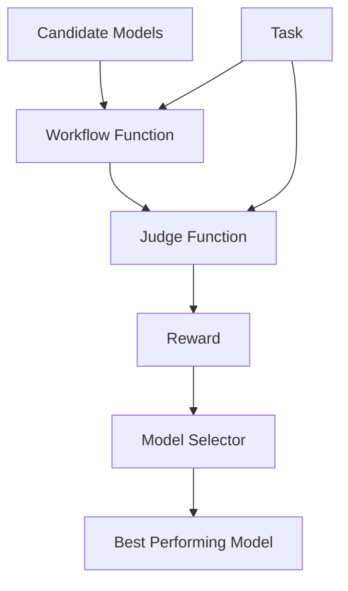

# Guide de sélection de modèles

AgentScope fournit un sous-module `model_selection` dans le module tuner pour sélectionner automatiquement le modèle le plus performant parmi un ensemble de candidats en fonction de métriques d'évaluation. Ce guide vous accompagne à travers les étapes pour évaluer et sélectionner le modèle optimal pour votre workflow d'agents.

## Vue d'ensemble

La sélection de modèles est le processus de choix du modèle le plus performant parmi un ensemble de modèles candidats en fonction de leurs performances sur un jeu de données. Pour utiliser la sélection de modèles, vous devez comprendre trois composants :

1. **Fonction de workflow** : Une fonction asynchrone qui prend une tâche et un modèle, exécute la tâche avec le modèle et retourne une sortie de workflow.
2. **Fonction de jugement** : Une fonction qui évalue la sortie du workflow et retourne une récompense indiquant la performance.
3. **Jeu de données de tâches** : Un jeu de données contenant des échantillons pour l'évaluation.

Le diagramme suivant illustre la relation entre ces composants :



## Comment implémenter

Nous utilisons ici un scénario de traduction comme exemple pour illustrer comment implémenter les trois composants ci-dessus.

Supposons que vous ayez un workflow d'agent qui effectue de la traduction en utilisant le `ReActAgent`.

```python
from agentscope.agent import ReActAgent
from agentscope.model import ChatModelBase

async def run_translation_agent(text: str, model: ChatModelBase):
    agent = ReActAgent(
        name="translator",
        sys_prompt="You are a helpful translation agent. Translate the given text accurately, and only output the translated text.",
        model=model,
        formatter=OpenAIChatFormatter(),
    )

    response = await agent.reply(
        msg=Msg("user", f"Translate the following text between English and Chinese: {text}", role="user"),
    )

    print(response)
```

### Étape 1 : Préparer le jeu de données de tâches

Pour évaluer les modèles sur des tâches de traduction, vous avez besoin d'un jeu de données contenant des échantillons de textes sources et leurs traductions de référence correspondantes.

Le jeu de données doit être organisé dans un format compatible avec la fonction `datasets.load_dataset` (ex. : JSONL, Parquet, CSV) ou provenir de jeux de données en ligne huggingface. Pour les tâches de traduction, votre fichier de données (comme `translate_data/test.json`) pourrait contenir des échantillons tels que :

```json
  {
    "question": "量子退相干是限制量子计算机可扩展性的主要障碍之一。",
    "answer": "Quantum decoherence is one of the primary obstacles limiting the scalability of quantum computers."
  }
```


### Étape 2 : Définir une fonction de workflow

La fonction de workflow prend un dictionnaire de tâche et un modèle en entrée, et retourne un `WorkflowOutput`. Le sélecteur de modèles appellera cette fonction avec différents modèles pendant l'évaluation.

```python
async def translation_workflow(
    task: Dict,
    model: ChatModelBase,
) -> WorkflowOutput:
    """Run the translation workflow on a single task with the given model."""
    ...
```

- Entrées :
    - `task` : Un dictionnaire représentant une tâche d'entraînement individuelle issue du jeu de données.
    - `model` : Le modèle à utiliser dans le workflow. Il sera évalué par le sélecteur.

- Retour :
    - `WorkflowOutput` : Un objet contenant la réponse de l'agent.

Voici une version remaniée de la fonction `run_translation_agent` originale pour correspondre au schéma de la fonction de workflow.

**Modifications clés par rapport à la fonction originale** :

1. Ajout de `model` comme paramètre de la fonction de workflow.
2. Utilisation du `model` en entrée pour initialiser l'agent.
3. Utilisation du champ `question` du dictionnaire `task` comme texte source pour la traduction.
4. Retour d'un objet `WorkflowOutput` contenant la réponse de l'agent.

```python
from agentscope.agent import ReActAgent
from agentscope.formatter import OpenAIChatFormatter
from agentscope.tuner import WorkflowOutput
from agentscope.message import Msg

async def translation_workflow(
    task: Dict,
    model: ChatModelBase,
) -> WorkflowOutput:
    agent = ReActAgent(
        name="translator",
        sys_prompt="You are a helpful translation agent. Translate the given text accurately, and only output the translated text.",
        model=model,
        formatter=OpenAIChatFormatter(),
    )

    # Extract source text from task
    source_text = task.get("question", "") if isinstance(task, dict) else str(task)

    # Create a message with the translation request
    prompt = f"Translate the following text between English and Chinese: {source_text}"
    msg = Msg(name="user", content=prompt, role="user")

    # Get response from the agent
    response = await agent.reply(msg=msg)

    return WorkflowOutput(
        response=response,
    )
```

### Étape 3 : Implémenter la fonction de jugement

La fonction de jugement évalue la réponse du workflow et retourne une récompense. Des valeurs de récompense plus élevées indiquent de meilleures performances.

```python
async def judge_function(
    task: Dict,
    response: Any,
) -> JudgeOutput:
    """Calculate reward based on the input task and workflow's response."""
```

- Entrées :
    - `task` : Un dictionnaire représentant une tâche d'entraînement individuelle.
    - `response` : Un dictionnaire composite contenant :
        - `"response"` : La réponse effective de la fonction de workflow.
        - `"metrics"` : Les métriques du workflow incluant le temps d'exécution et l'utilisation de tokens.

- Sorties :
    - `JudgeOutput` : Un objet contenant :
        - `reward` : Un scalaire flottant représentant la récompense (plus élevé est meilleur).
        - `metrics` : Dictionnaire optionnel de métriques supplémentaires.

Voici un exemple d'implémentation pour les tâches de traduction utilisant le score BLEU (veuillez d'abord installer le package `sacrebleu` via pip) :

```python
from agentscope.tuner import JudgeOutput

async def bleu_judge(
    task: Dict,
    response: Any,
) -> JudgeOutput:
    """Calculate BLEU score for translation quality."""
    # Lazy import to follow the requirement
    import sacrebleu

    # Extract response text from the composite dict
    response_content = response["response"]
    response_str = response_content.get_text_content()

    # Extract reference translation
    reference_translation = task.get("answer", "") if isinstance(task, dict) else ""

    # Calculate BLEU score
    ref = reference_translation.strip()
    pred = response_str.strip()
    bleu_score = sacrebleu.sentence_bleu(pred, [ref])

    return JudgeOutput(
        reward=bleu_score.score,
        metrics={
            "bleu": bleu_score.score/100,
            "brevity_penalty": bleu_score.bp,
            "ratio": bleu_score.ratio
        }
    )
```

AgentScope.tuner fournit également des fonctions de jugement intégrées pour les métriques courantes d'efficacité des workflows, telles que le temps d'exécution et l'utilisation de tokens dans example_token_usage.py :

```python
from agentscope.tuner.model_selection import avg_time_judge, avg_token_consumption_judge

# For selecting based on fastest execution time
judge_function = avg_time_judge

# For selecting based on lowest token consumption
judge_function = avg_token_consumption_judge
```

### Étape 4 : Lancer la sélection de modèles

Utilisez l'interface `select_model` pour trouver le modèle le plus performant.

```python
from agentscope.tuner import DatasetConfig
from agentscope.tuner.model_selection import select_model
from agentscope.model import DashScopeChatModel
import os

# your workflow / judge function and candidate models here...

if __name__ == "__main__":
    # Define your candidate models
    model1 = DashScopeChatModel(
        "qwen3-max-2025-09-23",
        api_key=os.environ.get("DASHSCOPE_API_KEY", ""),
        max_tokens=1024,
    )
    model2 = DashScopeChatModel(
        "deepseek-r1",
        api_key=os.environ.get("DASHSCOPE_API_KEY", ""),
        max_tokens=1024,
    )

    best_model, metrics = select_model(
        workflow_func=translation_workflow,
        judge_func=bleu_judge,
        train_dataset=DatasetConfig(path="examples/tuner/model_selection/translate_data.json"),
        candidate_models=[model1, model2],
    )

    print(f"Best model: {best_model.model_name}")
    print(f"Performance metrics: {metrics}")
```

---

> **Note** : En plus de la fonction de jugement par score BLEU présentée dans cet exemple, vous pouvez également implémenter des fonctions de jugement personnalisées pour votre cas d'utilisation spécifique. Alternativement, vous pouvez utiliser les fonctions intégrées pour optimiser l'efficacité des workflows telles que les fonctions de jugement par temps et par utilisation de tokens, disponibles dans `example_token_usage.py`.

---

## Comment exécuter

Après avoir implémenté la fonction de workflow et la fonction de jugement, suivez ces étapes pour lancer la sélection de modèles :

1. Prérequis

    - Configurez votre clé API comme variable d'environnement :

      ```bash
      export DASHSCOPE_API_KEY="your_api_key_here"
      ```

    - Préparez votre jeu de données dans un format supporté (JSONL, Parquet, CSV, etc.).

    - Installez les dépendances requises si ce n'est pas déjà fait :

      ```bash
      pip install datasets
      ```

2. Exécutez le script de sélection

    ```bash
    python example_token_usage.py  # or other example files in this directory
    ```

3. Le modèle le plus performant sera retourné accompagné des métriques de performance.

## Sortie

```
Evaluating 3 candidate models: ['qwen3-max', 'deepseek-r1', 'glm-4.7']

INFO:agentscope.tuner.model_selection._model_selection:Model evaluation results:
INFO:agentscope.tuner.model_selection._model_selection:  qwen3-max: 61.8407
INFO:agentscope.tuner.model_selection._model_selection:  deepseek-r1: 43.5547
INFO:agentscope.tuner.model_selection._model_selection:  glm-4.7: 48.8801

Selected best model: qwen3-max-2025-09-23
Metrics: {'bleu_avg': 0.6184069765855449, 'brevity_penalty_avg': 0.9900344064325004, 'ratio_avg': 1.070816065067906}
```

---

## Cas d'utilisation

La sélection de modèles est particulièrement utile pour :

| Scénario | Avantage |
|----------|---------|
| **Optimisation des performances** | Identifier le modèle qui atteint la meilleure précision/récompense sur votre tâche spécifique |
| **Efficacité des coûts** | Sélectionner les modèles qui atteignent la performance souhaitée avec des coûts de calcul plus faibles |
| **Exigences de latence** | Choisir les modèles qui respectent vos contraintes de vitesse/latence |
| **Contraintes de ressources** | Trouver le meilleur modèle qui s'adapte à vos limitations matérielles |

> [!TIP]
> La sélection de modèles est idéale lorsque vous disposez de plusieurs modèles et souhaitez identifier systématiquement lequel est le plus performant pour votre cas d'utilisation spécifique.
