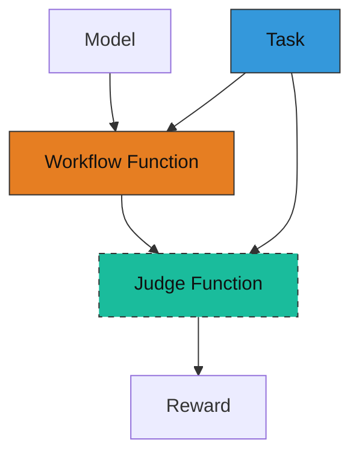
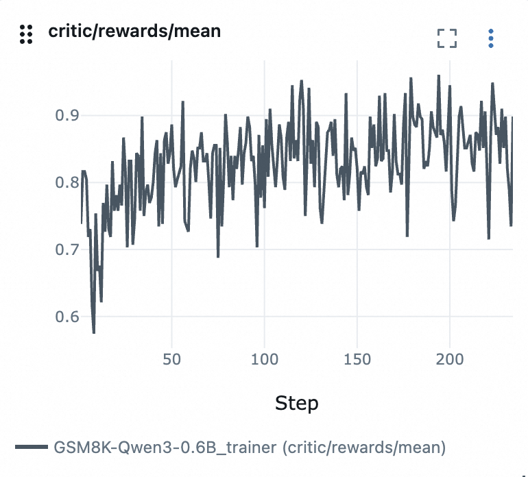

# Guide d'ajustement de modèles

AgentScope fournit un sous-module `tuner` pour entraîner les workflows d'agents en utilisant l'apprentissage par renforcement (RL).
Ce guide vous accompagne à travers les étapes pour implémenter et entraîner un workflow d'agent en utilisant le RL avec AgentScope Tuner.

## Vue d'ensemble

Pour entraîner votre workflow d'agent en utilisant le RL, vous devez comprendre trois composants :

1. **Fonction de workflow** : Restructurez votre workflow d'agent en une fonction de workflow qui respecte la signature d'entrée/sortie spécifiée.
2. **Fonction de jugement** : Implémentez une fonction de jugement qui calcule les récompenses en fonction des réponses de l'agent.
3. **Jeu de données de tâches** : Préparez un jeu de données contenant des échantillons d'entraînement pour l'apprentissage de l'agent.

Le diagramme suivant illustre la relation entre ces composants :



## Comment implémenter

Nous utilisons ici un scénario de résolution de problèmes mathématiques comme exemple pour illustrer comment implémenter les trois composants ci-dessus.

Supposons que vous ayez un workflow d'agent qui résout des problèmes mathématiques en utilisant le `ReActAgent`.

```python
from agentscope.agent import ReActAgent

async def run_react_agent(query: str):
    # model = ...  # Initialize your ChatModel here

    agent = ReActAgent(
        name="react_agent",
        sys_prompt="You are a helpful math problem solving agent.",
        model=model,
        enable_meta_tool=True,
        formatter=OpenAIChatFormatter(),
    )

    response = await agent.reply(
        msg=Msg("user", query, role="user"),
    )

    print(response)
```

### Étape 1 : Préparer le jeu de données de tâches

Pour entraîner l'agent à résoudre des problèmes mathématiques, vous avez besoin d'un jeu de données d'entraînement contenant des échantillons de problèmes mathématiques et leurs réponses correctes correspondantes.

Le jeu de données doit être organisé au format huggingface [datasets](https://huggingface.co/docs/datasets/quickstart) et peut être chargé avec la fonction `datasets.load_dataset`. Par exemple :

```
my_dataset/
    ├── train.jsonl  # samples for training
    └── test.jsonl   # samples for evaluation
```

Supposons que votre `train.jsonl` contienne des échantillons tels que :

```json
{"question": "What is 2 + 2?", "answer": "4"}
{"question": "What is 4 + 4?", "answer": "8"}
```

Notez que le format des échantillons de tâches peut varier selon votre scénario spécifique. Le point essentiel est que chaque échantillon doit contenir les informations nécessaires pour que l'agent puisse accomplir la tâche et pour évaluer la qualité de la réponse.

Vous pouvez prévisualiser votre jeu de données avec le code suivant :

```python
from agentscope.tuner import DatasetConfig

DatasetConfig(path="my_dataset", split="train").preview()

# Output:
# [
#   {
#     "question": "What is 2 + 2?",
#     "answer": "4"
#   },
#   {
#     "question": "What is 4 + 4?",
#     "answer": "8"
#   }
# ]
```

### Étape 2 : Définir une fonction de workflow

Pour entraîner un workflow d'agent en utilisant le RL, vous devez restructurer votre agent avec la signature suivante.

```python
async def workflow_function(
    task: Dict,
    model: ChatModelBase,
    auxiliary_models: Optional[Dict[str, ChatModelBase]]=None,
) -> WorkflowOutput:
    """Run the agent workflow on a single task and return a scalar reward."""
```

- Entrées :
    - `task` : Un dictionnaire représentant une tâche d'entraînement individuelle, converti à partir d'un échantillon du jeu de données d'entraînement. Par exemple, en utilisant le jeu de données préparé à l'étape 1, le `task` est un dictionnaire contenant les champs `question` et `answer`.
    - `model` : Une instance de `ChatModelBase`, qui possède la même interface que `OpenAIChatModel`, mais prend en charge la conversion automatique de l'historique des invocations en données entraînables.
    - `auxiliary_models` : Un dictionnaire de modèles auxiliaires pouvant être utilisés dans le workflow. Les clés sont les noms des modèles et les valeurs sont des instances de `ChatModelBase`. Ces modèles diffèrent du `model` principal en ce qu'ils ne sont pas directement entraînés, mais peuvent être utilisés pour assister le modèle principal dans l'accomplissement de la tâche (ex. : agir en tant que juge). Dictionnaire vide si aucun modèle auxiliaire n'est nécessaire.

- Sorties :
    - `WorkflowOutput` : Un objet contenant la sortie de la fonction de workflow, qui comprend :
        - `reward` : Un scalaire flottant représentant la récompense obtenue par la fonction de workflow. Remplissez ce champ si vous souhaitez retourner directement la récompense depuis la fonction de workflow. Sinon, vous pouvez le laisser à `None` et implémenter le calcul de la récompense dans la fonction de jugement.
        - `response` : La sortie de la fonction de workflow, qui peut être la réponse de l'agent ou d'autres types de sorties selon l'implémentation de votre fonction de workflow. Utilisée pour le calcul de la récompense dans la fonction de jugement. Si vous n'avez pas besoin de calculer la récompense dans la fonction de jugement, vous pouvez le laisser à `None`.
        - `metrics` : Un dictionnaire de métriques supplémentaires pouvant être enregistrées pendant l'entraînement. Laissez-le à `None` si aucune métrique supplémentaire n'est nécessaire.


Voici une version remaniée de la fonction `run_react_agent` originale pour correspondre à la signature de la fonction de workflow.

**Il n'y a que 3 modifications mineures par rapport à la fonction originale** :

1. Utilisation du `model` en entrée pour initialiser l'agent.
2. Utilisation du champ `question` du dictionnaire `task` comme requête utilisateur.
3. Retour d'un objet `WorkflowOutput` contenant la réponse de l'agent.

```python
from agentscope.agent import ReActAgent
from agentscope.formatter import OpenAIChatFormatter
from agentscope.tuner import WorkflowOutput
from agentscope.message import Msg

async def run_react_agent(
    task: Dict,
    model: ChatModelBase,
    auxiliary_models: Optional[Dict[str, ChatModelBase]]=None,
) -> WorkflowOutput:
    agent = ReActAgent(
        name="react_agent",
        sys_prompt="You are a helpful math problem solving agent.",
        model=model,  # directly use the trainable model here
        formatter=OpenAIChatFormatter(),
    )

    response = await agent.reply(
        msg=Msg("user", task["question"], role="user"),  # extract question from task
    )

    return WorkflowOutput(  # put the response into WorkflowOutput
        response=response,
    )
```

### Étape 3 : Implémenter la fonction de jugement

Pour entraîner l'agent en utilisant le RL, vous devez définir une fonction de jugement qui calcule une récompense selon la signature ci-dessous.

```python
async def judge_function(
    task: Dict,
    response: Any,
    auxiliary_models: Dict[str, ChatModelBase],
) -> JudgeOutput:
    """Calculate reward based on the input task and agent's response."""
```

- Entrées :
    - `task` : Un dictionnaire représentant une tâche d'entraînement individuelle, identique à l'entrée de la fonction de workflow.
    - `response` : La sortie de la fonction de workflow, qui peut être la réponse de l'agent ou d'autres types de sorties selon l'implémentation de votre fonction de workflow.
    - `auxiliary_models` : Un dictionnaire de modèles auxiliaires pouvant être utilisés dans le calcul de la récompense. Les clés sont les noms des modèles et les valeurs sont des instances de `ChatModelBase`. Ces modèles diffèrent du modèle principal en ce qu'ils ne sont pas directement entraînés, mais peuvent être utilisés pour assister dans le calcul de la récompense (ex. : agir en tant que juge). Dictionnaire vide si aucun modèle auxiliaire n'est nécessaire.

- Sorties :
    - `JudgeOutput` : Un objet contenant la sortie de la fonction de jugement. Il contient :
        - `reward` : Un scalaire flottant représentant la récompense calculée en fonction de la tâche en entrée et de la réponse de l'agent. Ce champ doit être rempli.
        - `metrics` : Un dictionnaire de métriques supplémentaires pouvant être enregistrées pendant l'entraînement. Laissez-le à `None` si aucune métrique supplémentaire n'est nécessaire.

Voici un exemple d'implémentation d'un mécanisme simple de calcul de récompense qui attribue une récompense de `1.0` pour une correspondance exacte entre la réponse de l'agent et la réponse correcte, et `0.0` sinon.

> Note : Ceci est une fonction de récompense simplifiée ; en pratique, vous devez analyser la réponse de l'agent pour extraire la réponse finale avant de la comparer avec la vérité terrain. Vous pouvez également utiliser une métrique plus robuste pour le calcul de la récompense.

```python
from agentscope.message import Msg
from agentscope.tuner import JudgeOutput

async def judge_function(
    task: Dict, response: Msg, auxiliary_models: Dict[str, ChatModelBase]
) -> JudgeOutput:
    """Simple reward: 1.0 for exact match, else 0.0."""
    ground_truth = task["answer"]
    reward = 1.0 if ground_truth in response.get_text_content() else 0.0
    return JudgeOutput(reward=reward)
```

> Astuce : Vous pouvez exploiter les implémentations existantes de [`MetricBase`](https://github.com/agentscope-ai/agentscope/blob/main/src/agentscope/evaluate/_metric_base.py) dans votre fonction de jugement pour calculer des métriques plus sophistiquées et les combiner en une récompense composite.

### Étape 4 : Lancer l'ajustement

Enfin, vous pouvez utiliser l'interface `tune` pour entraîner la fonction de workflow définie avec un fichier de configuration.

```python
from agentscope.tuner import tune, AlgorithmConfig, DatasetConfig, TunerModelConfig

# your workflow / judge function here...

if __name__ == "__main__":
    dataset = DatasetConfig(path="my_dataset", split="train")
    model = TunerModelConfig(model_path="Qwen/Qwen3-0.6B", max_model_len=16384)
    algorithm = AlgorithmConfig(
        algorithm_type="multi_step_grpo",
        group_size=8,
        batch_size=32,
        learning_rate=1e-6,
    )
    tune(
        workflow_func=run_react_agent,
        judge_func=judge_function,
        model=model,
        train_dataset=dataset,
        algorithm=algorithm,
    )
    # for advanced users, you can pass in config_path to load config from a YAML file
    # and ignore other arguments
    # tune(
    #     workflow_func=run_react_agent,
    #     judge_func=judge_function,
    #     config_path="config.yaml",
    #)
```

Ici, nous utilisons `DatasetConfig` pour charger le jeu de données d'entraînement, `TunerModelConfig` pour initialiser le modèle entraînable, et `AlgorithmConfig` pour spécifier l'algorithme RL et ses hyperparamètres.

> Note :
> La fonction `tune` est basée sur [Trinity-RFT](https://github.com/agentscope-ai/Trinity-RFT) et convertit les paramètres d'entrée en une configuration YAML en interne.
> Les utilisateurs avancés peuvent ignorer les arguments `model`, `train_dataset`, `algorithm` et fournir un chemin vers un fichier de configuration pointant vers un fichier YAML en utilisant l'argument `config_path` à la place (voir [config.yaml](./config.yaml) pour un exemple).
> Nous recommandons l'approche par fichier de configuration pour un contrôle fin du processus d'entraînement et pour exploiter les fonctionnalités avancées fournies par Trinity-RFT.
> Vous pouvez consulter le [Guide de configuration](https://agentscope-ai.github.io/Trinity-RFT/en/main/tutorial/trinity_configs.html) de Trinity-RFT pour plus de détails sur les options de configuration.

Les checkpoints et les journaux seront automatiquement sauvegardés dans le répertoire `checkpoints/AgentScope` sous le répertoire de travail courant et chaque exécution sera sauvegardée dans un sous-répertoire suffixé par l'horodatage courant.
Vous pouvez trouver les journaux tensorboard dans `monitor/tensorboard` du répertoire de checkpoints.

```
react_agent/
    └── checkpoints/
        └──AgentScope/
            └── Experiment-20260104185355/  # each run saved in a sub-directory with timestamp
                ├── monitor/
                │   └── tensorboard/  # tensorboard logs
                └── global_step_x/    # saved model checkpoints at step x
```

---

### Exemple complet

```python
from typing import Dict

from agentscope.tuner import tune, WorkflowOutput, JudgeOutput, DatasetConfig, AlgorithmConfig
from agentscope.agent import ReActAgent
from agentscope.model import ChatModelBase
from agentscope.formatter import OpenAIChatFormatter
from agentscope.message import Msg


async def run_react_agent(
    task: Dict,
    model: ChatModelBase,
    auxiliary_models: Dict[str, ChatModelBase],
) -> WorkflowOutput:
    agent = ReActAgent(
        name="react_agent",
        sys_prompt="You are a helpful math problem solving agent.",
        model=model,  # directly use the trainable model here
        formatter=OpenAIChatFormatter(),
    )

    response = await agent.reply(
        msg=Msg("user", task["question"], role="user"),  # extract question from task
    )

    return WorkflowOutput(
        response=response,
    )


async def judge_function(
    task: Dict, response: Msg, auxiliary_models: Dict[str, ChatModelBase]
) -> JudgeOutput:
    """Simple reward: 1.0 for exact match, else 0.0."""
    ground_truth = task["answer"]
    reward = 1.0 if ground_truth in response.get_text_content() else 0.0
    return JudgeOutput(reward=reward)


if __name__ == "__main__":
    dataset = DatasetConfig(path="my_dataset", split="train")
    model = TunerModelConfig(model_path="Qwen/Qwen3-0.6B", max_model_len=16384)
    algorithm = AlgorithmConfig(
        algorithm_type="multi_step_grpo",
        group_size=8,
        batch_size=32,
        learning_rate=1e-6,
    )
    tune(
        workflow_func=run_react_agent,
        judge_func=judge_function,
        model=model,
        train_dataset=dataset,
        algorithm=algorithm,
    )
```

> Note :
> Le code ci-dessus est un exemple simplifié à des fins d'illustration uniquement.
> Pour une implémentation complète, veuillez consulter [main.py](./main.py), qui entraîne un agent ReAct à résoudre des problèmes mathématiques sur le jeu de données GSM8K.

---

## Comment exécuter

Après avoir implémenté la fonction de workflow, suivez ces étapes pour lancer l'entraînement :

1. Prérequis

    - Au moins 2 GPU NVIDIA avec CUDA 12.8 ou plus récent.
    - Ajustez le fichier de configuration ([config.yaml](./config.yaml)) en fonction de votre matériel.
    - Suivez le [guide d'installation](https://agentscope-ai.github.io/Trinity-RFT/en/main/tutorial/trinity_installation.html) de Trinity-RFT pour installer la dernière version à partir du code source.
    - Téléchargez le jeu de données GSM8K et les checkpoints du modèle Qwen/Qwen3-0.6B (exemple) :

      ```bash
      huggingface-cli download openai/gsm8k --repo-type dataset
      huggingface-cli download Qwen/Qwen3-0.6B
      ```

2. Configurez un cluster [Ray](https://github.com/ray-project/ray)

    ```bash
    ray start --head
    # for multi-node setup, run the following command on worker nodes
    # ray start --address=<master_address>
    ```

3. Exécutez le script d'entraînement

    ```bash
    python main.py
    ```

4. La courbe de récompense et les autres métriques d'entraînement peuvent être surveillées avec TensorBoard :

    ```bash
    tensorboard --logdir ./checkpoints/AgentScope/Experiment-xxxxxx/monitor/tensorboard
    ```

    Un exemple de courbe de récompense est présenté ci-dessous :

    

> [!TIP]
> Pour plus d'exemples d'ajustement, consultez le répertoire [tuner](https://github.com/agentscope-ai/agentscope-samples/tree/main/tuner) du dépôt AgentScope-Samples.
