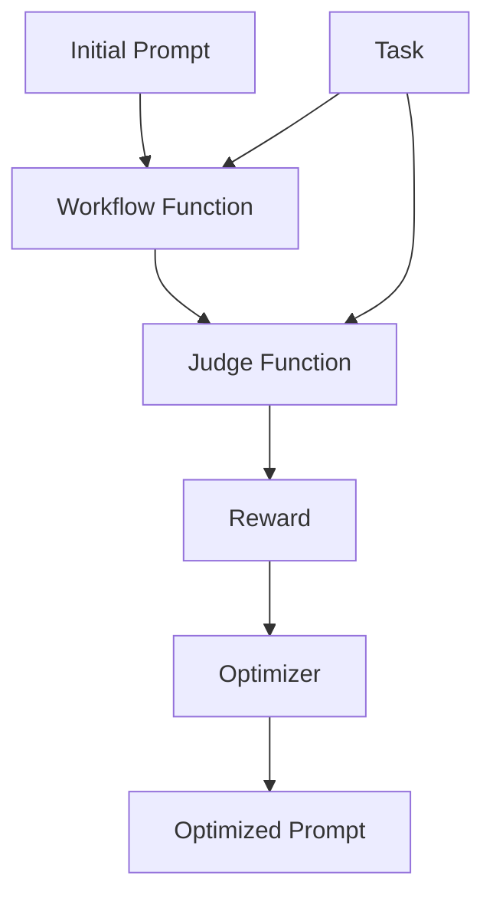

# Guide d'optimisation de prompts

AgentScope fournit un sous-module `prompt_tune` pour optimiser automatiquement les prompts système.
Ce guide vous accompagne à travers les étapes pour optimiser le prompt système de votre agent sans modifier les poids du modèle.

## Vue d'ensemble

L'optimisation de prompts est une alternative légère à l'ajustement de modèles qui optimise le prompt système pour améliorer les performances de l'agent. Pour utiliser l'optimisation de prompts, vous devez comprendre trois composants :

1. **Fonction de workflow** : Une fonction asynchrone qui prend une tâche et un prompt système, et retourne une sortie de workflow.
2. **Fonction de jugement** : Une fonction qui évalue la réponse de l'agent et retourne une récompense.
3. **Jeu de données de tâches** : Un jeu de données contenant des échantillons d'entraînement pour l'optimisation.

Le diagramme suivant illustre la relation entre ces composants :



## Comment implémenter

Nous utilisons ici un scénario de résolution de problèmes mathématiques comme exemple pour illustrer comment implémenter les trois composants ci-dessus.

Supposons que vous ayez un workflow d'agent qui résout des problèmes mathématiques en utilisant le `ReActAgent`.

```python
from agentscope.agent import ReActAgent

async def run_react_agent(query: str):
    # model = ...  # Initialize your ChatModel here

    agent = ReActAgent(
        name="react_agent",
        sys_prompt="You are a helpful math problem solving agent.",
        model=model,
        formatter=OpenAIChatFormatter(),
    )

    response = await agent.reply(
        msg=Msg("user", query, role="user"),
    )

    print(response)
```

### Étape 1 : Préparer le jeu de données de tâches

Pour optimiser le prompt pour la résolution de problèmes mathématiques, vous avez besoin d'un jeu de données contenant des échantillons de problèmes mathématiques et leurs réponses correctes correspondantes.

Le jeu de données doit être organisé dans un format compatible avec la fonction `datasets.load_dataset` (ex. : JSONL, Parquet, CSV). Par exemple :

```
my_dataset/
    ├── train.parquet  # samples for training/optimization
    └── test.parquet   # samples for evaluation
```

Supposons que votre `train.parquet` contienne des échantillons tels que :

```json
{"question": "What is 2 + 2?", "answer": "4"}
{"question": "What is 4 + 4?", "answer": "8"}
```

Vous pouvez prévisualiser votre jeu de données avec le code suivant :

```python
from agentscope.tuner import DatasetConfig

DatasetConfig(path="train.parquet").preview()

# Output:
# [
#   {
#     "question": "What is 2 + 2?",
#     "answer": "4"
#   },
#   {
#     "question": "What is 4 + 4?",
#     "answer": "8"
#   }
# ]
```

### Étape 2 : Définir une fonction de workflow

La fonction de workflow prend un dictionnaire de tâche et un prompt système en entrée, et retourne un `WorkflowOutput`. L'optimiseur appellera cette fonction avec différents prompts pendant l'optimisation.

```python
async def workflow(
    task: Dict,
    system_prompt: str,
) -> WorkflowOutput:
    """Run the agent workflow on a single task with the given system prompt."""
    ...
```

- Entrées :
    - `task` : Un dictionnaire représentant une tâche d'entraînement individuelle issue du jeu de données.
    - `system_prompt` : Le prompt système à utiliser dans le workflow. Il sera optimisé par le tuner.

- Retour :
    - `WorkflowOutput` : Un objet contenant la réponse de l'agent.

Voici une version remaniée de la fonction `run_react_agent` originale pour correspondre au schéma de la fonction de workflow.

**Modifications clés par rapport à la fonction originale** :

1. Ajout de `system_prompt` comme paramètre de la fonction de workflow.
2. Utilisation du `system_prompt` en entrée pour initialiser l'agent.
3. Utilisation du champ `question` du dictionnaire `task` comme requête utilisateur.
4. Retour d'un objet `WorkflowOutput` contenant la réponse de l'agent.

```python
from agentscope.agent import ReActAgent
from agentscope.formatter import OpenAIChatFormatter
from agentscope.tuner import WorkflowOutput
from agentscope.message import Msg

# Initialize the model (can be module-level or passed in via closure)
model = DashScopeChatModel("qwen-turbo", api_key="YOUR_API_KEY")

async def workflow(
    task: Dict,
    system_prompt: str,
) -> WorkflowOutput:
    agent = ReActAgent(
        name="react_agent",
        sys_prompt=system_prompt,  # use the optimizable system prompt
        model=model,
        formatter=OpenAIChatFormatter(),
    )

    response = await agent.reply(
        msg=Msg("user", task["question"], role="user"),
    )

    return WorkflowOutput(
        response=response,
    )
```

### Étape 3 : Implémenter la fonction de jugement

La fonction de jugement évalue la réponse de l'agent et retourne une récompense. Elle possède la même signature que dans l'ajustement basé sur le RL.

```python
async def judge_function(
    task: Dict,
    response: Any,
) -> JudgeOutput:
    """Calculate reward based on the input task and agent's response."""
```

- Entrées :
    - `task` : Un dictionnaire représentant une tâche d'entraînement individuelle.
    - `response` : Le champ `response` de la structure `WorkflowOutput` retournée par la fonction de workflow.

- Sorties :
    - `JudgeOutput` : Un objet contenant :
        - `reward` : Un scalaire flottant représentant la récompense.
        - `metrics` : Dictionnaire optionnel de métriques supplémentaires.

Voici un exemple d'implémentation :

```python
from agentscope.tuner import JudgeOutput

async def judge_function(
    task: Dict, response: Any
) -> JudgeOutput:
    """Simple reward: 1.0 for exact match, else 0.0."""
    ground_truth = task["answer"]
    reward = 1.0 if ground_truth in response.get_text_content() else 0.0
    return JudgeOutput(reward=reward)
```

### Étape 4 : Lancer l'optimisation de prompts

Utilisez l'interface `tune_prompt` pour optimiser votre prompt système.

```python
from agentscope.tuner import DatasetConfig
from agentscope.tuner.prompt_tune import tune_prompt, PromptTuneConfig

# your workflow / judge function here...

if __name__ == "__main__":
    init_prompt = "You are an agent. Please solve the math problem given to you."

    optimized_prompt, metrics = tune_prompt(
        workflow=workflow,
        init_system_prompt=init_prompt,
        judge_func=judge_function,
        train_dataset=DatasetConfig(path="train.parquet"),
        eval_dataset=DatasetConfig(path="test.parquet"),
        config=PromptTuneConfig(
            lm_model_name="dashscope/qwen-plus",
            optimization_level="light",
        ),
    )

    print(f"Optimized prompt: {optimized_prompt}")
    print(f"Metrics: {metrics}")
```

Ici, nous utilisons :
- `DatasetConfig` pour spécifier les jeux de données d'entraînement et d'évaluation.
- `PromptTuneConfig` pour configurer le processus d'optimisation.

#### Options de PromptTuneConfig

| Paramètre | Défaut | Description |
|-----------|---------|-------------|
| `lm_model_name` | `"dashscope/qwen-plus"` | Le nom du modèle pour le proposeur de prompts (modèle enseignant). |
| `optimization_level` | `"light"` | Intensité de l'optimisation : `"light"`, `"medium"` ou `"heavy"`. |
| `eval_display_progress` | `True` | Afficher ou non la progression pendant l'évaluation. |
| `eval_display_table` | `5` | Nombre de lignes du tableau à afficher pendant l'évaluation. |
| `eval_num_threads` | `16` | Nombre de threads pour l'évaluation parallèle. |
| `compare_performance` | `True` | Comparer ou non les performances de base avec les performances optimisées. |

---

### Exemple complet

```python
import os
from typing import Dict

from agentscope.tuner import DatasetConfig, WorkflowOutput, JudgeOutput
from agentscope.tuner.prompt_tune import tune_prompt, PromptTuneConfig
from agentscope.agent import ReActAgent
from agentscope.model import ChatModelBase, DashScopeChatModel
from agentscope.formatter import OpenAIChatFormatter
from agentscope.message import Msg


# Initialize the model for the workflow
model = DashScopeChatModel(
    "qwen-turbo",
    api_key=os.environ.get("DASHSCOPE_API_KEY", ""),
)


async def workflow(
    task: Dict,
    system_prompt: str,
) -> WorkflowOutput:
    agent = ReActAgent(
        name="react_agent",
        sys_prompt=system_prompt,
        model=model,
        formatter=OpenAIChatFormatter(),
    )

    response = await agent.reply(
        msg=Msg("user", task["question"], role="user"),
    )

    return WorkflowOutput(
        response=response,
    )


async def judge_function(
    task: Dict, response: Any
) -> JudgeOutput:
    """Simple reward: 1.0 for exact match, else 0.0."""
    ground_truth = task["answer"]
    reward = 1.0 if ground_truth in response.get_text_content() else 0.0
    return JudgeOutput(reward=reward)


if __name__ == "__main__":
    init_prompt = (
        "You are an agent."
        "Please solve the math problem given to you."
        "You should provide your output within \\boxed{{}}."
    )

    optimized_prompt, metrics = tune_prompt(
        workflow=workflow,
        init_system_prompt=init_prompt,
        judge_func=judge_function,
        train_dataset=DatasetConfig(path="train.parquet"),
        eval_dataset=DatasetConfig(path="test.parquet"),
    )

    print(f"Optimized prompt: {optimized_prompt}")
    print(f"Metrics: {metrics}")
```

> Note :
> Le code ci-dessus est un exemple simplifié à des fins d'illustration uniquement.
> Pour une implémentation complète, veuillez consulter [example.py](./example.py), qui optimise un agent ReAct pour résoudre des problèmes mathématiques sur un sous-ensemble du jeu de données GSM8K.

---

## Comment exécuter

Après avoir implémenté la fonction de workflow et la fonction de jugement, suivez ces étapes pour lancer l'optimisation de prompts :

1. Prérequis

    - Configurez votre clé API comme variable d'environnement :

      ```bash
      export DASHSCOPE_API_KEY="your_api_key_here"
      ```

    - Préparez votre jeu de données dans un format supporté (JSONL, Parquet, CSV, etc.).

2. Exécutez le script d'optimisation

    ```bash
    python example.py
    ```

3. Le prompt optimisé sera affiché dans la console et pourra être utilisé directement dans votre agent.

## Sortie

```
Initial prompt: You are an agent. Please solve the math problem given to you with python code. You should provife your output within \boxed{}.

Optimized prompt: You are a meticulous math tutor who solves elementary-to-middle-school-level word problems step by step. For each problem, first reason through the narrative to identify the key quantities and relationships. Then, write clear, executable Python code that computes the answer using only integer arithmetic. Finally, present your solution in the format \boxed{answer}, ensuring the answer is an integer and matches the logic of your explanation. Always double-check your reasoning and code before finalizing the boxed result.
```

---

## Comparaison avec l'ajustement basé sur le RL

| Aspect | Optimisation de prompts | Ajustement basé sur le RL |
|--------|---------------|-----------------|
| **Ce qui est optimisé** | Le texte du prompt système | Les poids du modèle |
| **Coût computationnel** | Faible (appels API uniquement) | Élevé (entraînement GPU) |
| **Exigences matérielles** | Aucun GPU requis | Plusieurs GPU requis |
| **Cas d'utilisation** | Itération rapide, ressources limitées | Performance maximale |

> [!TIP]
> L'optimisation de prompts est idéale pour le prototypage rapide et les scénarios où vous souhaitez améliorer les performances de l'agent sans les contraintes liées à l'entraînement d'un modèle.
