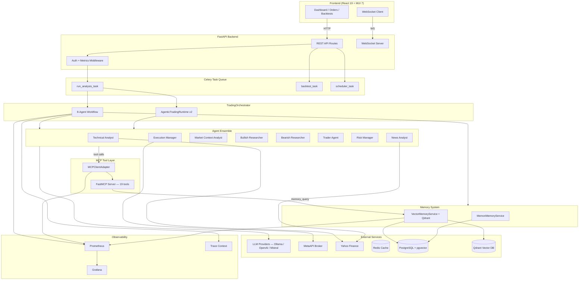
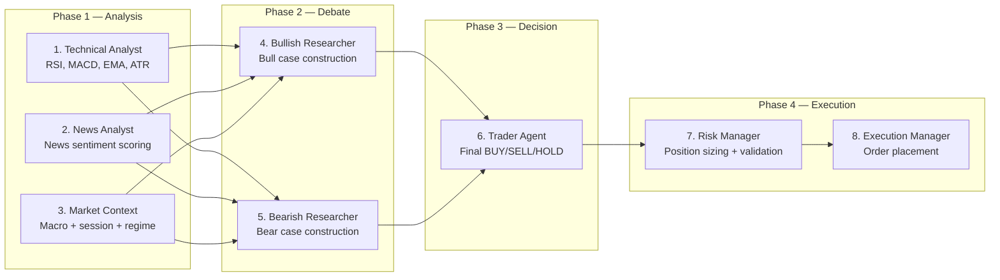
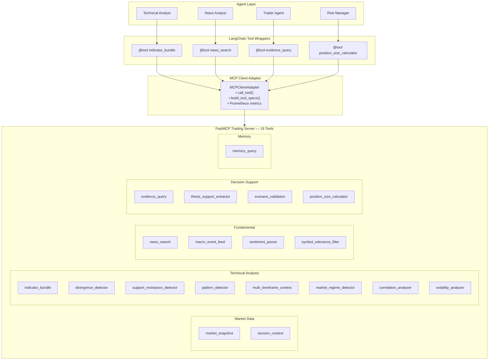
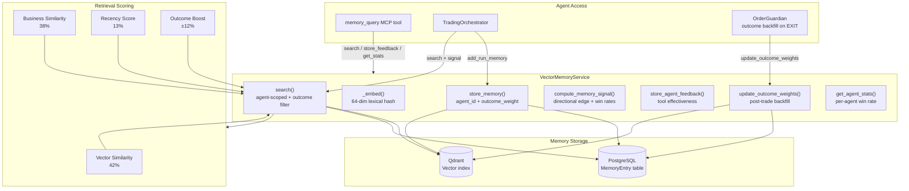
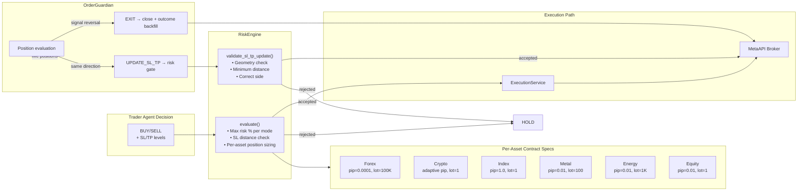
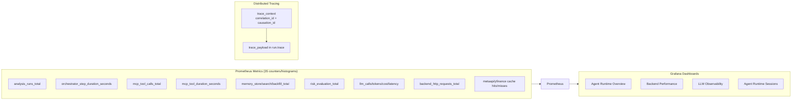
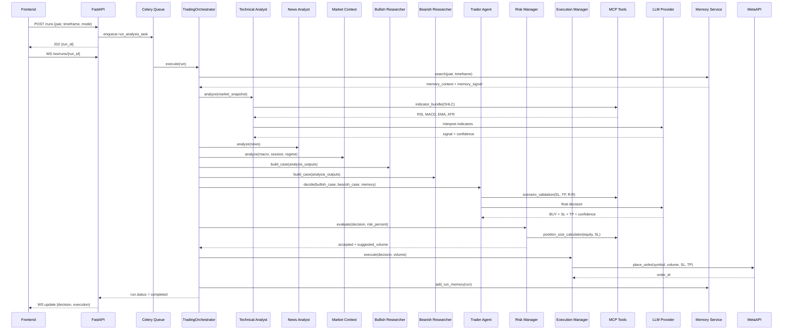
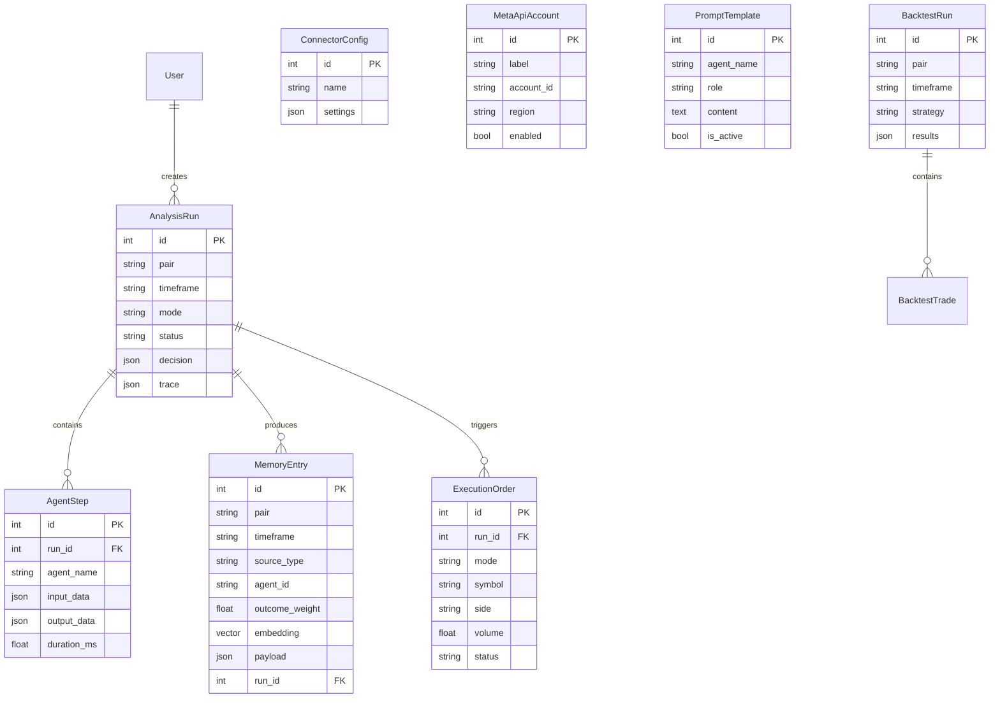
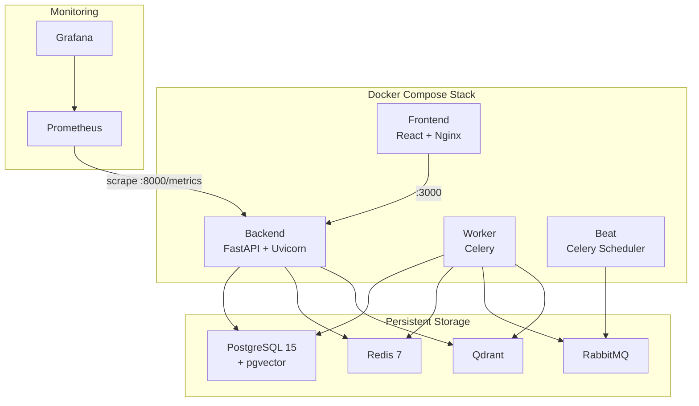

# Multi-Agent Trading Platform — Architecture

## 1. System Overview

The platform is a **multi-agent AI trading system** that orchestrates 8 specialized LLM agents to produce trading decisions across forex, crypto, indices, metals, energy, and equities. It features real-time execution via MetaAPI, vector memory for learning from past trades, and a React frontend for monitoring.

---

## 2. Agent Workflow Pipeline

The trading decision is produced through an **8-step sequential pipeline** with a debate phase and optional autonomy loops.

---

## 3. MCP Tool Architecture

All agent tools are served through a **FastMCP server** that performs real computation. The `MCPClientAdapter` bridges these tools into both the LangChain tool layer and the RuntimeToolRegistry.

### Tool-to-Agent Mapping

| Agent | Allowed Tools |
|-------|--------------|
| technical-analyst | indicator_bundle, market_snapshot, support_resistance_detector, multi_timeframe_context, divergence_detector, pattern_detector |
| news-analyst | news_search, macro_event_feed, symbol_relevance_filter, sentiment_parser |
| bullish-researcher | evidence_query, thesis_support_extractor, news_search, memory_query |
| bearish-researcher | evidence_query, thesis_support_extractor, news_search, memory_query |
| trader-agent | scenario_validation, evidence_query, position_size_calculator, memory_query |
| risk-manager | position_size_calculator, scenario_validation |
| execution-manager | position_size_calculator, scenario_validation |
| order-guardian | memory_query |

---

## 4. Memory System Architecture

The memory system uses **outcome-weighted retrieval** — memories from winning trades rank higher than losses.

### Memory Entry Schema

| Field | Type | Purpose |
|-------|------|---------|
| id | int | Primary key |
| pair | str | Trading pair (e.g. EURUSD) |
| timeframe | str | e.g. H1, D1 |
| source_type | str | run_outcome, agent_feedback |
| summary | text | Human-readable summary |
| embedding | vector(64) | Lexical-semantic hash |
| payload | JSON | Full trading case data |
| agent_id | str | Which agent created this (nullable) |
| outcome_weight | float | Trade result [-1.0 .. +1.0] (nullable) |
| run_id | int FK | Links to AnalysisRun |
| created_at | datetime | Entry timestamp |

---

## 5. Risk Engine & Order Guardian

---

## 6. Observability Stack

---

## 7. Data Flow — Full Trade Lifecycle

---

## 8. Database Schema (Entity Relationships)

---

## 9. Deployment Architecture

---

## 10. Key Design Decisions

| Decision | Rationale |
|----------|-----------|
| **MCP tool layer** | All agent tools compute real results (RSI, correlations, patterns) instead of passing through pre-assembled data |
| **Outcome-weighted memory** | Memories from winning trades get a +12% scoring boost, enabling the system to learn from success |
| **Agent-scoped memory** | Each agent stores/retrieves its own memories via `agent_id`, enabling independent learning |
| **Per-asset contract specs** | Risk engine uses correct pip size, contract size, and volume limits per asset class |
| **Risk gate on OrderGuardian** | SL/TP modifications are validated by RiskEngine before reaching the broker |
| **Correlation/causation IDs** | Every run gets a trace context for end-to-end request tracing |
| **TradingOrchestrator rename** | Reflects multi-product support (not just forex) |
| **Shared LLM base helpers** | Eliminates 100+ lines of duplicated code across Ollama and OpenAI providers |
