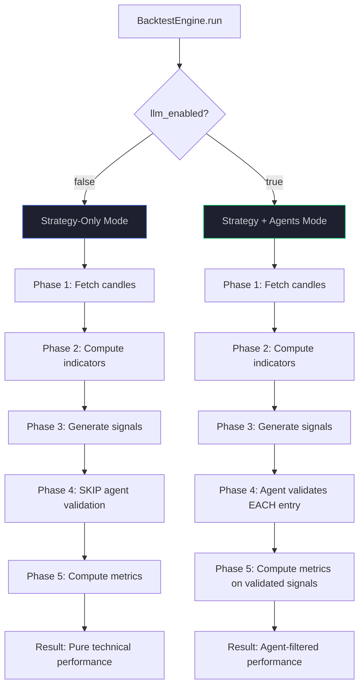
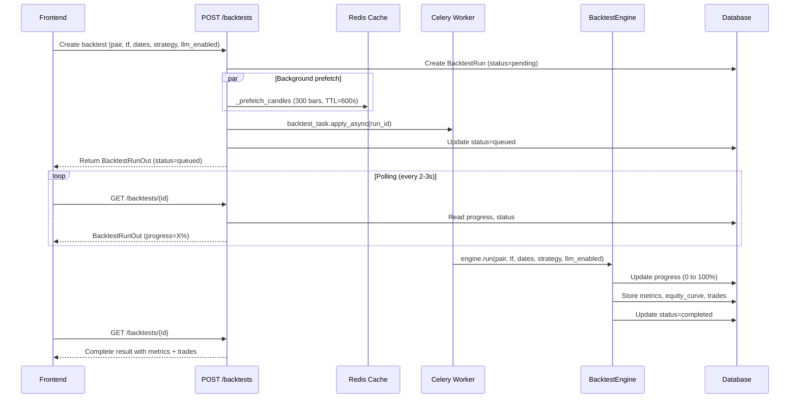
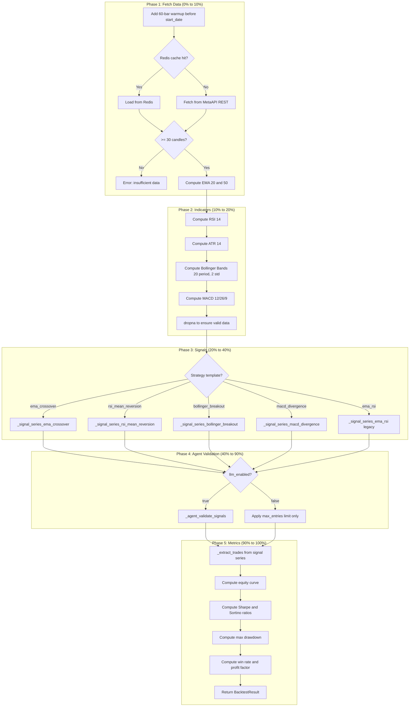
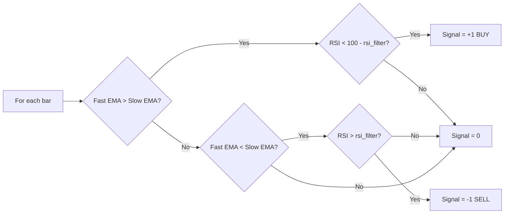
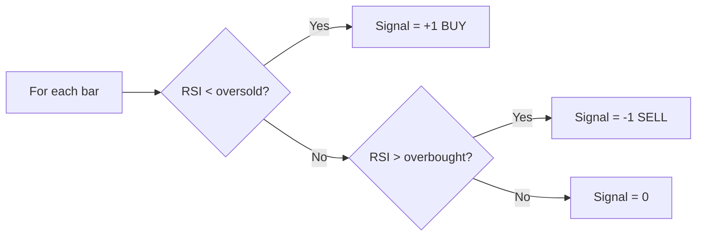
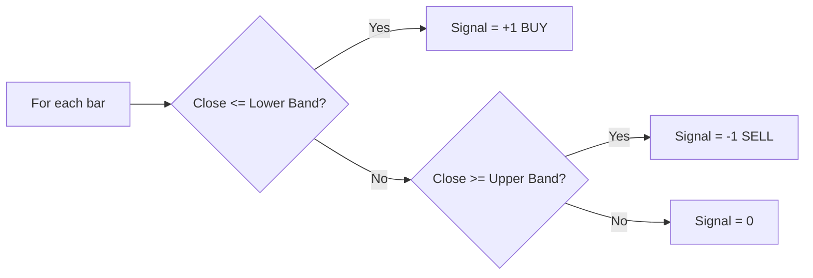
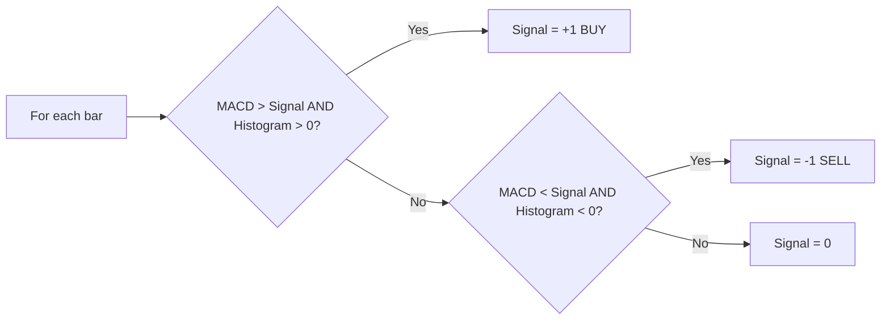
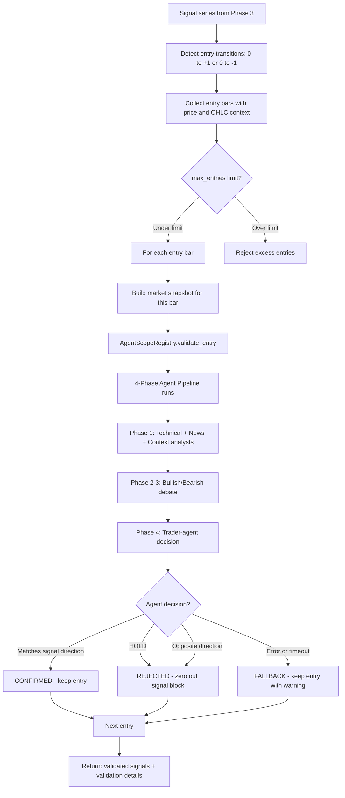
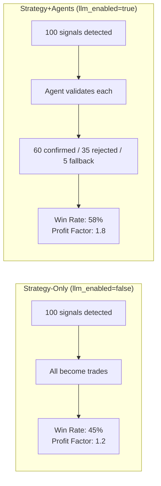
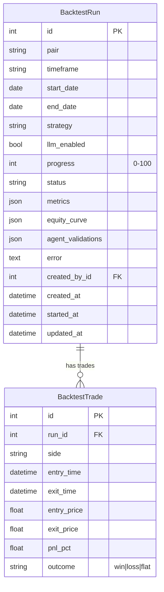

# Backtest Engine — Architecture Detail

## Purpose

Documents the backtesting engine in detail: data pipeline, signal generation, agent validation (LLM-enabled vs strategy-only mode), metrics computation, and the complete data flow with Mermaid diagrams.

## Source of Truth

| Component | File |
|-----------|------|
| Backtest engine | `app/services/backtest/engine.py` |
| Backtest task | `app/tasks/backtest_task.py` |
| Strategy backtest task | `app/tasks/strategy_backtest_task.py` |
| Backtest API | `app/api/routes/backtests.py` |
| AgentScope registry | `app/services/agentscope/registry.py` (`validate_entry()`) |
| BacktestRun model | `app/db/models/backtest_run.py` |
| BacktestTrade model | `app/db/models/backtest_trade.py` |

---

## Two Modes of Operation

The backtest engine supports two fundamentally different modes:

| Mode | `llm_enabled` | Agent Validation | Use Case |
|------|:----------:|:----------------:|----------|
| **Strategy-Only** | `false` | No | Fast technical backtest, pure signal performance |
| **Strategy + Agents** | `true` | Yes | Full multi-agent validation of each entry signal |



---

## Complete Backtest Workflow

### Entry Point: API



---

## 5-Phase Engine Pipeline



---

## Signal Generation Detail

### EMA Crossover



**Parameters**: `ema_fast` (default 9), `ema_slow` (default 21), `rsi_filter` (default 30)

### RSI Mean Reversion



**Parameters**: `rsi_period` (default 14), `oversold` (default 30), `overbought` (default 70)

### Bollinger Breakout



**Parameters**: `bb_period` (default 20), `bb_std` (default 2.0)

### MACD Divergence



**Parameters**: `fast` (default 12), `slow` (default 26), `signal` (default 9)

---

## Agent Validation Flow (llm_enabled=true)

This is the critical differentiator between the two modes. When enabled, each detected entry signal is validated by the full multi-agent pipeline.



### Agent Validation Decision Matrix

| Strategy Signal | Agent Decision | Outcome | Status |
|----------------|---------------|---------|--------|
| BUY | BUY | Keep entry | `confirmed` |
| BUY | HOLD | Reject entry | `rejected` |
| BUY | SELL | Reject entry | `rejected` |
| SELL | SELL | Keep entry | `confirmed` |
| SELL | HOLD | Reject entry | `rejected` |
| SELL | BUY | Reject entry | `rejected` |
| Any | Error/Timeout | Keep entry | `error_fallback` |

### Signal Block Zeroing

When an entry is rejected, the entire signal block is zeroed:

```
Before:  [0, 0, 1, 1, 1, 0, 0, -1, -1, 0]
                 ^-- entry rejected by agent
After:   [0, 0, 0, 0, 0, 0, 0, -1, -1, 0]
                 ^-----^ zeroed block
```

### Validation Detail Record

```json
{
  "bar": 142,
  "time": "2026-03-15T14:00:00Z",
  "price": 1.0985,
  "strategy_signal": "BUY",
  "agent_decision": "BUY",
  "confidence": 0.72,
  "status": "confirmed",
  "agents_used": ["technical-analyst", "news-analyst", "trader-agent"],
  "agent_details": {
    "technical-analyst": {"signal": "bullish", "score": 0.35},
    "trader-agent": {"decision": "BUY", "confidence": 0.72}
  }
}
```

---

## Comparison: Strategy-Only vs Strategy+Agents



| Aspect | Strategy-Only | Strategy+Agents |
|--------|:------------:|:---------------:|
| Speed | Fast (seconds) | Slow (minutes per entry) |
| LLM Cost | Zero | 1 call per validated entry |
| Reproducibility | 100% deterministic | Non-deterministic |
| Signal count | All signals kept | Some rejected |
| Win rate | Typically lower | Typically higher |
| False positives | Higher | Lower |

---

## Metrics Computation

| Metric | Formula | Notes |
|--------|---------|-------|
| Total Return % | `(final_equity - initial) / initial * 100` | Compounded |
| Annualized Return % | `total_return * (252 / trading_days)` | 252 trading days/year |
| Max Drawdown % | `max(peak - trough) / peak * 100` | Peak-to-trough |
| Sharpe Ratio | `mean(returns) / std(returns) * sqrt(252)` | Risk-adjusted |
| Sortino Ratio | `mean(returns) / downside_std * sqrt(252)` | Downside risk only |
| Profit Factor | `sum(wins) / abs(sum(losses))` | Win/loss ratio |
| Win Rate % | `winning / total * 100` | Percentage |

---

## Database Schema



---

## Configuration

| Setting | Env Var | Default | Purpose |
|---------|---------|---------|---------|
| LLM in backtests | `BACKTEST_ENABLE_LLM` | `false` | Enable agent validation by default |
| LLM sampling rate | `BACKTEST_LLM_EVERY` | 24 | Validate every Nth entry |
| Agent log frequency | `BACKTEST_AGENT_LOG_EVERY` | 25 | Log validation progress |
| Candle pre-fetch TTL | Hardcoded | 600s | Redis cache for pre-fetched candles |
| Warmup bars | Hardcoded | 60 | Extra bars for indicator warmup |

---

## Known Limitations

- No slippage, spread, or commission modeling
- No walk-forward or out-of-sample testing
- No Monte Carlo simulation or bootstrap confidence intervals
- Agent validation is slow (one LLM call per entry)
- Historical candle availability depends on MetaAPI/Redis
- Single-position model (no overlapping trades)
- Equity curve assumes fixed position size (no compounding)
- Legacy `ema_rsi` template supported in backtest but not in strategy monitor
