# Future Roadmap — Feature Catalog

## Purpose

Exhaustive catalog of future features that can be added to the platform. Each feature is grounded in the existing codebase — with references to what infrastructure already exists, what needs to be built, detailed workflows, and Mermaid diagrams.

**This document is NOT a commitment.** It is a technical feasibility map. Features are classified by impact and effort. Nothing described here is currently implemented unless explicitly marked.

## Source of Truth

| Existing Infrastructure | File |
|------------------------|------|
| Agent orchestration | `app/services/agentscope/registry.py` |
| Risk engine | `app/services/risk/rules.py` |
| Execution service | `app/services/execution/executor.py` |
| MCP tools (25+) | `app/services/mcp/trading_server.py` |
| Backtest engine | `app/services/backtest/engine.py` |
| Strategy monitor | `app/tasks/strategy_monitor_task.py` |
| MetaAPI client | `app/services/trading/metaapi_client.py` |
| Prometheus metrics (28+) | `app/observability/metrics.py` |
| Celery + Beat | `app/tasks/celery_app.py` |
| DB models (15 tables) | `app/db/models/` |
| Skill bootstrap | `app/services/llm/skill_bootstrap.py` |
| News providers (5+) | `app/services/market/news_provider.py` |
| Instrument classifier | `app/services/market/instrument.py` |

---

## Priority Matrix

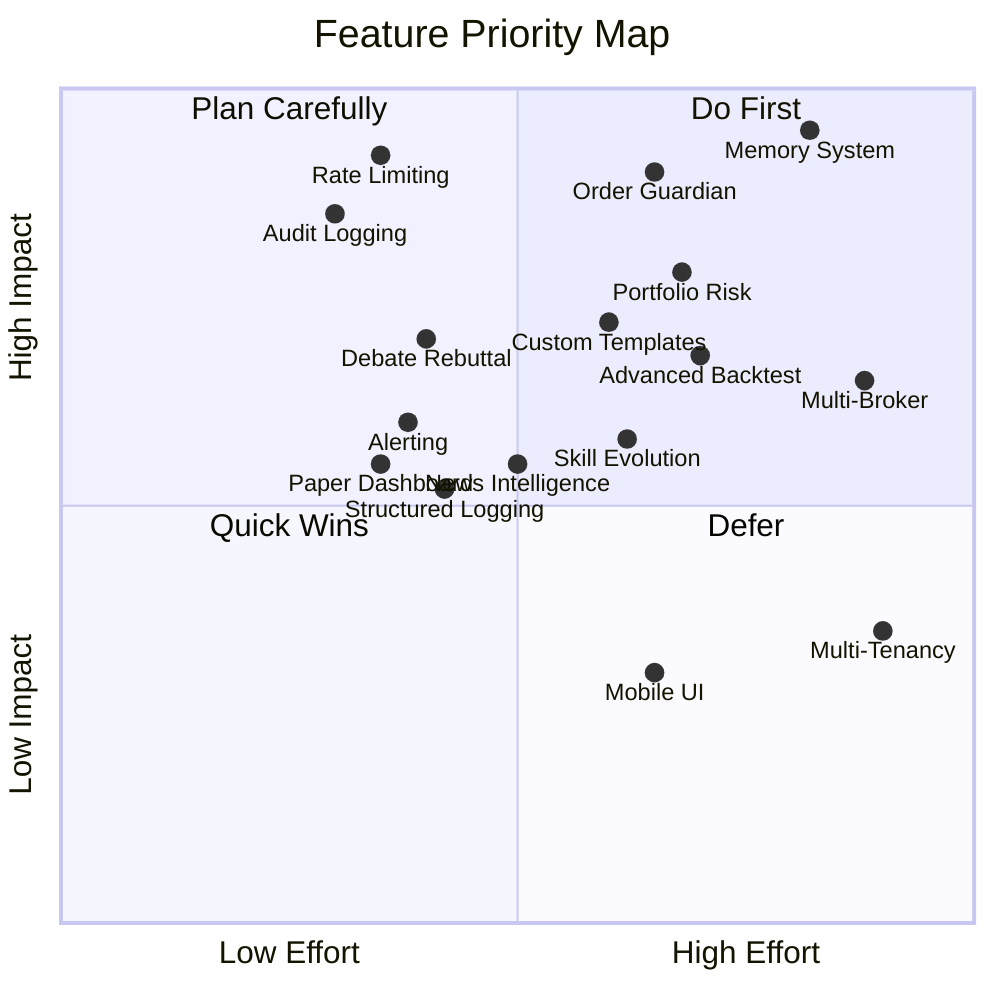
```mermaid
quadrantChart
    title Feature Priority Map
    x-axis Low Effort --> High Effort
    y-axis Low Impact --> High Impact
    quadrant-1 Do First
    quadrant-2 Plan Carefully
    quadrant-3 Quick Wins
    quadrant-4 Defer
    Rate Limiting: [0.35, 0.92]
    Audit Logging: [0.30, 0.85]
    Memory System: [0.82, 0.95]
    Order Guardian: [0.65, 0.90]
    Debate Rebuttal: [0.40, 0.70]
    Custom Templates: [0.60, 0.72]
    Portfolio Risk: [0.68, 0.78]
    Advanced Backtest: [0.70, 0.68]
    Alerting: [0.38, 0.60]
    Paper Dashboard: [0.35, 0.55]
    Multi-Broker: [0.88, 0.65]
    Skill Evolution: [0.62, 0.58]
    News Intelligence: [0.50, 0.55]
    Structured Logging: [0.42, 0.52]
    Mobile UI: [0.65, 0.30]
    Multi-Tenancy: [0.90, 0.35]
```

---

# Tier 1 — Critical (Must-Have for Production)

---

## 1. Persistent Memory System

### Problem

Each analysis run starts from zero. The system never learns from past decisions. A BUY that lost 5% is forgotten by the next run on the same instrument.

- `backend/app/services/memory/` does not exist
- `AgentRuntimeSession.state_snapshot` field declared in DB but never populated
- No outcome tracking (no link between `ExecutionOrder` and actual P&L)

### What to Build

```
backend/app/services/memory/
    __init__.py
    outcome_tracker.py      # Link orders to P&L results
    agent_accuracy.py       # Per-agent accuracy scoring over time
    context_store.py        # Cross-run context retrieval
    confidence_calibrator.py # Adjust gating thresholds from history
    vector_store.py         # Semantic search over past decisions (optional)
```

### Architecture

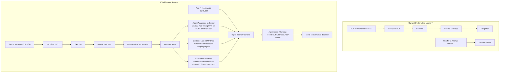
```mermaid
flowchart TD
    subgraph "Current System (No Memory)"
        A1[Run N: Analyze EURUSD] --> A2[Decision: BUY]
        A2 --> A3[Execute]
        A3 --> A4[Result: -3% loss]
        A4 --> A5[Forgotten]

        B1[Run N+1: Analyze EURUSD] --> B2[Same mistake]
    end

    subgraph "With Memory System"
        C1[Run N: Analyze EURUSD] --> C2[Decision: BUY]
        C2 --> C3[Execute]
        C3 --> C4[Result: -3% loss]
        C4 --> C5[OutcomeTracker records]

        C5 --> D1[Memory Store]
        D1 --> D2[Agent Accuracy: technical-analyst was wrong 60% on EURUSD this week]
        D1 --> D3[Context: Last 3 EURUSD runs were all losses in ranging regime]
        D1 --> D4[Calibration: Reduce confidence threshold for EURUSD from 0.28 to 0.35]

        E1[Run N+1: Analyze EURUSD] --> E2[Inject memory context]
        D2 --> E2
        D3 --> E2
        D4 --> E2
        E2 --> E3[Agent sees: 'Warning: recent EURUSD accuracy is low']
        E3 --> E4[More conservative decision]
    end
```

### Outcome Tracking Flow

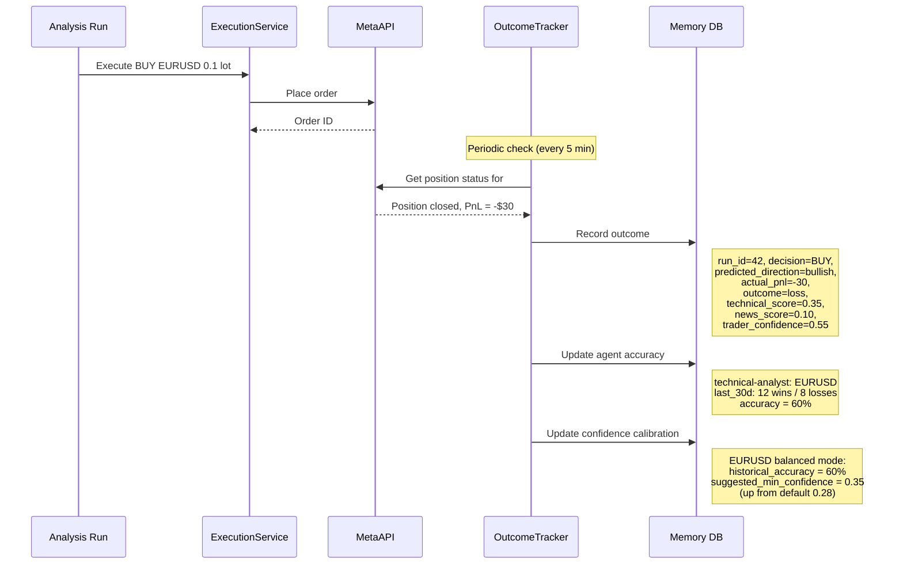
```mermaid
sequenceDiagram
    participant Run as Analysis Run
    participant Exec as ExecutionService
    participant Meta as MetaAPI
    participant Track as OutcomeTracker
    participant DB as Memory DB

    Run->>Exec: Execute BUY EURUSD 0.1 lot
    Exec->>Meta: Place order
    Meta-->>Exec: Order ID #12345

    Note over Track: Periodic check (every 5 min)
    Track->>Meta: Get position status for #12345
    Meta-->>Track: Position closed, PnL = -$30

    Track->>DB: Record outcome
    Note right of DB: run_id=42, decision=BUY,<br/>predicted_direction=bullish,<br/>actual_pnl=-30,<br/>outcome=loss,<br/>technical_score=0.35,<br/>news_score=0.10,<br/>trader_confidence=0.55

    Track->>DB: Update agent accuracy
    Note right of DB: technical-analyst: EURUSD<br/>last_30d: 12 wins / 8 losses<br/>accuracy = 60%

    Track->>DB: Update confidence calibration
    Note right of DB: EURUSD balanced mode:<br/>historical_accuracy = 60%<br/>suggested_min_confidence = 0.35<br/>(up from default 0.28)
```

### Data Model

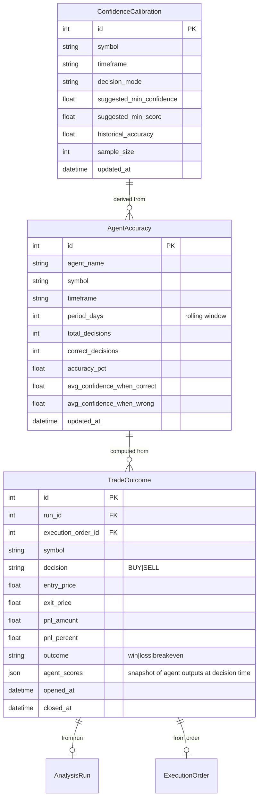
```mermaid
erDiagram
    TradeOutcome {
        int id PK
        int run_id FK
        int execution_order_id FK
        string symbol
        string decision "BUY|SELL"
        float entry_price
        float exit_price
        float pnl_amount
        float pnl_percent
        string outcome "win|loss|breakeven"
        json agent_scores "snapshot of agent outputs at decision time"
        datetime opened_at
        datetime closed_at
    }

    AgentAccuracy {
        int id PK
        string agent_name
        string symbol
        string timeframe
        int period_days "rolling window"
        int total_decisions
        int correct_decisions
        float accuracy_pct
        float avg_confidence_when_correct
        float avg_confidence_when_wrong
        datetime updated_at
    }

    ConfidenceCalibration {
        int id PK
        string symbol
        string timeframe
        string decision_mode
        float suggested_min_confidence
        float suggested_min_score
        float historical_accuracy
        int sample_size
        datetime updated_at
    }

    TradeOutcome ||--o| AnalysisRun : "from run"
    TradeOutcome ||--o| ExecutionOrder : "from order"
    AgentAccuracy ||--o{ TradeOutcome : "computed from"
    ConfidenceCalibration ||--o{ AgentAccuracy : "derived from"
```

### Integration Points

| Existing Component | Integration |
|-------------------|-------------|
| `AgentScopeRegistry.execute()` | Inject memory context into `_build_prompt_variables()` |
| `ExecutionService.execute()` | After order placed, register with OutcomeTracker |
| `strategy_monitor_task.check_all()` | Check agent accuracy before creating run |
| `constants.py` `DecisionGatingPolicy` | Override thresholds from ConfidenceCalibration |
| `prompts.py` user prompts | Add `{memory_context_block}` variable |

### Effort: XL | Prerequisite: None

---

## 2. Rate Limiting + API Protection

### Problem

No rate limiting on any endpoint. Login is brute-forceable. LLM endpoints (`/strategies/generate`) can be abused for cost.

### What to Build

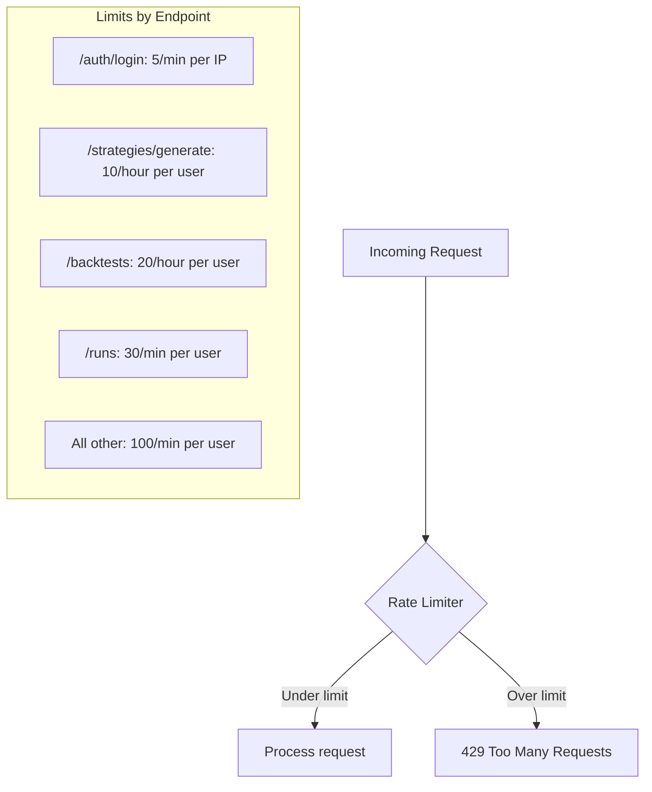
```mermaid
flowchart TD
    A[Incoming Request] --> B{Rate Limiter}
    B -->|Under limit| C[Process request]
    B -->|Over limit| D[429 Too Many Requests]

    subgraph "Limits by Endpoint"
        L1["/auth/login: 5/min per IP"]
        L2["/strategies/generate: 10/hour per user"]
        L3["/backtests: 20/hour per user"]
        L4["/runs: 30/min per user"]
        L5["All other: 100/min per user"]
    end
```

### Implementation

```python
# backend/app/middleware/rate_limiter.py
from slowapi import Limiter
from slowapi.util import get_remote_address

limiter = Limiter(
    key_func=get_remote_address,
    storage_uri="redis://redis:6379/2",
    default_limits=["100/minute"],
)

# Per-endpoint overrides in routes:
@router.post('/login')
@limiter.limit("5/minute")
def login(...): ...

@router.post('/generate')
@limiter.limit("10/hour")
def generate_strategy(...): ...
```

### Audit Logging

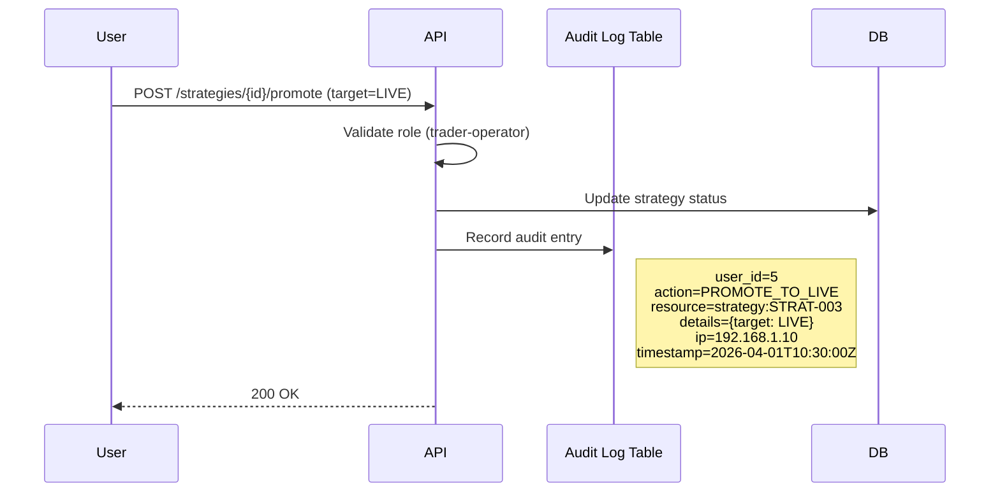
```mermaid
sequenceDiagram
    participant User
    participant API
    participant AuditLog as Audit Log Table
    participant DB

    User->>API: POST /strategies/{id}/promote (target=LIVE)
    API->>API: Validate role (trader-operator)
    API->>DB: Update strategy status
    API->>AuditLog: Record audit entry
    Note right of AuditLog: user_id=5<br/>action=PROMOTE_TO_LIVE<br/>resource=strategy:STRAT-003<br/>details={target: LIVE}<br/>ip=192.168.1.10<br/>timestamp=2026-04-01T10:30:00Z
    API-->>User: 200 OK
```

### Audit Events to Track

| Event | Trigger | Severity |
|-------|---------|----------|
| Login success/failure | `/auth/login` | INFO / WARNING |
| Strategy promoted to LIVE | `/strategies/{id}/promote` | CRITICAL |
| Live trading enabled | `/connectors` update | CRITICAL |
| Config change | `/connectors` PUT | HIGH |
| Strategy monitoring started | `/strategies/{id}/start-monitoring` | HIGH |
| Run created (live mode) | `POST /runs` with mode=live | HIGH |
| Admin bootstrap | `/auth/bootstrap-admin` | CRITICAL |

### Effort: M | Prerequisite: Redis (already deployed)

---

## 3. Order Guardian — Position Supervision

### Problem

Once an order is placed, the system has zero supervision. No trailing stops, no drawdown protection, no exit signals.

- `order_guardian.py` does not exist in current codebase
- `RiskEngine.validate_sl_tp_update()` exists but is never called automatically
- MetaAPI supports position modification (update SL/TP, close position)

### Architecture

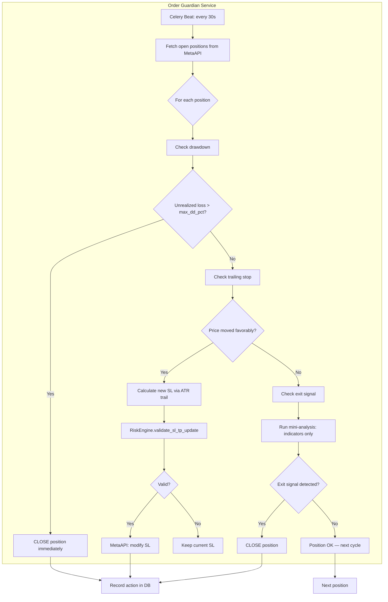
```mermaid
flowchart TD
    subgraph "Order Guardian Service"
        A[Celery Beat: every 30s] --> B[Fetch open positions from MetaAPI]
        B --> C{For each position}

        C --> D[Check drawdown]
        D --> D1{Unrealized loss > max_dd_pct?}
        D1 -->|Yes| D2[CLOSE position immediately]
        D1 -->|No| E[Check trailing stop]

        E --> E1{Price moved favorably?}
        E1 -->|Yes| E2[Calculate new SL via ATR trail]
        E2 --> E3[RiskEngine.validate_sl_tp_update]
        E3 --> E4{Valid?}
        E4 -->|Yes| E5[MetaAPI: modify SL]
        E4 -->|No| E6[Keep current SL]
        E1 -->|No| F[Check exit signal]

        F --> F1[Run mini-analysis: indicators only]
        F1 --> F2{Exit signal detected?}
        F2 -->|Yes| F3[CLOSE position]
        F2 -->|No| G[Position OK — next cycle]
    end

    D2 --> H[Record action in DB]
    E5 --> H
    F3 --> H
    G --> I[Next position]
```

### Guardian Decision Flow

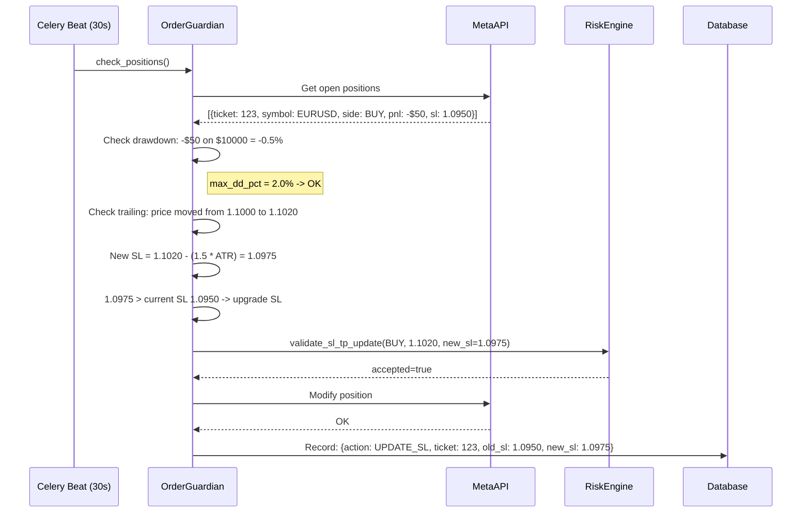
```mermaid
sequenceDiagram
    participant Beat as Celery Beat (30s)
    participant Guard as OrderGuardian
    participant Meta as MetaAPI
    participant Risk as RiskEngine
    participant DB as Database

    Beat->>Guard: check_positions()
    Guard->>Meta: Get open positions
    Meta-->>Guard: [{ticket: 123, symbol: EURUSD, side: BUY, pnl: -$50, sl: 1.0950}]

    Guard->>Guard: Check drawdown: -$50 on $10000 = -0.5%
    Note right of Guard: max_dd_pct = 2.0% -> OK

    Guard->>Guard: Check trailing: price moved from 1.1000 to 1.1020
    Guard->>Guard: New SL = 1.1020 - (1.5 * ATR) = 1.0975
    Guard->>Guard: 1.0975 > current SL 1.0950 -> upgrade SL

    Guard->>Risk: validate_sl_tp_update(BUY, 1.1020, new_sl=1.0975)
    Risk-->>Guard: accepted=true

    Guard->>Meta: Modify position #123: SL=1.0975
    Meta-->>Guard: OK

    Guard->>DB: Record: {action: UPDATE_SL, ticket: 123, old_sl: 1.0950, new_sl: 1.0975}
```

### Configuration

| Setting | Default | Purpose |
|---------|---------|---------|
| `GUARDIAN_ENABLED` | `false` | Master kill switch |
| `GUARDIAN_POLL_SECONDS` | 30 | Check interval |
| `GUARDIAN_MAX_DD_PCT` | 2.0 | Max drawdown before forced close |
| `GUARDIAN_TRAILING_ENABLED` | `true` | Enable trailing stop |
| `GUARDIAN_TRAILING_ATR_MULT` | 1.5 | ATR multiplier for trail distance |
| `GUARDIAN_EXIT_SIGNAL_ENABLED` | `false` | Enable LLM-based exit signals |
| `GUARDIAN_DRY_RUN` | `true` | Log actions but don't execute |

### Effort: L | Prerequisites: RiskEngine (exists), MetaAPI (exists)

---

# Tier 2 — Major Improvements

---

## 4. Multi-Strategy Portfolio Risk

### Problem

Current system: 1 run = 1 instrument = 1 position. No awareness of concurrent positions.

### Architecture

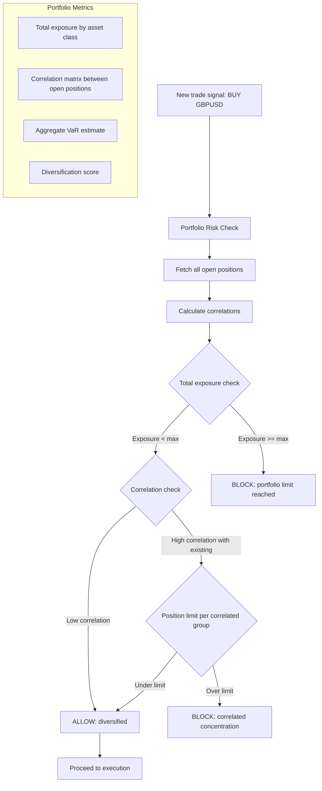
```mermaid
flowchart TD
    A[New trade signal: BUY GBPUSD] --> B[Portfolio Risk Check]

    B --> C[Fetch all open positions]
    C --> D[Calculate correlations]

    D --> E{Total exposure check}
    E -->|Exposure < max| F{Correlation check}
    E -->|Exposure >= max| G[BLOCK: portfolio limit reached]

    F -->|Low correlation| H[ALLOW: diversified]
    F -->|High correlation with existing| I{Position limit per correlated group}
    I -->|Under limit| H
    I -->|Over limit| J[BLOCK: correlated concentration]

    H --> K[Proceed to execution]

    subgraph "Portfolio Metrics"
        M1[Total exposure by asset class]
        M2[Correlation matrix between open positions]
        M3[Aggregate VaR estimate]
        M4[Diversification score]
    end
```

### Integration

The `correlation_analyzer` MCP tool already computes cross-asset correlations. It needs to be called at the **portfolio level** before execution, not just at the individual analysis level.

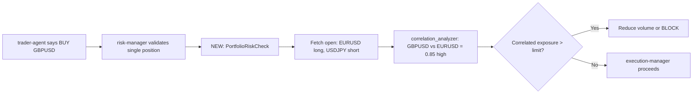
```mermaid
flowchart LR
    A[trader-agent says BUY GBPUSD] --> B[risk-manager validates single position]
    B --> C[NEW: PortfolioRiskCheck]
    C --> D[Fetch open: EURUSD long, USDJPY short]
    D --> E[correlation_analyzer: GBPUSD vs EURUSD = 0.85 high]
    E --> F{Correlated exposure > limit?}
    F -->|Yes| G[Reduce volume or BLOCK]
    F -->|No| H[execution-manager proceeds]
```

### Effort: L | Prerequisites: `correlation_analyzer` (exists), `MetaApiClient.get_positions()` (exists)

---

## 5. Enhanced Debate — Rebuttal Phase

### Problem

Current debate: bullish speaks, bearish speaks, moderator judges. No real exchange. Bullish always goes first (positional bias).

### Improved Flow

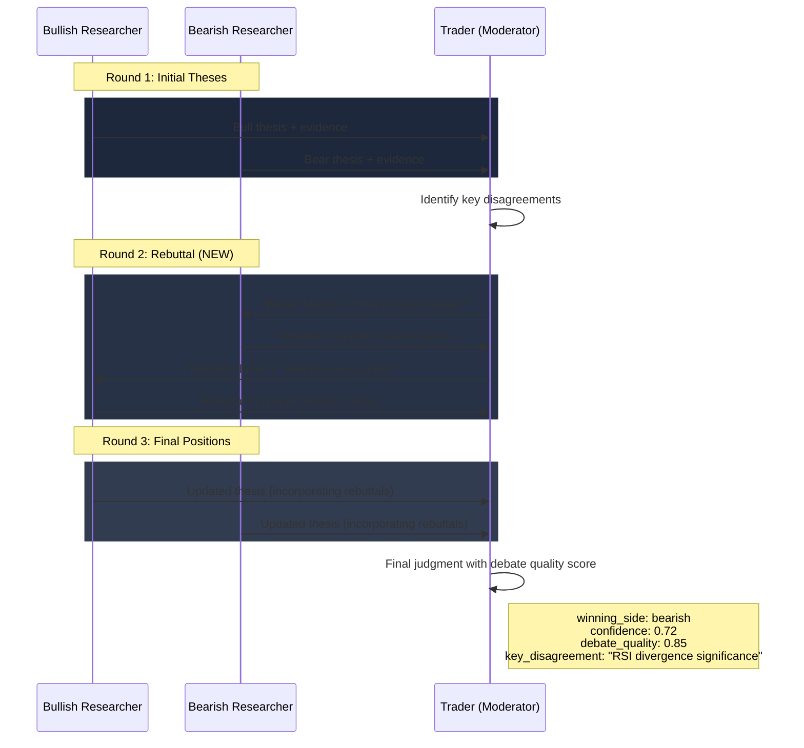
```mermaid
sequenceDiagram
    participant B as Bullish Researcher
    participant R as Bearish Researcher
    participant M as Trader (Moderator)

    Note over B,R: Round 1: Initial Theses
    rect rgb(30, 40, 60)
        B->>M: Bull thesis + evidence
        R->>M: Bear thesis + evidence
    end

    M->>M: Identify key disagreements

    Note over B,R: Round 2: Rebuttal (NEW)
    rect rgb(40, 50, 70)
        M->>R: "Bullish claims X. How do you counter?"
        R->>M: Rebuttal to specific bullish claims
        M->>B: "Bearish claims Y. How do you counter?"
        B->>M: Rebuttal to specific bearish claims
    end

    Note over B,R: Round 3: Final Positions
    rect rgb(50, 60, 80)
        B->>M: Updated thesis (incorporating rebuttals)
        R->>M: Updated thesis (incorporating rebuttals)
    end

    M->>M: Final judgment with debate quality score
    Note right of M: winning_side: bearish<br/>confidence: 0.72<br/>debate_quality: 0.85<br/>key_disagreement: "RSI divergence significance"
```

### Implementation Changes

```python
# debate.py — enhanced debate with rebuttal
async def run_debate_v2(bullish, bearish, moderator, context_msg, config):
    # Round 1: Initial theses (existing)
    # Round 2: Rebuttal (NEW)
    #   - Moderator extracts key claims from each side
    #   - Each side responds to opponent's specific claims
    #   - Speaking order randomized per round
    # Round 3: Updated positions (NEW)
    #   - Both sides submit final thesis incorporating rebuttals
    # Judgment: Moderator scores debate quality + picks winner
```

### Effort: M | Prerequisites: `debate.py` (exists), `MsgHub` (exists)

---

## 6. Custom Strategy Templates

### Problem

Limited to 4 hardcoded templates. Users can't combine indicators or create custom logic.

### UI Concept

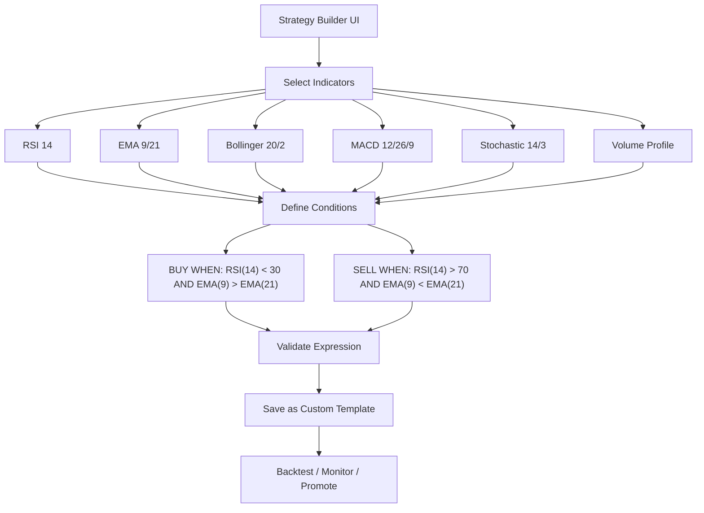
```mermaid
flowchart TD
    A[Strategy Builder UI] --> B[Select Indicators]
    B --> B1[RSI 14]
    B --> B2[EMA 9/21]
    B --> B3[Bollinger 20/2]
    B --> B4[MACD 12/26/9]
    B --> B5[Stochastic 14/3]
    B --> B6[Volume Profile]

    B1 & B2 & B3 & B4 & B5 & B6 --> C[Define Conditions]

    C --> C1["BUY WHEN: RSI(14) < 30 AND EMA(9) > EMA(21)"]
    C --> C2["SELL WHEN: RSI(14) > 70 AND EMA(9) < EMA(21)"]

    C1 & C2 --> D[Validate Expression]
    D --> E[Save as Custom Template]
    E --> F[Backtest / Monitor / Promote]
```

### Expression Language

```
# Simple conditions
BUY WHEN rsi(14) < 30
SELL WHEN rsi(14) > 70

# Combined conditions
BUY WHEN rsi(14) < 30 AND ema(9) > ema(21)
SELL WHEN rsi(14) > 70 OR close > bb_upper(20, 2)

# Multi-timeframe
BUY WHEN rsi(14, H1) < 30 AND ema(50, D1) IS BULLISH

# Volume filter
BUY WHEN rsi(14) < 30 AND volume > sma_volume(20) * 1.5
```

### New Indicators to Add

| Indicator | Library | Already Installed |
|-----------|---------|:-----------------:|
| Stochastic | `ta` | Yes |
| Williams %R | `ta` | Yes |
| CCI | `ta` | Yes |
| Ichimoku Cloud | `ta` | Yes |
| Volume SMA | `pandas` | Yes |
| ADX | `ta` | Yes |
| Parabolic SAR | `ta` | Yes |
| Donchian Channel | `ta` | Yes |

### Effort: L | Prerequisites: `ta` library (installed), `BacktestEngine` (exists)

---

## 7. Advanced Backtesting

### Problem

No walk-forward testing. No slippage. No Monte Carlo. No benchmark.

### Walk-Forward Optimization

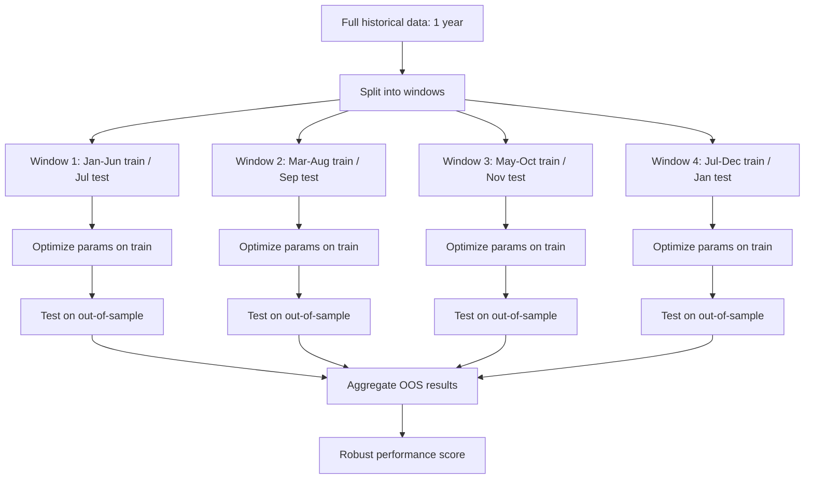
```mermaid
flowchart TD
    A[Full historical data: 1 year] --> B[Split into windows]

    B --> W1[Window 1: Jan-Jun train / Jul test]
    B --> W2[Window 2: Mar-Aug train / Sep test]
    B --> W3[Window 3: May-Oct train / Nov test]
    B --> W4[Window 4: Jul-Dec train / Jan test]

    W1 --> R1[Optimize params on train]
    W2 --> R2[Optimize params on train]
    W3 --> R3[Optimize params on train]
    W4 --> R4[Optimize params on train]

    R1 --> T1[Test on out-of-sample]
    R2 --> T2[Test on out-of-sample]
    R3 --> T3[Test on out-of-sample]
    R4 --> T4[Test on out-of-sample]

    T1 & T2 & T3 & T4 --> AGG[Aggregate OOS results]
    AGG --> SCORE[Robust performance score]
```

### Monte Carlo Simulation

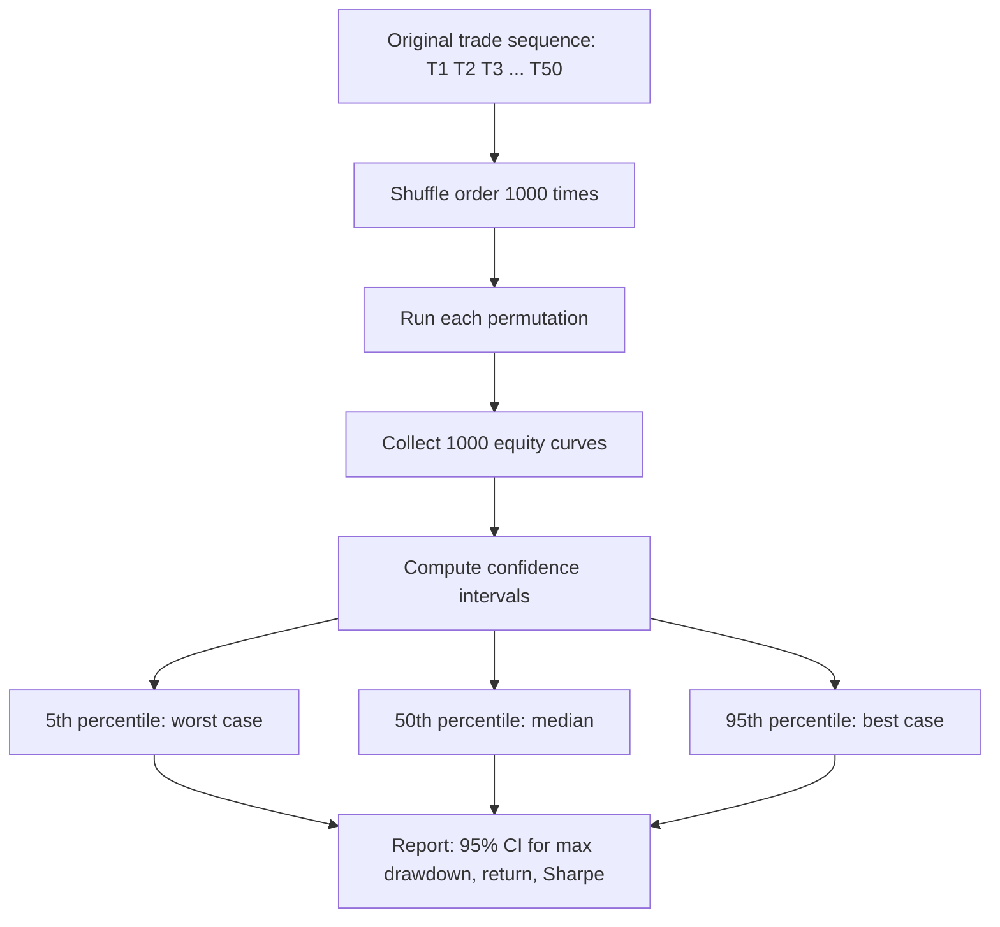
```mermaid
flowchart TD
    A[Original trade sequence: T1 T2 T3 ... T50] --> B[Shuffle order 1000 times]
    B --> C[Run each permutation]
    C --> D[Collect 1000 equity curves]
    D --> E[Compute confidence intervals]

    E --> F["5th percentile: worst case"]
    E --> G["50th percentile: median"]
    E --> H["95th percentile: best case"]

    F & G & H --> I[Report: 95% CI for max drawdown, return, Sharpe]
```

### Spread/Slippage Model

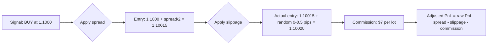
```mermaid
flowchart LR
    A[Signal: BUY at 1.1000] --> B{Apply spread}
    B --> C[Entry: 1.1000 + spread/2 = 1.10015]
    C --> D{Apply slippage}
    D --> E[Actual entry: 1.10015 + random 0-0.5 pips = 1.10020]
    E --> F[Commission: $7 per lot]
    F --> G[Adjusted PnL = raw PnL - spread - slippage - commission]
```

| Cost Component | Forex | Crypto | Indices |
|---------------|-------|--------|---------|
| Spread (pips) | 0.5-2.0 | 5-50 | 0.5-3.0 |
| Slippage (pips) | 0-0.5 | 0-10 | 0-1.0 |
| Commission/lot | $3.5-7 | 0.1% | $1-3 |

### Effort: L | Prerequisites: `BacktestEngine` (exists)

---

# Tier 3 — Product Features

---

## 8. Alerting System

### Architecture

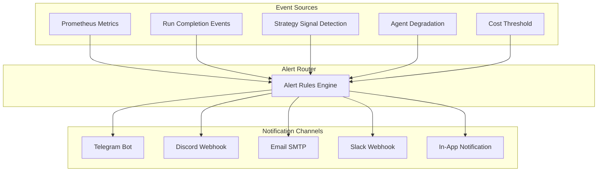
```mermaid
flowchart TD
    subgraph "Event Sources"
        S1[Prometheus Metrics]
        S2[Run Completion Events]
        S3[Strategy Signal Detection]
        S4[Agent Degradation]
        S5[Cost Threshold]
    end

    subgraph "Alert Router"
        R[Alert Rules Engine]
    end

    subgraph "Notification Channels"
        N1[Telegram Bot]
        N2[Discord Webhook]
        N3[Email SMTP]
        N4[Slack Webhook]
        N5[In-App Notification]
    end

    S1 & S2 & S3 & S4 & S5 --> R
    R --> N1 & N2 & N3 & N4 & N5
```

### Alert Rules

| Rule | Condition | Channel | Severity |
|------|-----------|---------|----------|
| Run failed | `run.status == 'failed'` | Telegram + Email | HIGH |
| Strategy signal | New BUY/SELL signal detected | Telegram | MEDIUM |
| LLM cost budget | Daily cost > $50 | Email | HIGH |
| Agent degraded 3x | `degraded_count > 3` in 1 hour | Discord | WARNING |
| Drawdown alert | Unrealized loss > 2% | Telegram + Email | CRITICAL |
| MetaAPI disconnected | Circuit breaker open > 5 min | Telegram | HIGH |
| Backtest completed | `backtest.status == 'completed'` | In-App | LOW |

### Effort: M | Prerequisites: Prometheus (exists), Celery Beat (exists)

---

## 9. Multi-Broker Support

### Plugin Architecture

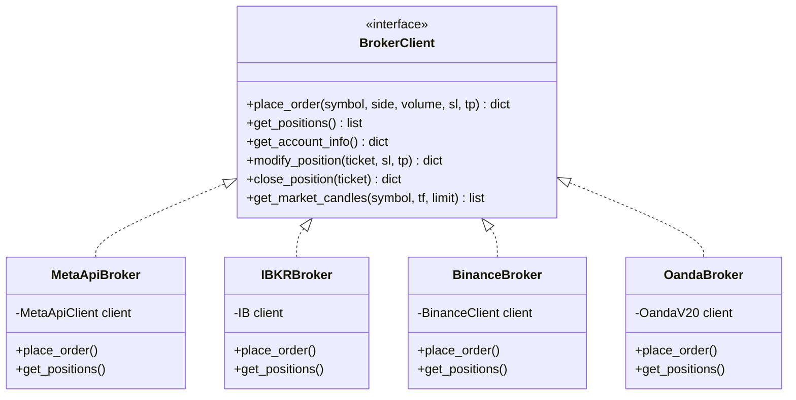
```mermaid
classDiagram
    class BrokerClient {
        <<interface>>
        +place_order(symbol, side, volume, sl, tp) dict
        +get_positions() list
        +get_account_info() dict
        +modify_position(ticket, sl, tp) dict
        +close_position(ticket) dict
        +get_market_candles(symbol, tf, limit) list
    }

    class MetaApiBroker {
        -MetaApiClient client
        +place_order()
        +get_positions()
    }

    class IBKRBroker {
        -IB client
        +place_order()
        +get_positions()
    }

    class BinanceBroker {
        -BinanceClient client
        +place_order()
        +get_positions()
    }

    class OandaBroker {
        -OandaV20 client
        +place_order()
        +get_positions()
    }

    BrokerClient <|.. MetaApiBroker
    BrokerClient <|.. IBKRBroker
    BrokerClient <|.. BinanceBroker
    BrokerClient <|.. OandaBroker
```

### Broker Routing

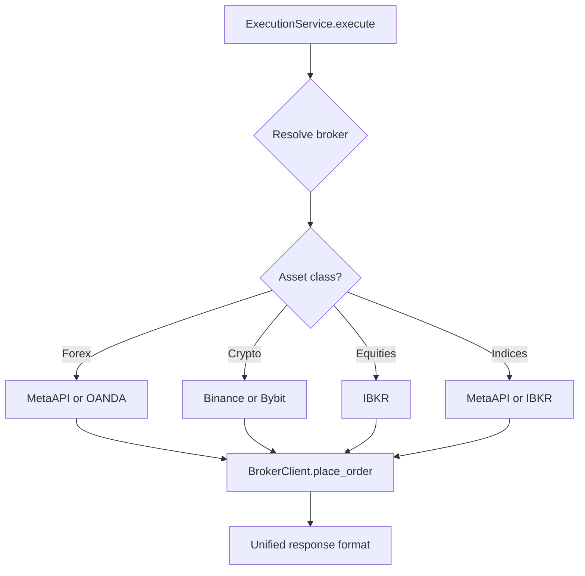
```mermaid
flowchart TD
    A[ExecutionService.execute] --> B{Resolve broker}

    B --> C{Asset class?}
    C -->|Forex| D[MetaAPI or OANDA]
    C -->|Crypto| E[Binance or Bybit]
    C -->|Equities| F[IBKR]
    C -->|Indices| G[MetaAPI or IBKR]

    D & E & F & G --> H[BrokerClient.place_order]
    H --> I[Unified response format]
```

### Effort: XL | Prerequisites: `ExecutionService` (exists, needs interface extraction)

---

## 10. Paper Trading Dashboard

### UI Layout

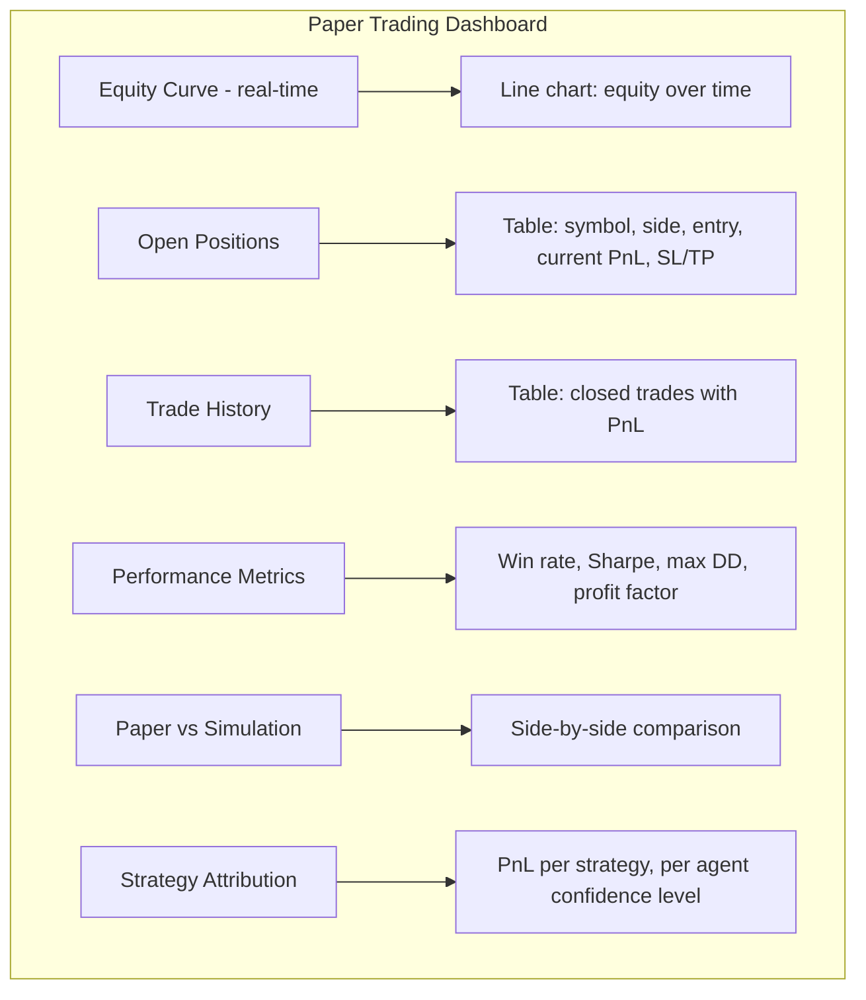
```mermaid
flowchart TD
    subgraph "Paper Trading Dashboard"
        A[Equity Curve - real-time] --> A1[Line chart: equity over time]
        B[Open Positions] --> B1[Table: symbol, side, entry, current PnL, SL/TP]
        C[Trade History] --> C1[Table: closed trades with PnL]
        D[Performance Metrics] --> D1[Win rate, Sharpe, max DD, profit factor]
        E[Paper vs Simulation] --> E1[Side-by-side comparison]
        F[Strategy Attribution] --> F1[PnL per strategy, per agent confidence level]
    end
```

### Effort: M | Prerequisites: `ExecutionOrder` model with mode filter (exists)

---

## 11. Agent Skill Evolution

### Problem

Skills are static files (`config/skills/{agent}/SKILL.md`). No learning from outcomes.

### Skill A/B Testing Flow

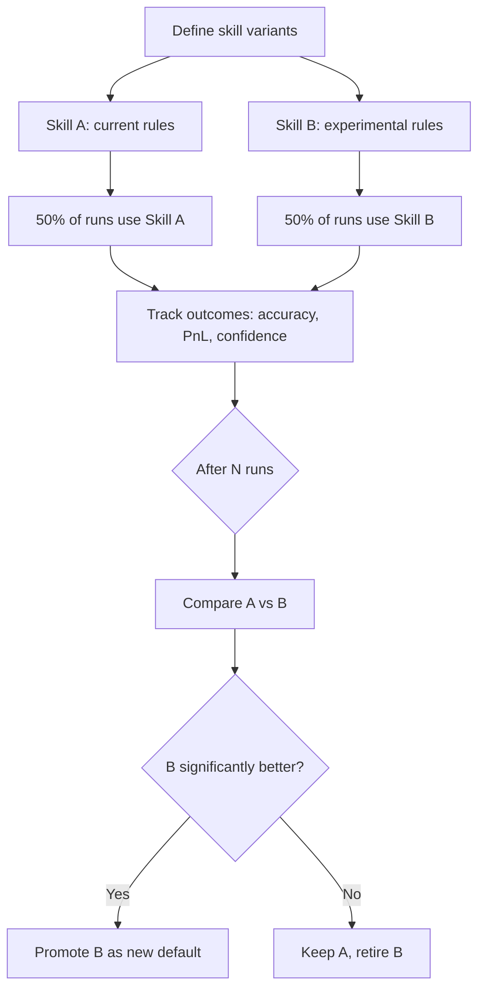
```mermaid
flowchart TD
    A[Define skill variants] --> B[Skill A: current rules]
    A --> C[Skill B: experimental rules]

    B --> D[50% of runs use Skill A]
    C --> E[50% of runs use Skill B]

    D --> F[Track outcomes: accuracy, PnL, confidence]
    E --> F

    F --> G{After N runs}
    G --> H[Compare A vs B]
    H --> I{B significantly better?}
    I -->|Yes| J[Promote B as new default]
    I -->|No| K[Keep A, retire B]
```

### Auto-Tuning

```mermaid
sequenceDiagram
    participant Engine as Skill Evolution Engine
    participant DB as Outcome Database
    participant Config as Skill Config

    Engine->>DB: Fetch last 100 outcomes for technical-analyst
    DB-->>Engine: 60 correct, 40 wrong

    Engine->>Engine: Analyze: wrong decisions correlate with<br/>"RSI divergence" skill being active
    Engine->>Engine: Hypothesis: skill "Reduce conviction on divergences"<br/>may be too aggressive

    Engine->>Config: Create variant: soften divergence penalty from 0.3 to 0.15
    Engine->>Config: Deploy in A/B test for next 50 runs
```

### Effort: L | Prerequisites: `skill_bootstrap.py` (exists), Memory System (Tier 1)

---

## 12. News Intelligence

### Problem

News aggregation works but analysis is basic. No sentiment tracking over time, no event calendar, no source weighting.

### Enhanced Architecture

```mermaid
flowchart TD
    subgraph "News Pipeline"
        A[Multi-provider fetch] --> B[Deduplication engine]
        B --> C[Source credibility scoring]
        C --> D[Sentiment extraction - per entity]
        D --> E[Sentiment time series - 7-day rolling]
    end

    subgraph "Event Calendar"
        F[FOMC dates] --> G[Pre-event alert: 24h before]
        H[NFP release] --> G
        I[ECB decision] --> G
        J[Earnings dates] --> G
        G --> K[Inject into agent context]
    end

    subgraph "Impact Analysis"
        L[Historical: how did EURUSD react to last 10 FOMC?]
        M[Correlation: sentiment spike -> price move?]
        N[Regime shift detection from news volume]
    end
```

### Source Credibility Weights

| Source | Credibility | Weight |
|--------|:----------:|:------:|
| Central bank statements | 10/10 | 1.0 |
| Reuters/Bloomberg | 9/10 | 0.9 |
| Financial Times | 8/10 | 0.8 |
| ForexLive/FXStreet | 7/10 | 0.7 |
| NewsAPI generic | 5/10 | 0.5 |
| LLM web search | 4/10 | 0.4 |

### Effort: M | Prerequisites: `news_provider.py` (exists), `fx_pair_bias.py` (exists)

---

## 13. Structured Logging + Distributed Tracing

### Architecture

```mermaid
flowchart TD
    subgraph "Application"
        A[FastAPI Request] --> B[Correlation ID assigned]
        B --> C[Agent Pipeline]
        C --> D[MCP Tool Calls]
        D --> E[Broker Execution]
    end

    subgraph "Logging Pipeline"
        F[JSON structured logs] --> G[Loki / ELK]
    end

    subgraph "Tracing Pipeline"
        H[OpenTelemetry Spans] --> I[Jaeger / Tempo]
    end

    subgraph "Metrics Pipeline"
        J[Prometheus] --> K[Grafana]
    end

    A --> F & H
    C --> F & H
    D --> F & H & J
    E --> F & H & J
```

### Trace Span Hierarchy

```
[HTTP POST /runs]
  └── [Celery: run_analysis_task]
       ├── [Market Data Resolution]
       │    ├── [MetaAPI: fetch candles]
       │    └── [YFinance: fallback]
       ├── [Phase 1: Parallel Analysts]
       │    ├── [technical-analyst: 3.2s]
       │    │    ├── [tool: indicator_bundle: 50ms]
       │    │    └── [tool: technical_scoring: 30ms]
       │    ├── [news-analyst: 2.8s]
       │    └── [market-context-analyst: 2.5s]
       ├── [Phase 2-3: Debate: 8.5s]
       │    ├── [bullish-researcher: 3.0s]
       │    ├── [bearish-researcher: 2.8s]
       │    └── [moderator judgment: 2.7s]
       ├── [Phase 4: Decision: 4.2s]
       │    ├── [trader-agent: 3.5s]
       │    ├── [risk-manager: 0.3s]
       │    └── [execution-manager: 0.4s]
       └── [Execution: 1.1s]
            └── [MetaAPI: place_order: 0.8s]
```

### Effort: M | Prerequisites: OpenTelemetry (optional in `main.py`), Prometheus (exists)

---

## 14. Mobile / Responsive UI

### Responsive Breakpoints

```mermaid
flowchart LR
    subgraph "Desktop (>1200px)"
        D1[Sidebar + Full content + Charts]
    end

    subgraph "Tablet (768-1200px)"
        T1[Collapsible sidebar + Stacked cards]
    end

    subgraph "Mobile (<768px)"
        M1[Bottom nav + Single column + Mini charts]
    end
```

### PWA Features

| Feature | Implementation |
|---------|---------------|
| Offline mode | Service worker + cached last state |
| Push notifications | Web Push API + alert system |
| Install prompt | manifest.json + service worker |
| Quick actions | "Check latest run", "View P&L" |

### Effort: L | Prerequisites: Tailwind responsive (exists)

---

## 15. Multi-Tenancy

### Data Model

```mermaid
erDiagram
    Organization {
        int id PK
        string name
        string plan "free|pro|enterprise"
        json limits "max_runs, max_strategies, max_llm_cost"
        datetime created_at
    }

    User {
        int id PK
        int org_id FK
        string email
        string role "org_admin|trader|analyst|viewer"
    }

    Organization ||--o{ User : "has members"
    Organization ||--o{ Strategy : "owns"
    Organization ||--o{ AnalysisRun : "owns"
```

### Resource Quotas

| Plan | Max Runs/Day | Max Strategies | Max LLM Cost/Day | Live Trading |
|------|:-----------:|:--------------:|:-----------------:|:------------:|
| Free | 10 | 5 | $1 | No |
| Pro | 100 | 50 | $20 | Paper only |
| Enterprise | Unlimited | Unlimited | Custom | Yes |

### Effort: XL | Prerequisites: User model (exists)

---

## Implementation Sequence

```mermaid
gantt
    title Recommended Implementation Sequence
    dateFormat YYYY-MM-DD
    axisFormat %b %Y

    section Critical
    Rate Limiting + Audit     :crit, rl, 2026-04-01, 2w
    Order Guardian            :crit, og, after rl, 3w

    section Memory
    Outcome Tracker           :mem1, after rl, 2w
    Agent Accuracy            :mem2, after mem1, 2w
    Context Injection         :mem3, after mem2, 3w
    Confidence Calibration    :mem4, after mem3, 2w

    section Trading
    Portfolio Risk            :port, after og, 3w
    Advanced Backtest         :bt, after port, 4w

    section Agents
    Debate Rebuttal           :deb, after mem2, 2w
    Skill Evolution           :skill, after mem4, 3w

    section Product
    Alerting System           :alert, after rl, 2w
    News Intelligence         :news, after alert, 3w
    Custom Templates          :tmpl, after bt, 4w
    Paper Dashboard           :paper, after port, 2w

    section Infrastructure
    Structured Logging        :log, after rl, 2w
    Multi-Broker (research)   :broker, after port, 6w
    Mobile UI                 :mobile, after paper, 4w
    Multi-Tenancy             :tenant, after broker, 8w
```

---

## What NOT to Build Too Early

| Feature | Why Wait |
|---------|----------|
| Multi-Tenancy | Need stable single-tenant first. Foundation for everything else. |
| Multi-Broker | Need Order Guardian and Portfolio Risk before managing multiple brokers. |
| Mobile UI | Desktop experience must be polished first. Mobile is a cosmetic layer. |
| Skill Evolution | Need Memory System (outcome tracking) before you can measure skill effectiveness. |
| Custom Templates | Need Advanced Backtesting first to properly validate custom strategies. |
| Monte Carlo | Need spread/slippage model first. Monte Carlo on unrealistic backtests is misleading. |
