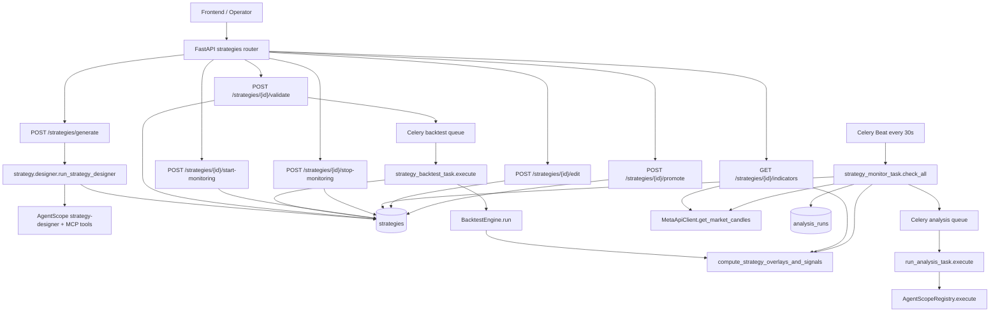
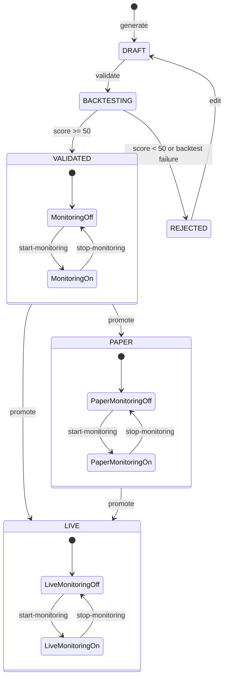
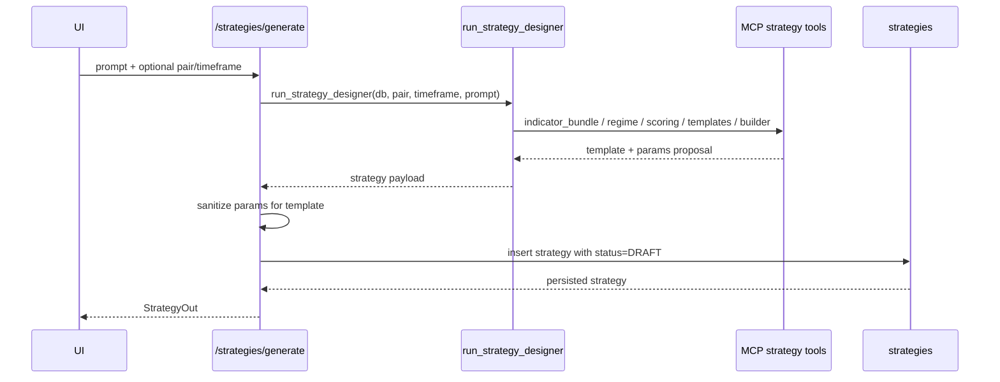
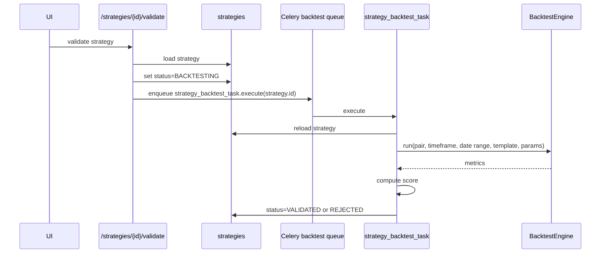
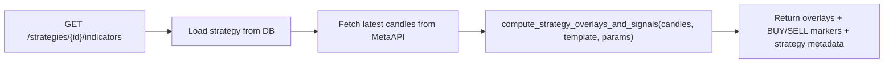
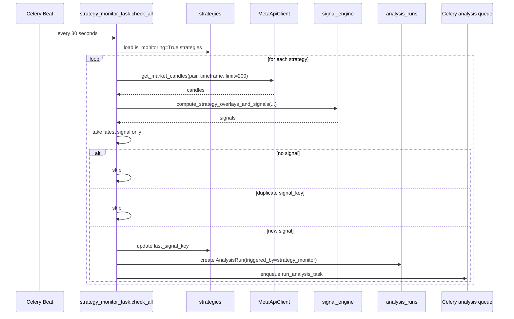
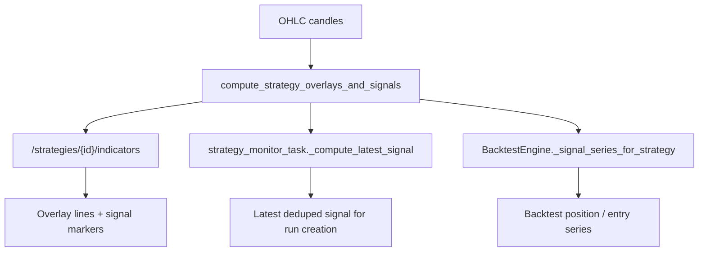

# Strategies Workflow Architecture

## Purpose

This document explains the current strategy workflow architecture end to end:

- strategy generation
- strategy persistence and lifecycle
- validation through backtest
- live indicator projection
- monitoring and run triggering
- signal parity across chart, monitor, and backtest surfaces

It describes the implementation that exists today in the codebase.

## Scope

- Backend strategy lifecycle only
- Current FastAPI, Celery, DB, and signal-engine interactions
- Current executable templates only:
  - `ema_crossover`
  - `rsi_mean_reversion`
  - `bollinger_breakout`
  - `macd_divergence`

Out of scope:

- frontend UX details
- future strategy orchestration ideas
- non-strategy run flows unrelated to `/strategies`

## Source Of Truth

| Concern | File |
|---|---|
| Strategy routes | `backend/app/api/routes/strategies.py` |
| Strategy record | `backend/app/db/models/strategy.py` |
| Strategy designer agent | `backend/app/services/strategy/designer.py` |
| Shared signal engine | `backend/app/services/strategy/signal_engine.py` |
| Backtest engine | `backend/app/services/backtest/engine.py` |
| Strategy validation task | `backend/app/tasks/strategy_backtest_task.py` |
| Strategy monitor task | `backend/app/tasks/strategy_monitor_task.py` |
| Analysis run task | `backend/app/tasks/run_analysis_task.py` |

---

## Requirements Summary

### Functional

- Generate a strategy from a natural-language prompt
- Persist a strategy with template, params, symbol, timeframe, and lifecycle state
- Validate a strategy asynchronously with a historical backtest
- Compute chart overlays and entry markers for a strategy
- Monitor validated or promoted strategies for new live signals
- Trigger the main multi-agent run workflow when monitoring detects a new signal

### Non-functional

- Keep signal rules consistent across all surfaces
- Decouple HTTP request latency from backtest and monitoring work
- Support fallback behavior when designer generation fails
- Prevent duplicate monitoring-triggered runs
- Keep strategy lifecycle explicit and auditable in the database

---

## High-Level Architecture

### Main design idea

The strategy system is split into three layers:

1. Control layer in `strategies.py`
2. Async execution layer in Celery tasks
3. Shared signal computation layer in `signal_engine.py`

The critical architectural choice is that executable strategy signal rules now live in one shared signal engine and are reused by:

- the chart indicators endpoint
- the monitoring task
- the backtest engine for executable templates

---

## Lifecycle Model

### Persisted strategy state

The `strategies` table carries both definition and runtime workflow state:

- identity: `strategy_id`, `name`, `description`
- signal definition: `template`, `params`
- market target: `symbol`, `timeframe`
- validation state: `status`, `score`, `metrics`
- monitoring state: `is_monitoring`, `monitoring_mode`, `monitoring_risk_percent`, `last_signal_key`
- authoring trace: `prompt_history`

---

## Workflow By Phase

## 1. Generation

### Notes

- The route prefers the dedicated strategy-designer agent.
- If agent output is unusable, the route falls back to `_llm_generate(...)`.
- If that also fails, the route falls back to a default randomized executable template with default params.
- The generated strategy is always normalized before persistence through `sanitize_strategy_params_for_template(...)`.

## 2. Validation Through Backtest

### Notes

- Validation is async by design; the HTTP route only flips state and enqueues work.
- The validation task backtests the strategy on its own `symbol` and `timeframe`.
- The task persists:
  - normalized validation score
  - summary metrics
  - `validated_template`
  - `validated_params`

## 3. Live Indicators Surface

### Notes

- The chart surface does not implement signal rules locally.
- It delegates to the shared signal engine and only adds strategy metadata to the response.

## 4. Monitoring And Run Triggering

### Notes

- Monitoring is edge-triggered by `last_signal_key`.
- The task creates an `AnalysisRun`; it does not place orders directly.
- Execution remains delegated to the normal analysis workflow, which preserves the main runtime governance path.

---

## Signal Parity Architecture

## Why this matters

Before parity work, strategy surfaces could diverge if each surface reimplemented its own BUY/SELL logic. The current architecture reduces that risk by centralizing executable-template rules.

## Shared signal source

### Consequence

For executable templates, these three surfaces now consume the same entry-event rules:

- chart markers
- monitoring triggers
- backtest entries

This is the main consistency boundary in the strategy workflow.

## Signal translation in backtest

The shared signal engine returns sparse events:

- `BUY` at a specific candle
- `SELL` at a specific candle

The backtest engine converts those events into a held position series:

- `0` before the first event
- `1` after a `BUY`
- `-1` after a `SELL`
- position flips only when a new opposite event arrives

That translation is done in `BacktestEngine._signal_series_for_strategy(...)`.

---

## Component Responsibilities

| Component | Responsibility | Does not do |
|---|---|---|
| `strategies.py` | HTTP control plane for strategy lifecycle | Heavy async work |
| `strategy.designer.py` | Strategy authoring via agent + tool workflow | Persist final lifecycle state transitions after validation |
| `signal_engine.py` | Template overlays and signal event computation | DB writes, scheduling, execution |
| `strategy_backtest_task.py` | Async validation orchestration and score persistence | Strategy authoring, live monitoring |
| `BacktestEngine` | Historical signal replay, metrics, optional agent validation | Strategy persistence logic |
| `strategy_monitor_task.py` | Periodic live signal polling and run creation | Direct trading execution |
| `run_analysis_task.py` | Bridge from monitoring-triggered run to main agent pipeline | Strategy signal generation |

---

## Key Decisions And Trade-offs

## Decision 1: Async validation through Celery

### Decision

Validation is offloaded from the route to `strategy_backtest_task`.

### Why

- backtests can take seconds or minutes
- route latency stays predictable
- status in DB becomes the workflow handshake

### Trade-off

- clients observe eventual consistency instead of synchronous validation completion

## Decision 2: Strategy workflow reuses the normal run pipeline

### Decision

Monitoring creates an `AnalysisRun` and re-enters `run_analysis_task` instead of placing trades from the monitor task.

### Why

- one operational path for analysis and execution
- monitoring-triggered actions keep the same trace structure as manual runs
- execution gates remain centralized

### Trade-off

- more moving pieces than a direct signal-to-order path

## Decision 3: One shared executable signal engine

### Decision

Executable template rules are centralized in `compute_strategy_overlays_and_signals(...)`.

### Why

- chart, monitor, and backtest parity
- lower maintenance cost
- easier test coverage

### Trade-off

- backtest needs a translation step from sparse events to held-position series

---

## Risks And Failure Modes

| Risk | Effect | Current mitigation |
|---|---|---|
| Designer output invalid | Strategy generation fails or degrades | Fallback chain: agent -> direct LLM -> default template |
| Candle fetch failure | Indicators or monitoring produce no signal | Route/task catches exceptions and returns empty/no-op behavior |
| Signal duplication in monitor | Duplicate run creation | `last_signal_key` dedup |
| Divergent signal logic across surfaces | Chart/backtest/live mismatch | Shared signal engine + parity tests |
| Backtest failure | Strategy stuck or misleading | Task marks strategy `REJECTED` with error metrics |
| Async queue outage | Validation or monitoring delayed | Status remains explicit in DB; enqueue failures are logged |

---

## Recommended Reading Order

1. This document
2. `docs/architecture/STRATEGY_ENGINE.md`
3. `docs/architecture/ARCHITECTURE.md`
4. Source files listed in the source-of-truth table
