# Strategy Engine — Architecture Detail

## Purpose

Documents the full strategy lifecycle: AI-powered generation, backtest validation, automated monitoring, signal detection, promotion governance, and chart overlay computation.

## Source of Truth

| Component | File |
|-----------|------|
| Strategy designer agent | `app/services/strategy/designer.py` |
| Strategy monitor task | `app/tasks/strategy_monitor_task.py` |
| Strategy validation task | `app/tasks/strategy_backtest_task.py` |
| Strategy API routes | `app/api/routes/strategies.py` |
| Strategy DB model | `app/db/models/strategy.py` |
| Backtest engine | `app/services/backtest/engine.py` |
| Indicator computation | `app/api/routes/strategies.py` (`_compute_indicators`) |

---

## Strategy Lifecycle

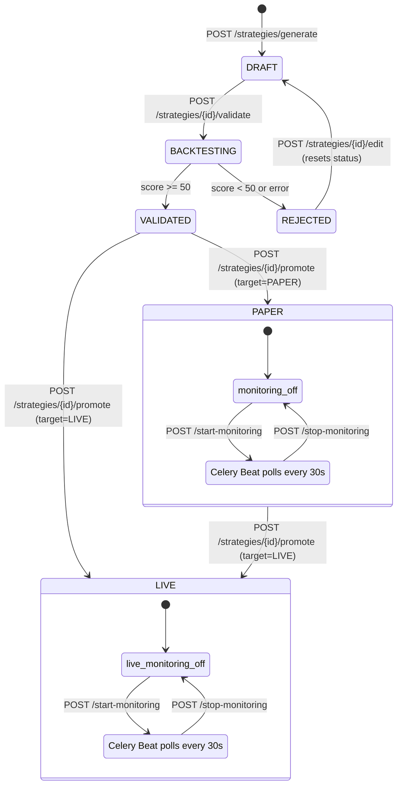

---

## 1. Strategy Generation

### Workflow

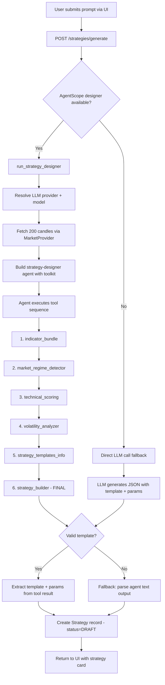

### Template Selection Logic

The agent chooses a template based on market regime:

| Market Regime | Recommended Template | Reasoning |
|---------------|---------------------|-----------|
| Trending (up/down) | `ema_crossover` or `macd_divergence` | Follow the trend with momentum confirmation |
| Ranging | `rsi_mean_reversion` or `bollinger_breakout` | Capture mean-reversion in bounded markets |
| High volatility | Any, with wider params | Higher `atr_multiplier`, wider `bb_std` |
| Low volatility | Any, with tighter params | Tighter params for precision entries |

### Available Templates

| Template | Parameters | Buy Signal | Sell Signal |
|----------|-----------|-----------|------------|
| `ema_crossover` | `ema_fast` (9), `ema_slow` (21), `rsi_filter` (30) | Fast EMA > Slow EMA AND RSI < (100 - rsi_filter) | Fast EMA < Slow EMA AND RSI > rsi_filter |
| `rsi_mean_reversion` | `rsi_period` (14), `oversold` (30), `overbought` (70) | RSI < oversold | RSI > overbought |
| `bollinger_breakout` | `bb_period` (20), `bb_std` (2.0) | Close <= lower band | Close >= upper band |
| `macd_divergence` | `fast` (12), `slow` (26), `signal` (9) | MACD > signal AND histogram > 0 | MACD < signal AND histogram < 0 |

### Fallback Chain

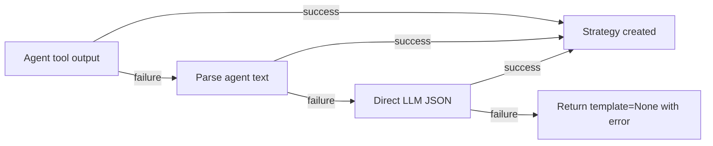

---

## 2. Strategy Validation (Backtest)

### Workflow

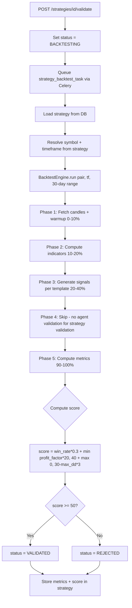

### Scoring Formula

```
score = min(100, max(0,
    win_rate_pct * 0.3                    // 30% weight on win rate
  + min(profit_factor * 20, 40)           // Up to 40 points for profit factor (capped)
  + max(0, 30 - max_drawdown_pct * 3)    // Up to 30 points, penalized by drawdown
))
```

| Component | Max Points | Formula |
|-----------|-----------|---------|
| Win Rate | ~30 | `win_rate * 0.3` (100% win rate = 30 points) |
| Profit Factor | 40 | `min(profit_factor * 20, 40)` (capped at 2.0 PF) |
| Max Drawdown | 30 | `max(0, 30 - max_dd * 3)` (10% DD = 0 points) |
| **Total** | **100** | Sum of above, clamped to [0, 100] |

**Threshold**: score >= 50 = VALIDATED, score < 50 = REJECTED

---

## 3. Strategy Monitoring

### Monitoring Loop

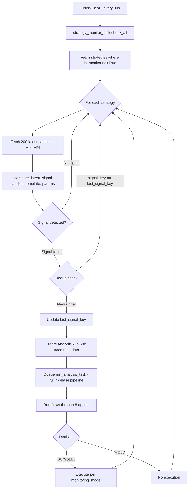

### Signal Detection Per Template

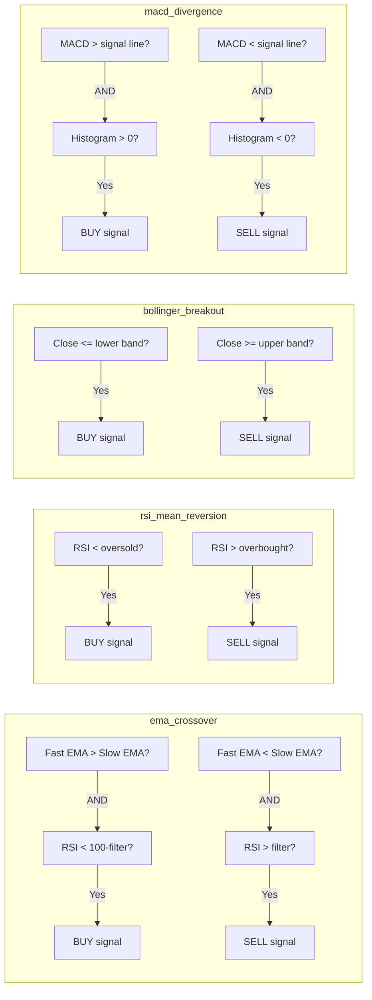

### Signal Deduplication

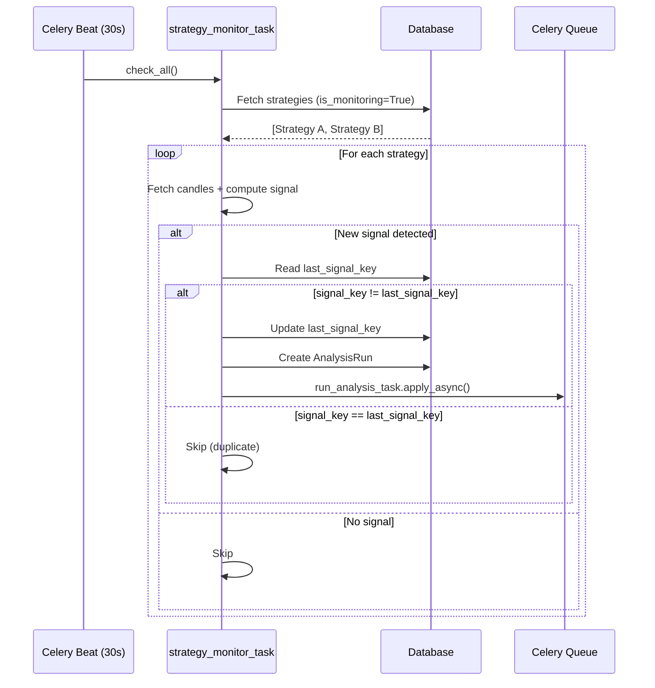

### Run Trace Metadata (Strategy-Triggered)

When a strategy monitor creates a run, the trace includes:

```json
{
  "triggered_by": "strategy_monitor",
  "strategy_id": "STRAT-001",
  "strategy_name": "EMA Crossover EURUSD",
  "strategy_template": "ema_crossover",
  "signal_side": "BUY",
  "signal_price": 1.0985,
  "signal_time": "2026-03-31T14:30:00Z"
}
```

---

## 4. Promotion & Governance

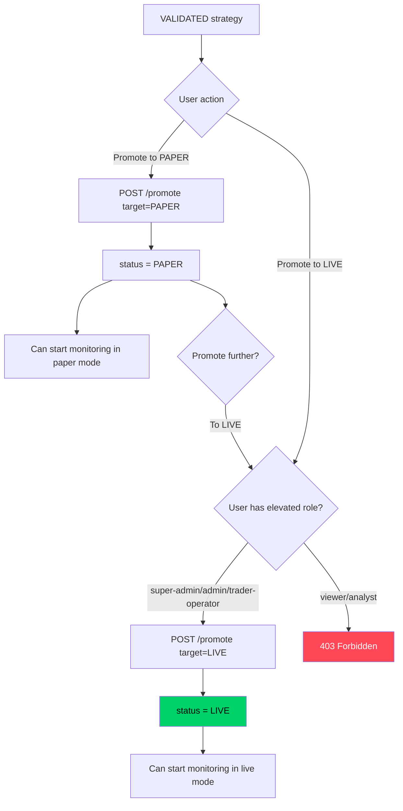

### Governance Rules

| Transition | Allowed Roles | Additional Checks |
|-----------|---------------|-------------------|
| DRAFT -> BACKTESTING | All authenticated | None |
| BACKTESTING -> VALIDATED | System (automatic) | Score >= 50 |
| BACKTESTING -> REJECTED | System (automatic) | Score < 50 or error |
| VALIDATED -> PAPER | All authenticated | None |
| VALIDATED -> LIVE | super-admin, admin, trader-operator | Role check |
| PAPER -> LIVE | super-admin, admin, trader-operator | Role check |
| REJECTED -> DRAFT | All authenticated | Via edit endpoint |
| Start monitoring (paper) | All authenticated | Strategy in PAPER or LIVE |
| Start monitoring (live) | super-admin, admin, trader-operator | ALLOW_LIVE_TRADING must be true |

---

## 5. Chart Overlays & Indicators

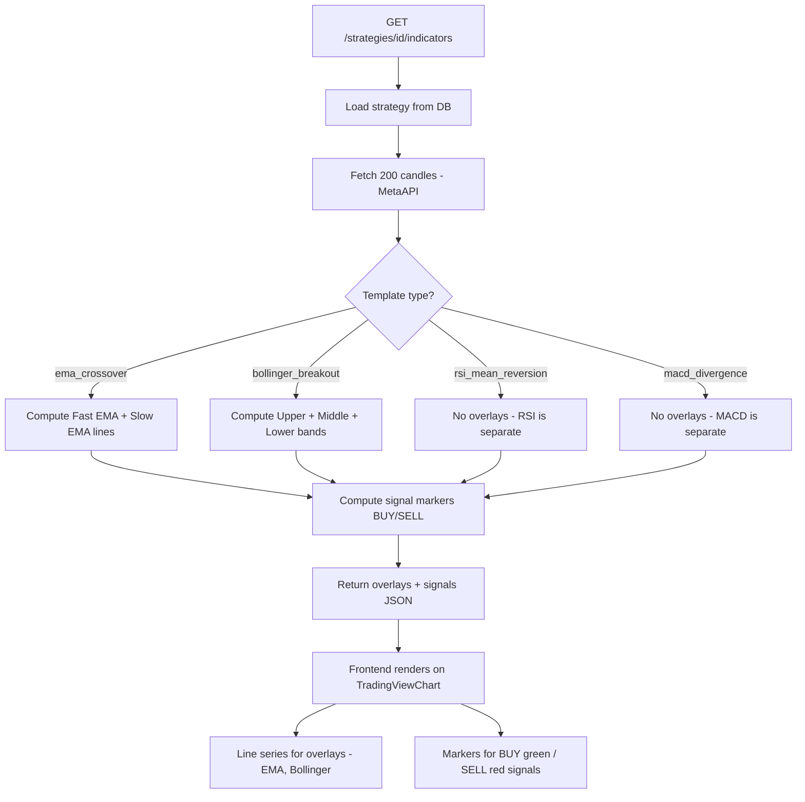

### Overlay Response Format

```json
{
  "overlays": [
    {
      "name": "EMA_9",
      "color": "#4a90d9",
      "data": [
        {"time": "2026-03-31T10:00:00Z", "value": 1.0985},
        {"time": "2026-03-31T11:00:00Z", "value": 1.0990}
      ]
    },
    {
      "name": "EMA_21",
      "color": "#e8a838",
      "data": [...]
    }
  ],
  "signals": [
    {
      "time": "2026-03-31T14:00:00Z",
      "price": 1.0985,
      "side": "BUY"
    }
  ]
}
```

---

## 6. LLM Strategy Edit

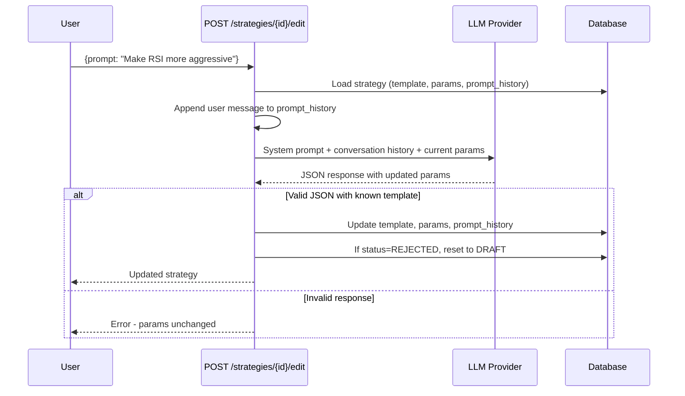

---

## Database Schema

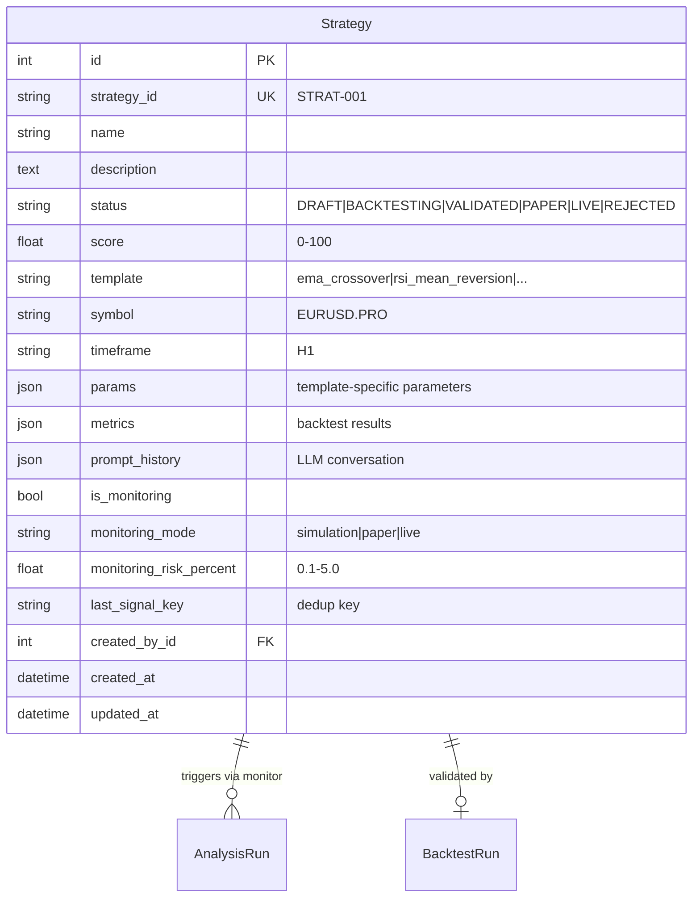

---

## Known Limitations

- Only 4 strategy templates available (ema_crossover, rsi_mean_reversion, bollinger_breakout, macd_divergence)
- No custom indicator support (templates are hardcoded)
- Strategy validation scoring is a simple weighted formula, not risk-adjusted
- No walk-forward or out-of-sample testing in validation
- No Monte Carlo confidence intervals on backtest results
- LLM edit may produce invalid params (caught but not always gracefully)
- Monitoring checks every 30s regardless of timeframe (M5 strategy gets checked 6x per candle)
- No slippage, spread, or commission modeling in validation backtest
